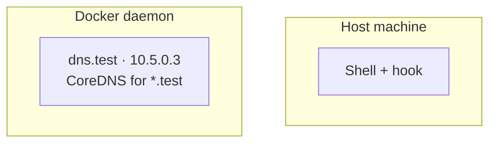

# Windsor Docs Style

This skill encodes the editorial contract from
[STYLE.md](../../../STYLE.md). Use it any time you're writing or
editing a page in this repo.

## When to use this skill

- Writing a new page from scratch
- Restructuring an existing page
- Reviewing a draft for tone before opening a PR

For a *pre-PR pass* (check frontmatter, links, terminology, render),
use [`docs-review`](../docs-review/SKILL.md) instead.

## The 30-second model

This repo holds Windsor's **general docs** — concepts, how-tos,
overviews. Reference docs (every flag, every field) live in
`windsorcli/cli` and `windsorcli/core` and get vendored alongside
these pages at build time.

## Frontmatter (required)

```yaml
---
title: Sentence-case title
description: One sentence under 160 chars. Used for OG, search, and llms.txt.
---
```

Both fields are required, and `description:` is capped at 160
characters. CI rejects pages missing either, or with overlong
descriptions.

## Pages stand alone

Agents and search results fetch single pages, not whole sections.
Three rules that follow from that:

- **No forward references.** `As we'll see below` or `as discussed
  above` assume the reader is reading top-to-bottom. They probably
  aren't. Vale's `Windsor.ForwardReferences` flags these.
- **Restate context at each section start.** Which command? Which
  context? Which layer? A reader who deep-linked to `#troubleshooting`
  shouldn't have to scroll up to know what's being troubleshot.
- **Link, don't cross-reference.** If a concept lives elsewhere,
  link to it. Don't write `the schema (covered earlier)`.

## Plain markdown only

This repo's pages are vendored into Astro, which supports MDX
components. But raw `.md` fetches don't get the renderer. Stick
to portable syntax: CommonMark, GFM tables, fenced code blocks,
mermaid, frontmatter, and the small HTML set markdownlint allows
(`<details>`, `<kbd>`, `<sup>`, `<br>`, ``).

If a section *only* renders on the website, the agent reading it
sees broken markup.

## Voice rules

- **Direct.** Active voice. Subject does the verb.
- **Calm.** No exclamation points. No marketing words.
- **Specific.** Numbers, paths, command names, real timings.
- **Honest about scope.** Workstation-only? Say so in the lead.

Banned words (Vale enforces — `styles/Windsor/MarketingWords.yml`):
`seamless`, `powerful`, `simple`, `simply`, `leverages`, `robust`,
`magical`, `cutting-edge`, `world-class`, `blazingly`, `effortless`,
`next-generation`.

Hedges to drop: `basically`, `just`, `really`, `simply`,
`essentially`, `obviously`, `clearly`, `of course`.

## Page shape

````markdown
---
title: ...
description: ...
---

Lead paragraph — 2-3 sentences. What this page covers, who it's
for, what the reader can do after.

```bash
# Minimal example up front (how-to pages)
windsor init local
```

## Anatomy

What the moving parts are. Table or mermaid if relationships are
non-obvious.

## Walkthrough

Sequential steps. One command + one paragraph each. Not the other
way around.

## Troubleshooting

Symptom · cause · fix. Three to five entries max — link reference
for the full list.

## Where to next

- [Related page](/docs/...)
- [Reference](/docs/reference/cli/...)
````

Drop a section if a page genuinely doesn't need it. Don't pad.

## Link conventions

- Internal links use **site paths**: `/docs/blueprints/schema`. Not
  relative `.md` paths. Content from this repo, `cli/`, and `core/`
  is flattened side-by-side at build.
- External links: `[label](https://...)`. Bare URLs only inside code
  blocks.
- Every link should pay rent — what does the reader learn by
  following it?

## Code fences

- Always declare a language: `bash`, `yaml`, `terraform`, `mermaid`,
  `text` for plain output.
- Prefer copy-pasteable. Placeholders use angle brackets:
  `windsor init <context>`.
- Show output when output is the point. Hide it otherwise.
- Long output goes in `<details>` with a one-line `<summary>`.

## Mermaid

Use when spatial relationships matter (host / container / cluster
boundaries). Don't use as a fancy bullet list.



Conventions:

- One `subgraph` per boundary
- `TB` for hierarchy, `LR` for pipelines
- Each node has a name and a one-line role
- Reference: `workstation/overview.md`

## Terminology

| Use         | Not                          |
|-------------|------------------------------|
| Windsor CLI | `windsorcli`, `WindsorCLI`   |
| Kubernetes  | `K8s`, `k8s`                 |
| GitHub      | `Github` (lowercase `github` is fine in URLs/paths) |
| macOS       | `MacOS`, `Mac OS`            |
| open-source (adj.) | `open source` (adj.)  |

Vale's `Windsor.Spelling` rule auto-swaps these.

## File naming and IA

- Filenames: kebab-case (`first-project.md`)
- Each section has an `overview.md` that establishes scope and links
  to children
- Don't duplicate filenames across sections without a section prefix
  in the title
