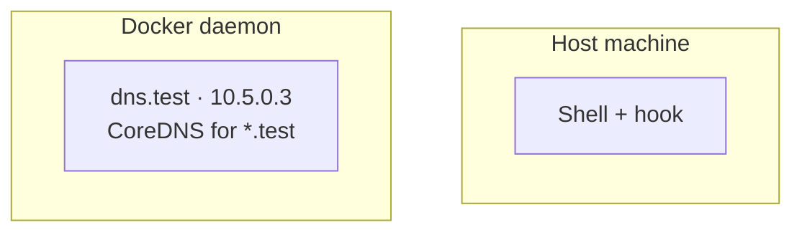

# Windsor Docs Style

This skill encodes the editorial contract from
[STYLE.md](../../../STYLE.md). Use it any time you're writing or
editing a page in this repo.

## When to use this skill

- Writing a new page from scratch
- Restructuring an existing page
- Reviewing a draft for tone before opening a PR

For a *pre-PR pass* (check frontmatter, links, terminology, render),
use [`docs-review`](../docs-review/SKILL.md) instead. If the page
describes cli or core behavior, ground the prose first with
[`upstream-history`](../upstream-history/SKILL.md) — docs drift
silently when the code moves underneath them.

## The 30-second model

This repo holds Windsor's **general docs** — concepts, how-tos,
overviews. Reference docs (every flag, every field) live in
`windsorcli/cli` and `windsorcli/core` and get vendored alongside
these pages at build time.

## Frontmatter (required)

```yaml
---
title: Sentence-case title
description: One sentence under 160 chars. Used for OG, search, and llms.txt.
---
```

Both fields are required, and `description:` is capped at 160
characters. CI rejects pages missing either, or with overlong
descriptions.

## Pages stand alone

Agents and search results fetch single pages, not whole sections.
Three rules that follow from that:

- **No forward references.** `As we'll see below` or `as discussed
  above` assume the reader is reading top-to-bottom. They probably
  aren't. Vale's `Windsor.ForwardReferences` flags these.
- **Restate context at each section start.** Which command? Which
  context? Which layer? A reader who deep-linked to `#troubleshooting`
  shouldn't have to scroll up to know what's being troubleshot.
- **Link, don't cross-reference.** If a concept lives elsewhere,
  link to it. Don't write `the schema (covered earlier)`.

## Plain markdown only

This repo's pages are vendored into Astro, which supports MDX
components. But raw `.md` fetches don't get the renderer. Stick
to portable syntax: CommonMark, GFM tables, fenced code blocks,
mermaid, frontmatter, and the small HTML set markdownlint allows
(`<details>`, `<kbd>`, `<sup>`, `<br>`, ``).

If a section *only* renders on the website, the agent reading it
sees broken markup.

## Voice rules

- **Direct.** Active voice. Subject does the verb.
- **Calm.** No exclamation points. No marketing words.
- **Specific.** Numbers, paths, command names, real timings.
- **Honest about scope.** Workstation-only? Say so in the lead.

Banned words (Vale enforces — `styles/Windsor/MarketingWords.yml`):
`seamless`, `powerful`, `simple`, `simply`, `leverages`, `robust`,
`magical`, `cutting-edge`, `world-class`, `blazingly`, `effortless`,
`next-generation`.

Hedges to drop: `basically`, `just`, `really`, `simply`,
`essentially`, `obviously`, `clearly`, `of course`.

## Voice persona

Pick the voice before you pick the words. Write as one experienced
engineer explaining something to another — a competent peer who can
`sudo`, not a stranger you're selling to or a beginner you're
lecturing. That archetype, not any particular writer, is the persona.
Its qualities are concrete and checkable:

- **Plain.** Short sentences, ordinary words. If a shorter word works,
  use it.
- **Concrete.** Real commands, paths, numbers, outcomes — never an
  abstraction where an example would do.
- **Calm and economical.** No hype, no padding. Every sentence earns
  its place.
- **Curious about the machine, not showing off.** Explain how it works
  because that's useful, not to impress.

For documented conventions to lean on, cite reusable style guides
rather than a personality — they're built to be adopted, they don't go
stale, and a new contributor can actually read them. This repo already
extends the **Microsoft Writing Style Guide** (see `.vale.ini`); the
**Google developer documentation style guide** and plain-language
government guides like **GOV.UK** are good public references for the
same register.

The register shifts by page type (the types in
[ADR 0001](../../../adrs/0001-guide-first-two-tier-pages.md)):

- **Guide tier — how-to and tutorial.** Second person, present tense,
  the task in the verb: "You run `windsor up`, and the cluster comes
  up." The reader is mid-task; keep them moving.
- **Under the hood — explanation.** Third-person about the *system*,
  mechanism first: "Windsor walks up the tree looking for
  `windsor.yaml`." Precise and unhurried, no second-person
  hand-holding.
- **Section overviews — explanation.** Lead with the idea, not a
  command — one strong definition sentence, then the shape of the
  thing.

### The anti-voice — don't write like an LLM

The fastest way to sound wrong is to sound like generic AI prose. If a
sentence could open a thousand blog posts, cut it. Tells to delete on
sight:

- **Inflated vocabulary:** `delve`, `tapestry`, `testament to`,
  `realm`, `landscape`, `boasts`, `pivotal`, `vibrant` (and the
  banned marketing words above).
- **Throat-clearing:** `it's worth noting that`, `it's important to
  understand`, `in today's fast-paced world`, `when it comes to`,
  `let's dive in`.
- **Hollow structure:** the rule of three on every list; "not just X,
  but Y" / "it's not about X, it's about Y"; a present-participle tail
  clause tacked on to sound profound (`, further enhancing reliability`).
- **The "verb *for you* — comma list — qualifier tail" cadence:**
  "Windsor runs Terraform for you — `init`, `plan`, `apply`, and
  `destroy`, in dependency order." One em-dash into a tidy list into a
  trailing qualifier, all in a single breath. Split it: a short
  declarative, then one concrete sentence. Drop the "for you" / "by
  hand" reassurance tags while you're at it.
- **Balanced negative parallelism:** "you don't X, and you don't Y" —
  two negations hung symmetrically on `and you don't`. Same family as
  "not just X, but Y." Say what the reader *does*, once.
- **Reassurance tails:** "for you," "yourself," "so you don't have to,"
  "the right/correct X." They flatter the tool instead of stating what
  it does. "`KUBECONFIG` is set for you" → "set automatically";
  "targets the right cluster" → "targets the new context's cluster."
- **Vague list filler:** a trailing `and the rest`, `and more`, `and
  other …`, `and so on`. Name the items or bound the set — don't wave
  at it. "your `KUBECONFIG`, cloud profile, and the rest" → list them,
  or "the per-context variables."
- **Definition-thesis openers:** opening a page or section by *defining
  its subject* ("Windsor wraps Terraform," "X is a Y that …") instead
  of stating what it does or the one fact the reader needs. Concept and
  `overview.md` leads are the exception — they're meant to define.
- **Em-dashes in prose.** Avoid them. Convert to a colon, semicolon,
  comma, or parentheses: `X — appositive — Y` → `X (appositive) Y`;
  `statement — tacked-on clause` → `statement; clause`;
  `**Term** — definition` (lists) → `**Term**: definition`. The only
  em-dashes that stay are `[Page — Section]` link labels and text
  inside code fences. In **YAML frontmatter** use a comma or
  parentheses, never a colon — an unquoted `key: value` colon breaks
  the parse.

The point isn't a banned-word list — it's that this register is vague
and unearned, the opposite of the specific, calm voice above.
[Wikipedia's "Signs of AI writing"](https://en.wikipedia.org/wiki/Wikipedia:Signs_of_AI_writing)
is a good running catalog of the tells.

## Techniques worth stealing

The anti-voice list says what to cut. These are the moves the best
slightly technical docs — Django's tutorial, Stripe's quickstarts,
the Rails getting-started guide — actually make. They're checkable:

- **Show the payoff before the prose.** Lead with the command that
  produces a result, then explain it. The page-shape template's
  "minimal example up front" is this rule.
- **Predict the reader's next question and answer it in the same
  sentence.** "which `up` does not request on its own" pre-empts "why
  not?" without a digression.
- **Be honest about scope and the ugly parts.** "There is no
  `--force`." "It does not touch live cloud resources." A named limit
  reads as competence; a glossed one reads as marketing.
- **Concrete, memorable example values over `foo`/`bar`.** Real
  context names (`local`, `staging`), real paths, real output.
- **Vary sentence length on purpose.** A long sentence that carries
  the mechanism, then a short one that lands it. A run of uniform
  medium-length sentences is the deepest AI tell — deeper than any
  single word.
- **One idea per page; link out for the rest.** Don't fold reference
  detail into a how-to. The two-tier seam from
  [ADR 0001](../../../adrs/0001-guide-first-two-tier-pages.md) is
  where the extra detail goes.

## Calibration samples

Rules tell you what to avoid; samples tell you what to hit. These
three excerpts are one per register from
[ADR 0001](../../../adrs/0001-guide-first-two-tier-pages.md). Read the
matching one before you write that page type, and match the *rhythm*,
not the content. The overview lead below is the docs owner's own
writing — when a generated draft and these samples disagree, the
owner's prose wins.

### Guide tier (how-to) — [`contexts/lifecycle.md`](../../../content/contexts/lifecycle.md)

> Host networking and DNS need elevation, which `up` does not request
> on its own. It hands that to `configure network` instead: sudo on
> macOS/Linux, an Administrator PowerShell on Windows.

Why it works:

- **Varied rhythm.** A long sentence carries the mechanism; a short
  colon-clause names the three cases. Not two uniform sentences.
- **Concrete, not abstract.** Names the exact command and the exact
  elevation per OS — never "the appropriate permissions."
- **Answers the next question inline.** "which `up` does not request
  on its own" pre-empts "why doesn't `up` just do it?" without a
  digression.

### Under the hood (explanation) — [`contexts/environment-injection.md`](../../../content/contexts/environment-injection.md)

> To choose project or global mode, Windsor walks up from the current
> directory looking for `windsor.yaml`. If it finds one, that
> directory is the project root and the shell is in project mode. If
> it finds none, Windsor falls back to `~/.config/windsor` and runs in
> global mode.

Why it works:

- **Mechanism first, third person about the system.** The subject is
  Windsor and the verb is what it does — "walks up," "falls back." No
  second-person hand-holding.
- **Plain words for a precise idea.** "Walks up… looking for" beats
  "performs an upward traversal in search of."
- **Sentence shape mirrors the logic.** "If it finds one… / If it
  finds none…" — the parallel structure carries the branch so the
  reader doesn't have to reconstruct it.

### Section / overview lead (explanation) — [`blueprints/terraform.md`](../../../content/blueprints/terraform.md)

> Windsor manages a Terraform stack defined in a blueprint. Stacks are
> built sequentially, threading Terraform output values to
> corresponding input values according to the facet definition.

Why it works:

- **States what the system does, no windup.** No "X is a Y that…"
  definition-thesis, no analogy, no "for you." Subject, verb, object.
- **Dense with real nouns.** "threading output values to input values
  according to the facet definition" carries the mechanism; the work is
  in the nouns, not the adjectives.
- **No em-dash, no flourish list, no trailing reassurance clause.** Two
  plain declarative sentences. This is the truest target here: the docs
  owner wrote it, not a model.

## Page shape

````markdown
---
title: ...
description: ...
---

Lead paragraph — 2-3 sentences. What this page covers, who it's
for, what the reader can do after.

```bash
# Minimal example up front (how-to pages)
windsor init local
```

## Anatomy

What the moving parts are. Table or mermaid if relationships are
non-obvious.

## Walkthrough

Sequential steps. One command + one paragraph each. Not the other
way around.

## Troubleshooting

Symptom · cause · fix. Three to five entries max — link reference
for the full list.

## Where to next

- [Related page](../section/related.md)
- [Reference](https://www.windsorcli.dev/reference/cli/...)
````

Drop a section if a page genuinely doesn't need it. Don't pad.

## Link conventions

- **Target in this repo → relative `.md` path**: `[schema](../blueprints/schema.md)`,
  `[first project](../getting-started/first-project.md)`. They resolve in
  GitHub's raw view and for agents fetching the raw page; the website
  rewrites them to clean routes (`/blueprints/schema`) when it vendors the
  docs. Don't use bare site paths (`/blueprints/schema`) — they're dead when
  the raw `.md` is read on its own.
- **Target not in this repo → `windsorcli.dev` URL**: `cli`/`core` reference
  or anything off-repo, e.g.
  `[the up command](https://www.windsorcli.dev/reference/cli/commands/up)`.
  There's no local file to reach with a relative path; the URL works on
  GitHub and the website localizes it to a root-relative path at vendor time.
- External links: `[label](https://...)`. Bare URLs only inside code
  blocks.
- Every link should pay rent — what does the reader learn by
  following it?

## Code fences

- Always declare a language: `bash`, `yaml`, `terraform`, `mermaid`,
  `text` for plain output.
- Prefer copy-pasteable. Placeholders use angle brackets:
  `windsor init <context>`.
- Show output when output is the point. Hide it otherwise.
- Long output goes in `<details>` with a one-line `<summary>`.

## Mermaid

Use when spatial relationships matter (host / container / cluster
boundaries). Don't use as a fancy bullet list.



Conventions:

- One `subgraph` per boundary
- `TB` for hierarchy, `LR` for pipelines
- Each node has a name and a one-line role
- Reference: `content/workstation/overview.md`

## Terminology

| Use         | Not                          |
|-------------|------------------------------|
| Windsor CLI | `windsorcli`, `WindsorCLI`   |
| Kubernetes  | `K8s`, `k8s`                 |
| GitHub      | `Github` (lowercase `github` is fine in URLs/paths) |
| macOS       | `MacOS`, `Mac OS`            |
| open-source (adj.) | `open source` (adj.)  |

Vale's `Windsor.Spelling` rule auto-swaps these.

## File naming and IA

- All pages live under `content/` — for example,
  `content/workstation/overview.md`
- Filenames: kebab-case (`first-project.md`)
- Each section has an `overview.md` that establishes scope and links
  to children
- Don't duplicate filenames across sections without a section prefix
  in the title
