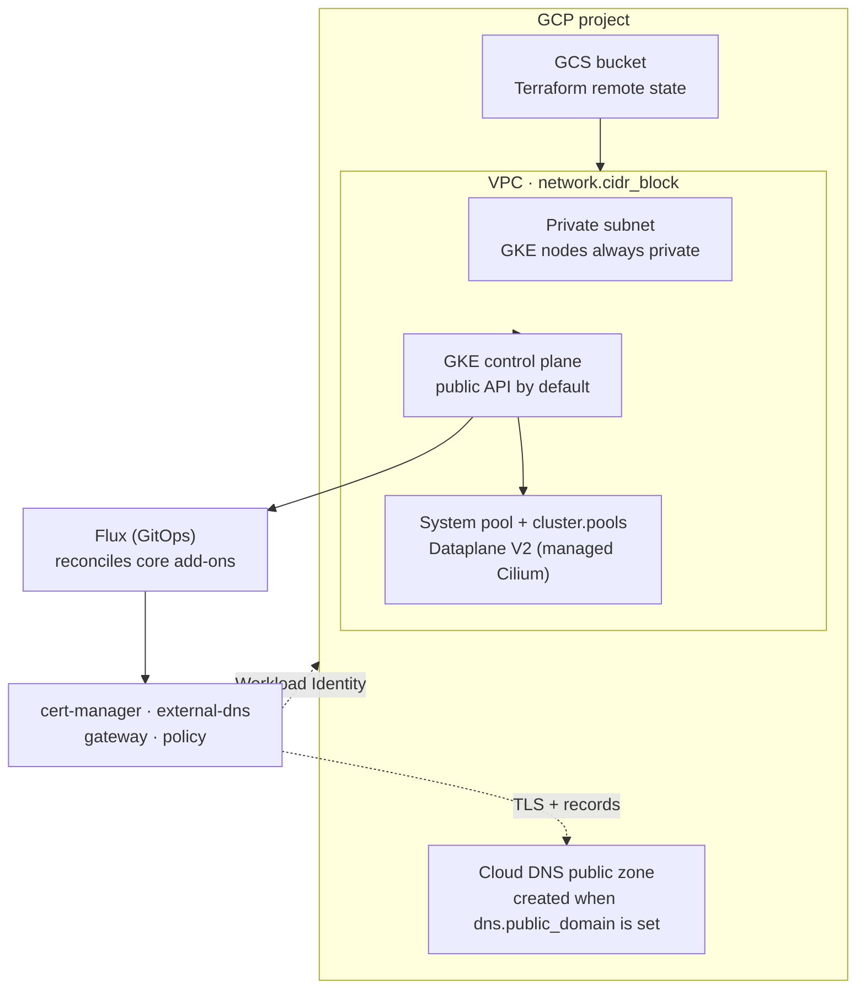

This guide stands up a production-style Windsor stack on GCP: a dedicated VPC, a [GKE](https://cloud.google.com/kubernetes-engine) cluster, Terraform state in a GCS bucket, and the `core` blueprint's services reconciled by Flux. It targets a **non-workstation context**: there is no local VM, so the lifecycle is `init` → `bootstrap` → `apply` → `destroy`. For the concepts behind those verbs, see [Command model](../provisioning/workflow.md).

## Prerequisites

- A GCP project and credentials on your shell (`gcloud auth application-default login`, or a service account key). Windsor uses the standard Google credential chain, so any setup `gcloud` accepts works.
- Terraform (or OpenTofu) and `kubectl` on your `PATH`. Run `windsor check` to validate the toolchain.
- A git repository for the project (`windsor init` refuses to scaffold outside one).
- For public DNS and TLS: a domain you can delegate to Cloud DNS.

## What gets created

Setting `platform: gcp` selects the GCP path in the `core` blueprint. Windsor provisions the following, in dependency order, then hands ongoing reconciliation to Flux:



Nodes are always private (`enable_private_nodes: true`); the control plane's API endpoint is public by default, open to `0.0.0.0/0`. There's no schema knob to restrict it yet. Persistent Disk CSI and `metrics-server` ship built into GKE — Windsor suppresses its own `metrics-server` copy for this platform rather than run two. Disks use Google's default managed encryption; there's no customer-managed-key wiring yet, unlike AWS and Azure.

Unlike AWS and Azure, there's no CNI choice: GKE always runs Dataplane V2, Google's managed Cilium integration, wired inline on the cluster module. `cluster.cni.driver` has nothing to select here — Windsor's own `cni`/Cilium kustomize component never installs on this platform.

## 1. Create the context

```bash
windsor init gcp-prod --platform gcp
windsor set context gcp-prod
```

`--platform gcp` defaults the Terraform backend to `gcs` and selects the GCP facet. This creates `contexts/gcp-prod/` with a `blueprint.yaml` and `values.yaml`.

## 2. Configure values

Edit `contexts/gcp-prod/values.yaml`. A minimal public-facing cluster:

```yaml
platform: gcp
gcp:
  project_id: my-project-id
network:
  cidr_block: 10.42.0.0/16
dns:
  public_domain: gcp-prod.example.com    # provisions a Cloud DNS zone + ACME TLS
email: platform@example.com              # required when public_domain is set
```

`gcp.project_id` is required — every GCP API call needs it, and there's no fallback. `gcp.region` defaults to `us-central1` when unset; the network module reads it directly, and the cluster module derives its own region from network's output rather than `gcp.region` again, so cluster and network always colocate regardless of how region was set.

When `dns.public_domain` is set, Windsor provisions a public Cloud DNS zone, wires `external-dns` to manage records in it, and issues real TLS certificates through Let's Encrypt (ACME) using a DNS-01 challenge scoped to that zone via Workload Identity. `email` is required in that case.

Common additional knobs:

| Key | Effect |
|-----|--------|
| `topology: ha` | The system pool grows from 1 node to 2 (a leader-election standby, not quorum), and every pool becomes eligible to spread across all of the VPC's zones instead of just one. Doesn't by itself change `cluster.pools` counts; see [Node pools](#node-pools). |
| `observability.enabled: true` | Grafana, Prometheus, and the logging stack. |

`dns.private_domain` and `gateway.access: private` have no effect on this platform yet — GCP has no private-zone wiring, unlike AWS and Azure.

### Node pools

Size the cluster with `cluster.pools`, which maps to GKE node pools and is portable across the other cloud platforms. Each pool picks a **class** (which selects sensible machine types) and a `count`; add an `autoscaling` block to scale between bounds instead of holding a fixed size:

```yaml
cluster:
  pools:
    apps:
      class: general        # system | general | compute | memory | storage | gpu | arm64
      count: 2
      autoscaling:
        min: 2
        max: 6
```

`count` is required on every pool; `autoscaling` is optional and defaults on (min 1, max 3, seeded from `count`) for every class except `system`. When `cluster.pools` is unset, the cluster falls back to one autoscaling `general` pool (1-3 nodes). Each class resolves to a fallback-ordered machine-type list, so an autoscaling pool tolerates single-type capacity shortages by falling over to the next entry; a fixed-count pool only ever uses the first.

GKE's system pool doesn't go through `cluster.pools` at all — it's a separate, always-created pool wired inline on the cluster module (`e2-standard-2`, fixed at 1 node, 2 under `topology: ha`), the same way AKS carries its own built-in system pool outside `cluster.pools`. A `cluster.pools.system` entry creates a second, additional pool rather than resizing it. Changing the inline system pool's size or machine type needs a raw `contexts/<context>/terraform/cluster.tfvars` setting `system_node_pool` directly — there's no portable schema path for it yet.

`topology: ha` widens `node_locations` from one zone to every zone the VPC exposes, for the system pool and every `cluster.pools` entry alike. It doesn't raise a `cluster.pools` `count` or `autoscaling` minimum on its own — a `topology: ha` cluster with the default pool still starts at one `general` node, just now eligible to land in any zone instead of one. That eligibility alone isn't node-level HA: if that node's zone goes down, the autoscaler has to notice and provision a replacement, rather than a standby already running. For genuine node-level redundancy, pair `topology: ha` with an explicit multi-node `count` or `autoscaling.min`:

```yaml
topology: ha
cluster:
  pools:
    apps:
      class: general
      count: 3
```

Node spread alone isn't sufficient either: workloads still need pod anti-affinity across those nodes to actually benefit from it.

## 3. Bootstrap

`bootstrap` runs the whole first-time setup, including the chicken-and-egg of creating the GCS bucket with Terraform and then migrating state into it:

```bash
windsor bootstrap gcp-prod
```

`bootstrap` blocks until every Kustomization reports ready. Windsor applies the components in order (GCS backend, VPC, Cloud DNS zone if public, GKE, then Flux), migrating state from local to the GCS bucket once it exists. The on-disk `windsor.yaml` is never mutated during the migration. See [Terraform — Bootstrap](../components/terraform.md#bootstrap) for the mechanics.

If you delegated `dns.public_domain` to the new Cloud DNS zone, update your registrar's NS records to the zone's nameservers so ACME validation and external-dns can resolve.

## 4. Verify

```bash
kubectl get nodes                       # node pools Ready
kubectl get kustomizations -A           # Flux reconciling
windsor show blueprint                  # the fully composed blueprint
windsor explain cluster.pools           # trace a value to its source
```

`kubectl` uses the context's `KUBECONFIG`; prefix with `windsor exec --` or install the [shell hook](../contexts/environment-injection.md) so it's exported automatically.

## 5. Day-two changes

Edit `values.yaml`, preview, then apply. `apply` reconciles without the first-run backend dance:

```bash
windsor plan                            # summary across all components
windsor apply --wait
```

Target a single layer when iterating:

```bash
windsor apply terraform cluster         # one Terraform component
windsor apply kustomize observability   # one Flux kustomization
```

## 6. Tear down

```bash
windsor destroy --confirm=gcp-prod
```

`destroy` removes the Flux kustomizations, then the Terraform components in reverse order, with the GCS backend removed last so dependent state is written out first. The public Cloud DNS zone lives in its own stack, so a full `destroy` removes it too. To keep the delegated zone, destroy individual components instead. See [destroy safety](../maintenance/destroy.md#tear-down).

## Troubleshooting

- **`bootstrap` fails on the backend stage.** Confirm credentials are active (`gcloud auth application-default print-access-token`) and `gcp.project_id` is set. The backend stack runs first; a credential or project error stops everything else.
- **`gcp.project_id` validation error.** The GCP facet requires it explicitly — there's no environment-variable fallback the way `AWS_REGION` works for AWS.
- **TLS certificates stay pending.** ACME needs the public zone reachable; verify the registrar's NS records point at the Cloud DNS zone, that `email` is set, and that cert-manager's Workload Identity binding landed (`windsor show kustomization pki-install`).
- **A `cluster.pools.system` entry didn't change the system pool.** GKE's system pool is wired inline on the cluster module, not reachable through `cluster.pools` — see [Node pools](#node-pools).

## Where to next

- [Command model](../provisioning/workflow.md) — the full command model
- [Destroy](../maintenance/destroy.md) — safety behaviors and locking on teardown
- [Terraform](../components/terraform.md) — state backends, the bootstrap two-phase apply, cross-component outputs
- [SOPS](../secrets/sops.md), [1Password](../secrets/1password.md) — for sensitive values
- [AWS](aws.md), [Azure](azure.md), [Hetzner](hetzner.md), [Hyper-V](../virtual/hyperv.md), and [vSphere](../virtual/vsphere.md) — the other deployment targets
