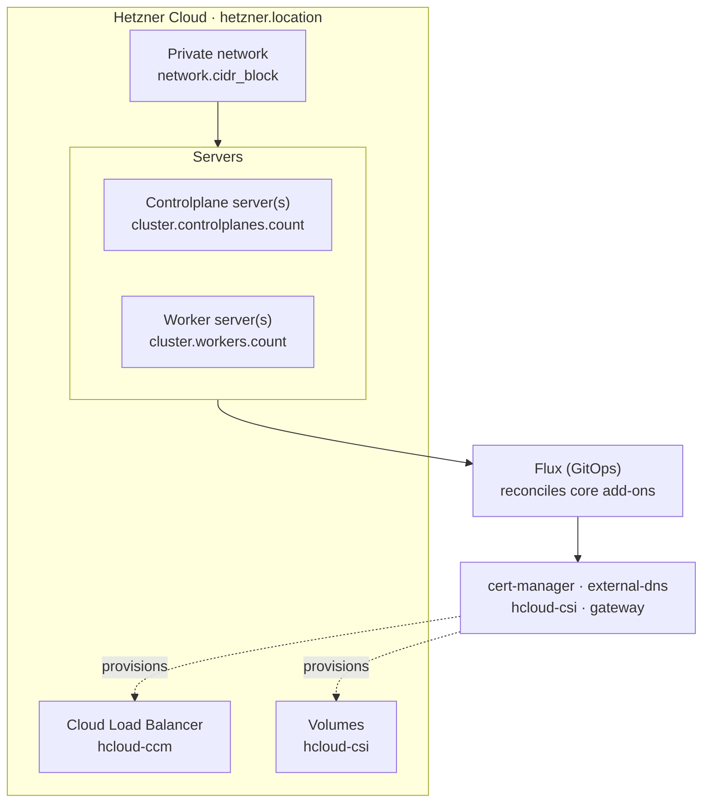

This guide stands up a Windsor stack on [Hetzner Cloud](https://www.hetzner.com/cloud/): Talos Linux servers on a private network, Hetzner's Cloud Load Balancer and Volumes, and the `core` blueprint's services reconciled by Flux. It targets a **non-workstation context**. There is no local VM, so the lifecycle is `init` → `bootstrap` → `apply` → `destroy`. For the concepts behind those verbs, see [Command model](../provisioning/workflow.md).

Unlike AWS or Azure, Hetzner has no managed Kubernetes offering. `cluster.driver` is always `talos`, and Windsor builds the cluster itself from bare servers.

## Prerequisites

- A Hetzner Cloud project and an API token with read/write access. Set it via a `${secret(...)}` reference in `values.yaml`, or export `HCLOUD_TOKEN` in your shell. Either satisfies the requirement.
- Terraform (or OpenTofu) and `kubectl` on your `PATH`. Run `windsor check` to validate the toolchain.
- A git repository for the project (`windsor init` refuses to scaffold outside one).
- For public DNS and TLS: a domain, and (optionally) an existing Hetzner-managed parent zone to auto-delegate from.

## What gets created

Setting `platform: hetzner` selects the Hetzner path in the `core` blueprint:



Windsor builds a Talos Image Factory snapshot on first apply, boots servers from it into Talos maintenance mode, then applies machine config over each server's public IP. Hetzner has no equivalent to S3 that Terraform's backend can encrypt at rest, so the backend tier is the `cluster` component itself: `bootstrap` applies it against local state first, then migrates that state into the cluster. There's no separate state-bucket phase to run first, the way AWS and Azure have.

## 1. Create the context

```bash
windsor init hetzner-prod --platform hetzner
windsor set context hetzner-prod
```

## 2. Configure values

Edit `contexts/hetzner-prod/values.yaml`. A minimal public-facing cluster:

```yaml
platform: hetzner
hetzner:
  token: ${secret("MyVault", "hetzner", "token")}
  location: fsn1
network:
  cidr_block: 10.5.0.0/16
cluster:
  controlplanes:
    count: 1
  workers:
    count: 2
dns:
  public_domain: hetzner-prod.example.com
email: platform@example.com
```

`cluster.pools` is for elastic providers (AWS, Azure, GCP); Hetzner ignores it. `cluster.controlplanes.count` and `cluster.workers.count` set node counts directly — `workers.count` defaults to `1` when unset — and each sizes from `cluster.{controlplanes,workers}.instance_type` (a Hetzner server type, `cpx31` by default) rather than a portable class name.

`topology` defaults from those counts when you don't set it explicitly: one node total resolves to `single-node`, three or more controlplanes to `ha`, anything else to `multi-node`. The minimal config above (1 controlplane, 2 workers) resolves to `multi-node`.

Common additional knobs:

| Key | Effect |
|-----|--------|
| `cluster.api_allowed_cidrs` | CIDRs allowed to reach the Talos API (`50000`) and Kubernetes API (`6443`) on each node's public interface. Defaults to `["0.0.0.0/0"]` — open to the internet. Restrict this before going to production. |
| `hetzner.network_zone` | Network zone the private network spans. Defaults to the zone matching `hetzner.location` (see the table below); set it only to override that. |
| `hetzner.dns_parent_zone` | An existing Hetzner-managed parent zone to auto-delegate `dns.public_domain` from, instead of delegating manually. |
| `cluster.controlplanes.instance_type` / `cluster.workers.instance_type` | Hetzner server type (`cpx31`, `ccx23`, …); drives both the servers Terraform creates and the CPU/memory Flux's own concurrency tuning assumes. |
| `cluster.storage.driver` | Swaps Hetzner Volumes (`hcloud-csi`) for a Talos-native driver (`openebs`, `longhorn`, `mayastor`). |
| `gateway.access: private` | Skips the public ACME issuer. external-dns still runs in public mode only — Hetzner DNS has no private-zone equivalent. |
| `observability.enabled: true` | Grafana, Prometheus, and the logging stack. |

### Locations and instance types

Six locations are available, each tied to a network zone:

| Location | Region | Network zone |
|---|---|---|
| `fsn1` (default) | Germany | `eu-central` |
| `nbg1` | Germany | `eu-central` |
| `hel1` | Finland | `eu-central` |
| `ash` | US East | `us-east` |
| `hil` | US West | `us-west` |
| `sin` | Singapore | `ap-southeast` |

The two US locations (`ash`, `hil`) offer a narrower instance catalog than the rest: only `cpx11`-`cpx51` and `ccx13`-`ccx63`. Every other line — Gen2 `cpx*2`, the shared-vCPU `cx*` line, and ARM `cax*` — fails there. Windsor validates this: setting `cluster.controlplanes.instance_type` or `cluster.workers.instance_type` outside that list while `hetzner.location` is `ash` or `hil` fails composition before Terraform ever runs, citing a `hetzner_us_instance_type_ok` requirement with the restriction spelled out. Pick a `cpx11`-`cpx51` or `ccx` type for a US location, or a EU/Asia location for the wider catalog.

## 3. Bootstrap

```bash
windsor bootstrap hetzner-prod
```

`bootstrap` provisions the private network and servers, applies Talos machine config, then installs the Flux blueprint and waits for every kustomization to report ready.

If you set `dns.public_domain` without `hetzner.dns_parent_zone`, update your registrar's NS records to the new zone's nameservers so ACME validation and external-dns can resolve.

## 4. Verify

```bash
kubectl get nodes                       # servers Ready
kubectl get kustomizations -A           # Flux reconciling
windsor show blueprint                  # the fully composed blueprint
windsor explain cluster.controlplanes.instance_type
```

`kubectl` uses the context's `KUBECONFIG`; prefix with `windsor exec --` or install the [shell hook](../contexts/environment-injection.md) so it's exported automatically.

## 5. Day-two changes

```bash
windsor plan                            # summary across all components
windsor apply --wait
```

Raising `cluster.workers.count` adds servers on the next `apply`. There's no separate autoscaling group to configure: Hetzner has no managed node group concept.

Changing `cluster.workers.instance_type` replaces worker servers — an in-place hcloud resize reboots the server and can corrupt Talos's container image store. The same change to `cluster.controlplanes.instance_type` resizes in place.

## 6. Tear down

```bash
windsor destroy --confirm=hetzner-prod
```

`destroy` removes the Flux kustomizations, then the servers and private network in reverse order. Since every component's Terraform state lives on the cluster itself (the `kubernetes` backend), `destroy` migrates it all to local state first, before the cluster hosting it disappears.

There's a separate `dns-zone` component when `dns.public_domain` is set. It's independent of the cluster, so a plain `destroy` removes it too. To keep a delegated zone while tearing down the cluster, target it separately: `windsor destroy terraform dns-zone --confirm=dns-zone`.

## Troubleshooting

- **`bootstrap` fails validating the token.** Confirm `HCLOUD_TOKEN` is exported or `hetzner.token` resolves; a token scoped to the wrong project fails with a Hetzner API 403, not a Windsor-specific error.
- **Composition fails citing `hetzner_us_instance_type_ok`.** You're in a US location (`ash`/`hil`) with an instance type outside the US catalog. See [Locations and instance types](#locations-and-instance-types).
- **The apiserver can't reach kubelet on port 10250.** Each server also has a public NIC, but kubelet binds to the private network. `nodeIP.validSubnets` pins that automatically, so this symptom usually means you changed `network.cidr_block` after the cluster existed. Nodes provisioned under the old CIDR need replacing, not just a config edit.
- **TLS certificates stay pending.** ACME needs the public zone reachable; verify NS delegation (direct or via `hetzner.dns_parent_zone`) and that `email` is set.

## Where to next

- [Command model](../provisioning/workflow.md) — the full command model
- [Destroy](../maintenance/destroy.md) — safety behaviors and locking on teardown
- [Terraform](../components/terraform.md) — state backends and cross-component outputs
- [SOPS](../secrets/sops.md), [1Password](../secrets/1password.md) — for `hetzner.token`
- [AWS](aws.md) and [Azure](azure.md) — the other deployment targets
