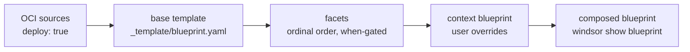

Composition turns a base template and a set of facets into the blueprint Windsor applies. This page covers the merge order and how CRDs are sequenced ahead of the stack that depends on them. For the template structure itself — `blueprint.yaml`, `schema.yaml`, `facets/` — see [The _template folder](../blueprints/templates.md).

## Composition order



Windsor builds the final blueprint in four layers:

1. **OCI sources with `deploy: true`**: components from these sources are merged. Sources with `deploy: false` are index-only; their components aren't merged but components elsewhere can reference them via `source: <name>`. Non-OCI sources (Git URLs) are always index-only.
2. **Base template**: `_template/blueprint.yaml` merges in full.
3. **Facets**: processed in ordinal order, with strategies and `when` expressions applied.
4. **User blueprint**: `contexts/<name>/blueprint.yaml` overrides without filtering. Components from earlier layers remain unless this layer sets `destroy: false` or omits them by name when the merge strategy is `replace`. See [Facets — merge strategies](../blueprints/facets.md).

Only OCI sources can have their components merged; the `deploy` flag only applies to OCI sources and defaults to `true` when omitted.

## CRD layers

A source can vendor CRDs alongside its components. Windsor installs these ahead of everything else, so no kustomization or Helm release ever races its own CRD registration.

Windsor assigns each CRD reference to exactly one owner: the default project list (`crds:` in a blueprint) claims first, then each install-eligible source claims alphabetically by name. A reference already claimed by an earlier owner is dropped from later ones, so the same CRD is never installed twice.

Each owner becomes one synthesized kustomization, named `crds` for the project list and `crds-<source>` for a named source. These are real kustomizations — target them like any other:

```bash
windsor plan crds
windsor apply kustomize crds-core
```

Every root kustomization or Flux system — one with no `dependsOn` of its own — is made to depend on all the CRD kustomizations. Anything that depends on a root reaches the CRD layer transitively, so the stack always reconciles after the CRDs are Established. No facet needs to name a CRD kustomization in `dependsOn`.

Pruning is disabled on CRD kustomizations: pruning a CRD deletes every custom resource of that kind, cluster-wide. `windsor destroy` leaves them in place.

## See also

- [The _template folder](../blueprints/templates.md) — `blueprint.yaml`, `schema.yaml`, and `facets/` structure
- [Facets](../blueprints/facets.md) — `when` expressions, ordinals, and merge strategies
- [Components](../components/terraform.md) — adding your own Terraform and Kustomize without a template
- [Command model](../provisioning/workflow.md) — the command model that applies a composed blueprint
