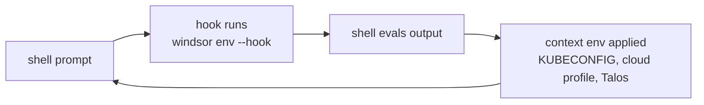

The Windsor CLI manages your environment based on the active context and your current directory. Conceptually it's similar to [direnv](https://github.com/direnv/direnv), but the variables track the active **context** rather than the current folder — switching contexts updates your `KUBECONFIG`, cloud profile, and Talos config without you having to think about it.

## How it works

`windsor hook <shell>` emits a snippet you install into your `~/.zshrc`, `~/.bashrc`, or PowerShell profile (see [Installation](/cli/installation)). On every prompt, the hook calls `windsor env --hook` and the shell evaluates the output. The variables Windsor manages are listed in `WINDSOR_MANAGED_ENV`; on context switch the hook unsets stale variables before applying the new set.



`windsor env` only emits variables when the current directory is **trusted** (recorded in `~/.config/windsor/.trusted` and added by `windsor init`). If a project hasn't been trusted, `windsor env` exits silently. See [Trusted folders](/contexts/trusted-folders).

The `--hook` flag puts `env` in non-fatal mode: warnings are suppressed and errors exit 0 so a misconfigured project never breaks your prompt. Run `windsor env` without `--hook` to see the full output and any errors.

## Project mode and global mode

Windsor walks up from the current directory looking for `windsor.yaml`. When found, the shell is in **project mode** and that directory is the project root. When no `windsor.yaml` is found, Windsor falls back to `~/.config/windsor` and runs in **global mode** so cloud-provider CLIs and `kubectl` can still operate against a Windsor-managed context from any directory.

Some context-scoped variables are deliberately suppressed in global mode so Windsor doesn't override your operator-level config. The principle: variables that describe **which** account, cluster, or project the context targets flow in both modes; variables that would redirect tools to context-local **credential or config files** flow only in project mode.

## Sample

A fresh `windsor init local` in a project directory:

```text
$ windsor env
DOCKER_CONFIG=/Users/me/.config/windsor/docker
DOCKER_HOST=unix:///Users/me/.docker/run/docker.sock
FLUX_SYSTEM_NAMESPACE=system-gitops
K8S_AUTH_KUBECONFIG=/path/to/project/contexts/local/.kube/config
KUBECONFIG=/path/to/project/contexts/local/.kube/config
KUBE_CONFIG_PATH=/path/to/project/contexts/local/.kube/config
TALOSCONFIG=/path/to/project/contexts/local/.talos/config
WINDSOR_CONTEXT=local
WINDSOR_CONTEXT_ID=wrk3va8i
WINDSOR_MANAGED_ENV=DOCKER_HOST,DOCKER_CONFIG,KUBECONFIG,KUBE_CONFIG_PATH,TALOSCONFIG,FLUX_SYSTEM_NAMESPACE,K8S_AUTH_KUBECONFIG,WINDSOR_CONTEXT,WINDSOR_CONTEXT_ID,WINDSOR_PROJECT_ROOT,WINDSOR_SESSION_TOKEN
WINDSOR_MANAGED_ALIAS=
WINDSOR_PROJECT_ROOT=/path/to/project
WINDSOR_SESSION_TOKEN=ldC26Dp
```

`WINDSOR_MANAGED_ENV` is the comma-separated list of variables Windsor will unset on the next context switch; `WINDSOR_MANAGED_ALIAS` is the same for shell aliases. Cloud-provider variables appear when the corresponding config block is present. Terraform variables appear when the current directory is inside a generated Terraform module shim.

## Reference

For the full per-tool catalog — every variable Windsor emits for AWS, Azure, GCP, Docker, Kubernetes/Talos, and Terraform, plus the project/global suppression matrix — see the [environment reference](/reference/cli/environment).

- [`windsor env`](/reference/cli/commands/env), [`windsor hook`](/reference/cli/commands/hook)
- [Trusted folders](/contexts/trusted-folders)
