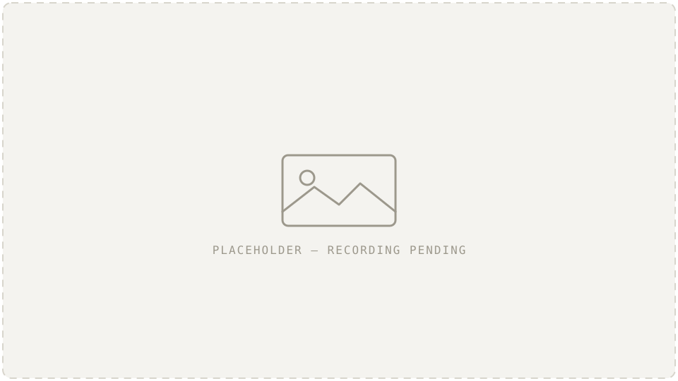
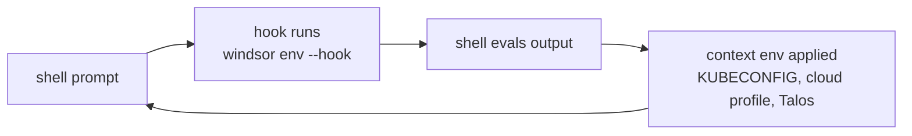

Windsor manages a set of environment variables for the active context: `KUBECONFIG`, the cloud profile, and others. On a context switch they update on the next shell prompt, so `kubectl` and the cloud CLIs target the new context's cluster and account. It works like [direnv](https://github.com/direnv/direnv), except the variables follow the active context rather than the current directory.



## Set it up once

Injection needs two things, each done once: the shell hook installed, and the project trusted.

Install the hook so your shell asks Windsor for the current environment on each prompt:

```bash
windsor hook zsh >> ~/.zshrc      # or bash, fish, powershell
exec $SHELL
```

[Installation](https://www.windsorcli.dev/cli/installation) covers the profile path for each shell.

Then trust the project by running `windsor init` in it. Windsor injects only in directories you've trusted, so a repo you clone and `cd` into does nothing until you initialize it:

```bash
windsor init local
```

After that, `windsor set context <name>` updates the environment on your next prompt.

## What changes when you switch

`windsor set context staging` changes the active context. On the next prompt the hook replaces the old context's variables with the new one's, among them `KUBECONFIG` and the cloud profile. The previous values are unset, not merged.

Whether anything is injected depends on two things. First, the directory has to be trusted; in an untrusted directory Windsor injects nothing (see [Trusted folders](trusted-folders.md)). Second, the variable set depends on whether you're inside a project. A project is any directory with a `windsor.yaml` above it, and there you get the full context environment. Outside a project, Windsor runs in global mode: the cloud CLIs and `kubectl` still target the managed context, but variables that point a tool at a project-local config or credential file are left out, so Windsor doesn't override your operator-level setup.

## Under the hood

The hook is a snippet that `windsor hook <shell>` emits for installation in `~/.zshrc`, `~/.bashrc`, or a PowerShell profile. On every prompt it calls `windsor env --hook`, and the shell evaluates the output:


```mermaid
flowchart LR
  Prompt["shell prompt"] --> Hook["hook runs<br/>windsor env --hook"]
  Hook --> Eval["shell evals output"]
  Eval --> Vars["context env applied<br/>KUBECONFIG, cloud profile, Talos"]
  Vars --> Prompt
```

`WINDSOR_MANAGED_ENV` lists the variables Windsor owns. On a context switch the hook unsets that set before applying the new one. The `--hook` flag runs `env` in non-fatal mode: warnings are suppressed and errors exit 0, so a broken project can't break your prompt. Run `windsor env` without `--hook` to see the full output and any errors.

`windsor env` emits nothing unless the current directory is trusted (recorded in `~/.config/windsor/.trusted`, added by `windsor init`). In an untrusted directory it exits silently. See [Trusted folders](trusted-folders.md).

To choose project or global mode, Windsor walks up from the current directory looking for `windsor.yaml`. If it finds one, that directory is the project root and the shell is in project mode. If it finds none, Windsor falls back to `~/.config/windsor` and runs in global mode. The rule for what each mode emits is consistent: variables that say which account, cluster, or project the context targets are injected in both modes; variables that redirect a tool to a context-local credential or config file are injected only in project mode.

A fresh `windsor init local` in a project directory produces output like this:

```text
$ windsor env
DOCKER_CONFIG=/Users/me/.config/windsor/docker
DOCKER_HOST=unix:///Users/me/.docker/run/docker.sock
FLUX_SYSTEM_NAMESPACE=system-gitops
K8S_AUTH_KUBECONFIG=/path/to/project/contexts/local/.kube/config
KUBECONFIG=/path/to/project/contexts/local/.kube/config
KUBE_CONFIG_PATH=/path/to/project/contexts/local/.kube/config
TALOSCONFIG=/path/to/project/contexts/local/.talos/config
WINDSOR_CONTEXT=local
WINDSOR_CONTEXT_ID=wrk3va8i
WINDSOR_MANAGED_ENV=DOCKER_HOST,DOCKER_CONFIG,KUBECONFIG,KUBE_CONFIG_PATH,TALOSCONFIG,FLUX_SYSTEM_NAMESPACE,K8S_AUTH_KUBECONFIG,WINDSOR_CONTEXT,WINDSOR_CONTEXT_ID,WINDSOR_PROJECT_ROOT,WINDSOR_SESSION_TOKEN
WINDSOR_MANAGED_ALIAS=
WINDSOR_PROJECT_ROOT=/path/to/project
WINDSOR_SESSION_TOKEN=ldC26Dp
```

`WINDSOR_MANAGED_ENV` is the comma-separated list of variables Windsor unsets on the next context switch, and `WINDSOR_MANAGED_ALIAS` is the same for shell aliases. Cloud-provider variables appear when the matching config block is present. Terraform variables appear when the current directory is inside a generated Terraform module shim.

## Reference

For the full per-tool catalog (every variable Windsor emits for AWS, Azure, GCP, Docker, Kubernetes/Talos, and Terraform, plus the project/global suppression matrix), run [`windsor env`](https://www.windsorcli.dev/reference/cli/commands/env) in the relevant context.

- [`windsor env`](https://www.windsorcli.dev/reference/cli/commands/env), [`windsor hook`](https://www.windsorcli.dev/reference/cli/commands/hook)
- [Trusted folders](trusted-folders.md)
