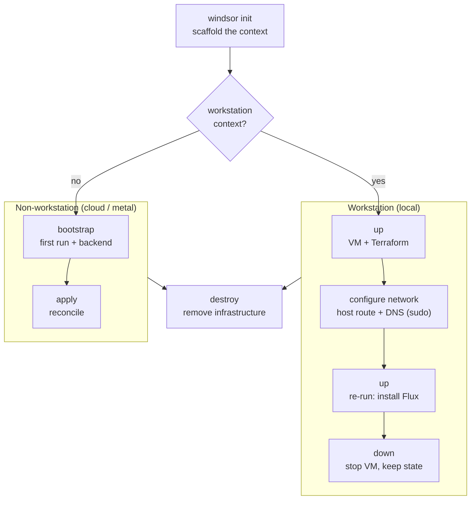

This page groups the lifecycle commands into the phases they represent. Knowing which phase a command belongs to is the shortest path through the CLI.

| Phase | Command | What it does |
|---|---|---|
| Scaffold | [`init`](https://www.windsorcli.dev/reference/cli/commands/init) | Creates the context, writes `windsor.yaml`, marks the directory trusted. |
| Workstation | [`up`](https://www.windsorcli.dev/reference/cli/commands/up) / [`down`](https://www.windsorcli.dev/reference/cli/commands/down) | Starts/stops the local VM and container runtime. Workstation contexts only. |
| First-run | [`bootstrap`](https://www.windsorcli.dev/reference/cli/commands/bootstrap) | End-to-end install for non-workstation contexts. Two-phase apply when a `backend` component is in play. |
| Install | [`apply`](https://www.windsorcli.dev/reference/cli/commands/apply) | Runs Terraform components, then installs the Flux blueprint. |
| Inspect | [`plan`](https://www.windsorcli.dev/reference/cli/commands/plan) / [`show`](https://www.windsorcli.dev/reference/cli/commands/show) / [`explain`](https://www.windsorcli.dev/reference/cli/commands/explain) | Previews changes, prints rendered resources, traces values. |
| Tear down | [`destroy`](https://www.windsorcli.dev/reference/cli/commands/destroy) | Destroys live infrastructure (Terraform + Flux). |

The path splits after `init` on whether the context runs a local workstation:



## Workstation contexts

A workstation context (typically `local`) runs a VM-backed Kubernetes cluster on your machine. It uses `up` and `down`.

```bash
windsor init local
windsor up                      # start VM + Terraform; halts if network setup is needed
windsor configure network       # first run only: prompts for sudo
windsor up                      # re-run to install the blueprint via Flux
# ... work ...
windsor down                    # stop VM, clean up local artifacts
```

`up` is workstation-only. It starts the configured VM driver, runs Terraform for the workstation infrastructure, and installs the blueprint via Flux. Pass `--wait` to block until kustomizations report ready.

Host networking and DNS need elevation, which `up` does not request on its own — it defers them to [`configure network`](https://www.windsorcli.dev/reference/cli/commands/configure-network) (sudo on macOS/Linux, an Administrator PowerShell on Windows). How `up` defers depends on what's needed:

- **Cluster reachability (Colima's host route).** `up` provisions what it can, then **halts** and prints `Run 'windsor configure network' (sudo), then re-run 'windsor up'.` Run it and re-run `up` to finish the install.
- **DNS only (Docker Desktop).** `up` completes; it prints `configure network` as a follow-up so `*.<domain>` resolves from your browser. Run it once — no re-run needed.

Either way, writing the resolver entry requires elevation, so DNS activation applies to every local runtime including Docker Desktop. Once configured, later `up` runs don't repeat the step. Use `--dry-run` to preview and `--revert` to remove what it installed.

`down` stops the VM and cleans local artifacts. It does not destroy live cloud resources — for that, run `destroy` first.

## Non-workstation contexts

Staging, production, and any other deployment context does not run a VM. The first run uses `bootstrap`; subsequent reconciles use `apply`.

```bash
windsor init staging
windsor set context staging
windsor bootstrap --wait        # first run: handles backend, migrates state
# ... later reconciles ...
windsor apply --wait
# ... and tear down ...
windsor destroy --confirm=staging
```

`bootstrap` handles the chicken-and-egg case where the remote Terraform backend (S3 bucket, DynamoDB table, etc.) is itself created by Terraform. It applies the `backend` component against local state, migrates state to the configured backend, then runs the rest of `apply`. When no `backend` component is declared, `bootstrap` is equivalent to `apply`.

`apply` does the same work as `up` does for a workstation — Terraform components, then Flux blueprint — minus the VM management. It supports targeted runs:

```bash
windsor apply terraform cluster        # one terraform component
windsor apply kustomize observability  # one Flux kustomization
```

## Inspect before you apply

`windsor plan` previews changes without applying. With no argument it prints a summary across all components; with a name it streams the full plan for that component. The summary renders per-component rows with the affected resources indented underneath, sorted destructive-first — a single replace shows as `±1` rather than `+1 -1`. Add `--summary` for the compact table, `--json` for machine-readable output in CI, or `--no-color` to disable color. `windsor show` prints rendered resources, and `windsor explain <path>` traces a single value back to where it came from in the composition.

See the per-command reference for the full flag set.

## Tear down

`destroy` removes live infrastructure: every Flux kustomization, then every Terraform component in reverse-dependency order. Before it touches anything it shows a destroy plan — the Terraform resources it will remove and the live Flux inventory queried from the cluster — then waits for confirmation.

Confirmation is always required. Type the context name (layer-wide) or component name (targeted) at the prompt, or pass `--confirm=<expected>` for CI. The value must match the prompt token exactly; a mismatch aborts. There is no `--force`.

Two safety behaviors are worth knowing:

- **`prevent_destroy` warning.** If any Terraform resource carries `lifecycle { prevent_destroy = true }`, destroy names it up front and warns that the run may halt partway through. It does not override the protection — remove the lifecycle block in HCL to actually destroy.
- **`--continue`.** By default destroy aborts on the first component failure. `--continue` keeps going, collects failures, and prints a one-line summary; it is layer-wide only (refused with a component argument). When any non-tier component is left un-destroyed, the backend tier is deferred so the state store isn't removed out from under components that still depend on it. Rerun to converge.

For workstation contexts, `destroy` then `down` is the typical full teardown:

```bash
windsor destroy --confirm=local
windsor down
```

For non-workstation contexts, `destroy` is the whole story.

## Safety and concurrency

Mutating commands (`up`, `apply`, `bootstrap`, `destroy`, and any `plan` that touches Terraform) take a per-context **stack lock** before they run — a single-writer lock at `.windsor/contexts/<context>/.stacklock`. A second `windsor` command on the same context waits up to 5 minutes for the lock, then fails and names the holder (`user@host`, PID, operation). Different contexts never contend. A read-only `plan kustomize` does not lock.

Terraform's own state lock is governed by `terraform.lock.timeout` (default `5m`), applied as `-lock-timeout` to every state-mutating Terraform command — so contended state waits rather than failing immediately.

## See also

- [Contexts](overview.md) — workstation vs non-workstation, switching contexts
- [Workstation overview](../workstation/overview.md) — VM driver options and topology
- [`init`](https://www.windsorcli.dev/reference/cli/commands/init), [`bootstrap`](https://www.windsorcli.dev/reference/cli/commands/bootstrap), [`apply`](https://www.windsorcli.dev/reference/cli/commands/apply), [`destroy`](https://www.windsorcli.dev/reference/cli/commands/destroy), [`up`](https://www.windsorcli.dev/reference/cli/commands/up), [`down`](https://www.windsorcli.dev/reference/cli/commands/down)
