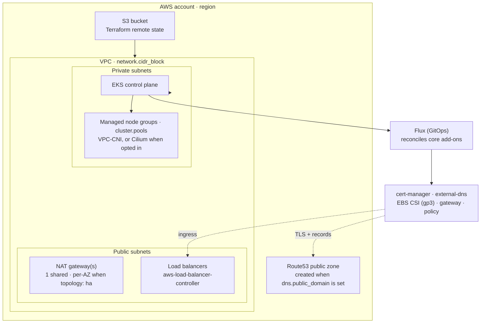

This guide stands up a production-style Windsor stack on AWS: a dedicated VPC, an [EKS](https://aws.amazon.com/eks/) cluster, Terraform state in S3, and the `core` blueprint's services reconciled by Flux. It targets a **non-workstation context** — there is no local VM, so the lifecycle is `init` → `bootstrap` → `apply` → `destroy`. For the concepts behind those verbs, see [Lifecycle](/contexts/lifecycle).

## Prerequisites

- An AWS account and credentials on your shell. Windsor uses the standard AWS credential chain — `AWS_PROFILE`, environment variables, or SSO — and resolves the active profile from your environment, so any setup the AWS CLI accepts works.
- Terraform (or OpenTofu) and `kubectl` on your `PATH`. Run `windsor check` to validate the toolchain.
- A git repository for the project (`windsor init` refuses to scaffold outside one).
- For public DNS and TLS: a domain you can delegate to Route53.

## What gets created

Setting `platform: aws` selects the AWS path in the `core` blueprint. Windsor provisions the following, in dependency order, then hands ongoing reconciliation to Flux:



EBS volumes are encrypted and cluster secrets are encrypted with a KMS key by default. The EKS API endpoint is public by default.

## 1. Create the context

```bash
windsor init aws-prod --platform aws
windsor set context aws-prod
```

`--platform aws` defaults the Terraform backend to `s3` and selects the AWS facet. This creates `contexts/aws-prod/` with a `blueprint.yaml` and `values.yaml`.

## 2. Configure values

Edit `contexts/aws-prod/values.yaml`. A minimal public-facing cluster:

```yaml
platform: aws
aws:
  region: us-east-2
network:
  cidr_block: 10.42.0.0/16
dns:
  public_domain: aws-prod.example.com    # provisions a Route53 zone + ACME TLS
email: platform@example.com              # required when public_domain is set
```

`aws.region` has no default — every AWS API call needs it, and the AWS load balancer controller, external-dns, and the ACME issuer all read it. When `dns.public_domain` is set, Windsor provisions a public Route53 zone, wires `external-dns` to manage records in it, and issues real TLS certificates through Let's Encrypt (ACME) using a DNS-01 challenge scoped to that zone — which is why `email` becomes required.

Common additional knobs:

| Key | Effect |
|-----|--------|
| `topology: ha` | One NAT gateway per AZ and node groups spread across all private subnets. The default is a single shared NAT and single-AZ node groups (cheaper). The control plane is always multi-AZ. |
| `dns.private_domain` | Name for the private, VPC-scoped Route53 zone (internal DNS). |
| `gateway.access: private` | Keep the gateway internal; pairs with `dns.private_domain` for a private issuer. |
| `cluster.cni.driver: cilium` | Replace VPC-CNI with Cilium (bootstrapped before Flux). Omit for the default VPC-CNI. |
| `addons.observability.enabled: true` | Grafana, Prometheus, and the logging stack. |

### Node pools

Size the cluster with `cluster.pools` — a portable shape that maps to EKS managed node groups. Each pool picks a **class** (which selects sensible instance types) and a size:

```yaml
cluster:
  pools:
    system:
      class: system        # system | general | compute | memory | storage | gpu | arm64
      count: 2
    apps:
      class: general
      min: 2
      max: 6               # min/max enables autoscaling between the bounds
```

Use `count` for a fixed size, or `min`/`max` for an autoscaling range. When `cluster.pools` is unset, the cluster falls back to a single `general`-class group (2 nodes, scaling 1–3). Each class resolves to a multi-instance-type list so a pool tolerates single-type capacity shortages.

## 3. Bootstrap

`bootstrap` runs the whole first-time setup, including the chicken-and-egg of creating the S3 state bucket with Terraform and then migrating state into it:

```bash
windsor bootstrap aws-prod --wait
```

`--wait` blocks until every Kustomization reports ready. Windsor applies the components in order — S3 backend, VPC, Route53 zone (if public), EKS, then Flux — migrating state from local to S3 once the bucket exists. The on-disk `windsor.yaml` is never mutated during the migration. See [Terraform — Bootstrap](/blueprints/terraform#bootstrap) for the mechanics.

If you delegated `dns.public_domain` to the new Route53 zone, update your registrar's NS records to the zone's nameservers so ACME validation and external-dns can resolve.

## 4. Verify

```bash
kubectl get nodes                       # node groups Ready
kubectl get kustomizations -A           # Flux reconciling
windsor show blueprint                  # the fully composed blueprint
windsor explain cluster.pools           # trace a value to its source
```

`kubectl` uses the context's `KUBECONFIG`; prefix with `windsor exec --` or install the [shell hook](/contexts/environment-injection) so it's exported automatically.

## 5. Day-two changes

Edit `values.yaml`, preview, then apply. `apply` reconciles without the first-run backend dance:

```bash
windsor plan                            # summary across all components
windsor apply --wait
```

Target a single layer when iterating:

```bash
windsor apply terraform cluster         # one Terraform component
windsor apply kustomize observability   # one Flux kustomization
```

## 6. Tear down

```bash
windsor destroy --confirm=aws-prod
```

`destroy` removes the Flux kustomizations, then the Terraform components in reverse order, with the S3 backend removed last so dependent state is written out first. The state bucket is emptied and deleted as part of teardown. `--confirm=aws-prod` is the non-interactive equivalent of typing the context name at the prompt. The public Route53 zone lives in its own stack, so it is removed only by this destroy — to keep the delegated zone, destroy individual components instead. See [destroy safety](/contexts/lifecycle#tear-down).

## Troubleshooting

- **`bootstrap` fails on the backend stage.** Confirm credentials are active (`aws sts get-caller-identity`) and the region is set. The backend stack runs first; a credential or region error stops everything else.
- **`aws.region` validation error.** The AWS facet requires `aws.region`; set it in `values.yaml` or export `AWS_REGION`.
- **TLS certificates stay pending.** ACME needs the public zone reachable — verify the registrar's NS records point at the Route53 zone, and that `email` is set.
- **Nodes don't join after a CNI change.** Switching `cluster.cni.driver` to `cilium` reorders the dependency graph (Cilium bootstraps before Flux). Re-run `windsor apply --wait` and check the `cni` component.

## Where to next

- [Lifecycle](/contexts/lifecycle) — the full command model and safety behaviors
- [Terraform](/blueprints/terraform) — state backends, the bootstrap two-phase apply, cross-component outputs
- [Secrets management](/deployment/secrets-management) — SOPS and 1Password for sensitive values
- [Azure](/deployment/azure) and [Metal](/deployment/metal) — the other deployment targets
