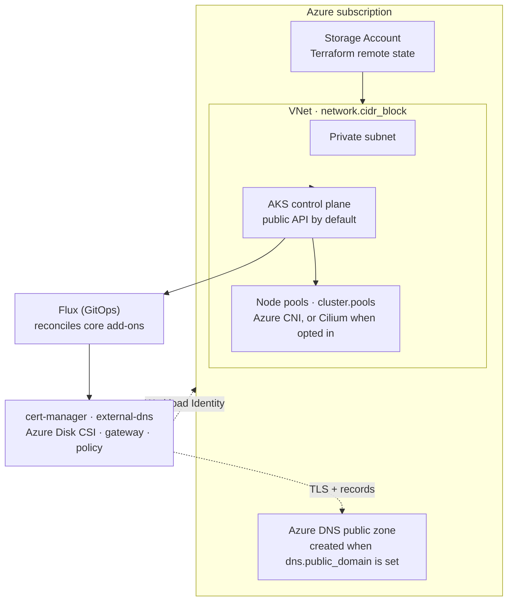

This guide stands up a production-style Windsor stack on Azure: a dedicated VNet, an [AKS](https://azure.microsoft.com/products/kubernetes-service) cluster, Terraform state in a Storage Account, and the `core` blueprint's services reconciled by Flux. It targets a **non-workstation context**: there is no local VM, so the lifecycle is `init` → `bootstrap` → `apply` → `destroy`. For the concepts behind those verbs, see [Lifecycle](../contexts/lifecycle.md).

## Prerequisites

- An Azure subscription and credentials on your shell (`az login`, a service principal, or workload identity). Windsor auto-detects the active credential mode for `kubelogin`; see [Configure values](#2-configure-values) below.
- Terraform (or OpenTofu) and `kubectl` on your `PATH`. Run `windsor check` to validate the toolchain.
- A git repository for the project (`windsor init` refuses to scaffold outside one).
- For public DNS and TLS: a domain you can delegate to Azure DNS.

## What gets created

Setting `platform: azure` selects the Azure path in the `core` blueprint. Windsor provisions the following, in dependency order, then hands ongoing reconciliation to Flux:



Disks are encrypted with a customer-managed key by default. The AKS API endpoint is public by default (`private_cluster_enabled: false` at the module level; there's no schema knob to flip it yet).

## 1. Create the context

```bash
windsor init azure-prod --platform azure
windsor set context azure-prod
```

`--platform azure` defaults the Terraform backend to `azurerm` and selects the Azure facet. This creates `contexts/azure-prod/` with a `blueprint.yaml` and `values.yaml`.

## 2. Configure values

Edit `contexts/azure-prod/values.yaml`. A minimal public-facing cluster:

```yaml
platform: azure
azure:
  subscription_id: 00000000-0000-0000-0000-000000000000
  tenant_id: 00000000-0000-0000-0000-000000000000
network:
  cidr_block: 10.42.0.0/16
dns:
  public_domain: azure-prod.example.com    # provisions an Azure DNS zone + ACME TLS
email: platform@example.com                 # required when public_domain is set
```

Unlike `aws.region`, there's no `azure.region` schema field yet: the network, cluster, and backend Terraform modules each default independently (`eastus` for network and cluster, `eastus2` for the backend). Override a component's region with a `contexts/azure-prod/terraform/<component>.tfvars` file (`region = "westus2"`, or `location` for the backend) if the defaults don't fit; see [Terraform reference](https://www.windsorcli.dev/reference/cli/terraform).

`azure.subscription_id`/`azure.tenant_id` activate Azure integration alongside (or instead of) `platform: azure` — either is sufficient. `kubelogin_mode` auto-detects from the active credential chain (`AZURE_FEDERATED_TOKEN_FILE` → workload identity, a client secret/certificate → service principal, otherwise the Azure CLI); set it explicitly only when the active credential is a mode without a process-env signal, like a managed identity. When `dns.public_domain` is set, Windsor provisions a public Azure DNS zone, wires `external-dns` to manage records in it, and issues real TLS certificates through Let's Encrypt (ACME) using a DNS-01 challenge scoped to that zone via Workload Identity, so `email` is required.

Common additional knobs:

| Key | Effect |
|-----|--------|
| `topology: ha` | Node pools become eligible to spread across availability zones 1-3, instead of a single zone. Doesn't by itself change how many nodes run; see [Node pools](#node-pools). |
| `dns.private_domain` | Name for the private, VNet-linked Azure DNS zone (internal DNS). |
| `gateway.access: private` | Keep the gateway internal, via an Azure internal load balancer; pairs with `dns.private_domain` for a private issuer. |
| `cluster.cni.driver: cilium` | Replace Azure CNI with Cilium (bootstrapped before Flux). Omit for the default Azure CNI. |
| `addons.observability.enabled: true` | Grafana, Prometheus, and the logging stack. |

### Node pools

Size the cluster with `cluster.pools`, which maps to AKS node pools and is portable across the other cloud platforms. Each pool picks a **class** (which selects sensible VM sizes) and a `count`; add an `autoscaling` block to scale between bounds instead of holding a fixed size:

```yaml
cluster:
  pools:
    system:
      class: system        # system | general | compute | memory | storage | gpu | arm64
      count: 1
    apps:
      class: general
      count: 2
      autoscaling:
        min: 2
        max: 6
```

`count` is required on every pool; `autoscaling` is optional and defaults on (min 1, max 3, seeded from `count`) for every class except `system`, which defaults fixed.

When `cluster.pools` is unset, the cluster falls back to a single autoscaling `general` pool (1-3 nodes). AKS also always creates its own built-in system node pool alongside it, tainted `CriticalAddonsOnly` so only cluster operators land there, not `cluster.pools`-managed workloads; it also scales automatically between 1 and 3 nodes, so a freshly bootstrapped cluster with no `cluster.pools` set starts at 2 nodes total and can grow to 6. Each class resolves to a preference-ordered VM size list, but AKS pools accept a single SKU each: only the first entry is actually used, and it falls back to broadly available `v3`-generation sizes rather than the newest generation, since the newer families need per-subscription-and-region enablement.

`topology: ha` only widens which zones a pool's nodes are eligible to land in; it doesn't raise `count` or an `autoscaling` minimum on its own. A `topology: ha` cluster with no explicit `cluster.pools` still starts at one node per pool, just now eligible for any of 3 zones instead of pinned to one, which isn't node-level HA: if that node's zone goes down, the autoscaler has to notice and provision a replacement rather than there being a standby already running. For genuine node-level redundancy in `cluster.pools`-managed pools, pair `topology: ha` with an explicit multi-node `count` or `autoscaling.min`:

```yaml
topology: ha
cluster:
  pools:
    apps:
      class: general
      count: 3
```

Node spread alone isn't sufficient either: workloads still need pod anti-affinity across those nodes to actually benefit from it.

AKS's built-in system pool doesn't follow this pattern. It isn't reachable through `cluster.pools` at all: a `cluster.pools.system` entry creates a second, separate node pool that collides with the built-in one's name rather than resizing it. The `platform-azure` facet passes no override for the built-in pool either, so its 1-3 autoscaling range is fixed regardless of `topology` or anything in `values.yaml`. Changing it needs a raw `contexts/<context>/terraform/cluster.tfvars` setting the full `default_node_pool` object; there's no portable schema path for it yet.

## 3. Bootstrap

`bootstrap` runs the whole first-time setup, including the chicken-and-egg of creating the Storage Account with Terraform and then migrating state into it:

```bash
windsor bootstrap azure-prod
```

`bootstrap` blocks until every Kustomization reports ready. Windsor applies the components in order (Storage Account backend, VNet, Azure DNS zone if public, AKS, then Flux), migrating state from local to the Storage Account once it exists. The on-disk `windsor.yaml` is never mutated during the migration. See [Terraform — Bootstrap](../blueprints/terraform.md#bootstrap) for the mechanics.

If you delegated `dns.public_domain` to the new Azure DNS zone, update your registrar's NS records to the zone's nameservers so ACME validation and external-dns can resolve.

## 4. Verify

```bash
kubectl get nodes                       # node pools Ready
kubectl get kustomizations -A           # Flux reconciling
windsor show blueprint                  # the fully composed blueprint
windsor explain cluster.pools           # trace a value to its source
```

`kubectl` uses the context's `KUBECONFIG`; prefix with `windsor exec --` or install the [shell hook](../contexts/environment-injection.md) so it's exported automatically.

## 5. Day-two changes

Edit `values.yaml`, preview, then apply. `apply` reconciles without the first-run backend dance:

```bash
windsor plan                            # summary across all components
windsor apply --wait
```

Target a single layer when iterating:

```bash
windsor apply terraform cluster         # one Terraform component
windsor apply kustomize observability   # one Flux kustomization
```

## 6. Tear down

```bash
windsor destroy --confirm=azure-prod
```

`destroy` removes the Flux kustomizations, then the Terraform components in reverse order, with the Storage Account backend removed last so dependent state is written out first. The public Azure DNS zone lives in its own stack, so it is removed only by this destroy; to keep the delegated zone, destroy individual components instead. See [destroy safety](../contexts/lifecycle.md#tear-down).

## Troubleshooting

- **`bootstrap` fails on the backend stage.** Confirm credentials are active (`az account show`) and the subscription is set. The backend stack runs first; a credential error stops everything else.
- **AKS create fails with "VM size not allowed."** The subscription or region doesn't have the newer VM generation enabled; the default pool classes already fall back to broadly available `v3` sizes, so this usually means an explicit `instance_types` override picked an unavailable SKU.
- **TLS certificates stay pending.** ACME needs the public zone reachable; verify the registrar's NS records point at the Azure DNS zone, that `email` is set, and that the cert-manager Workload Identity role assignment landed (`windsor show kustomization pki-install`).
- **Nodes don't join after a CNI change.** Switching `cluster.cni.driver` to `cilium` reorders the dependency graph (Cilium bootstraps before Flux). Re-run `windsor apply --wait` and check the `cni` component.

## Where to next

- [Lifecycle](../contexts/lifecycle.md) — the full command model and safety behaviors
- [Terraform](../blueprints/terraform.md) — state backends, the bootstrap two-phase apply, cross-component outputs
- [Secrets management](secrets-management.md) — SOPS and 1Password for sensitive values
- [AWS](aws.md) and [Metal](metal.md) — the other deployment targets
