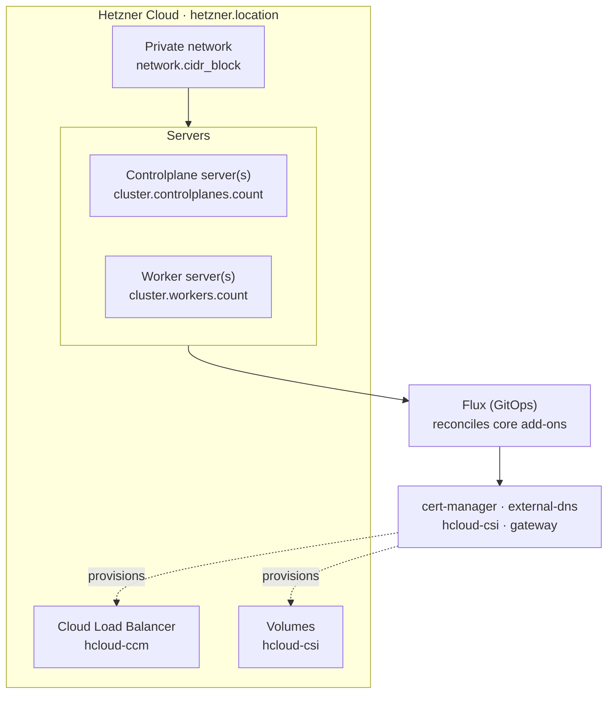

This guide stands up a Windsor stack on [Hetzner Cloud](https://www.hetzner.com/cloud/): Talos Linux servers on a private network, Hetzner's Cloud Load Balancer and Volumes, and the `core` blueprint's services reconciled by Flux. It targets a **non-workstation context** — there is no local VM, so the lifecycle is `init` → `bootstrap` → `apply` → `destroy`. For the concepts behind those verbs, see [Lifecycle](../contexts/lifecycle.md).

Unlike AWS or Azure, Hetzner has no managed Kubernetes offering — `cluster.driver` is always `talos`, and Windsor builds the cluster itself from bare servers.

## Prerequisites

- A Hetzner Cloud project and an API token with read/write access. Set it via a `${secret(...)}` reference in `values.yaml`, or export `HCLOUD_TOKEN` in your shell — either satisfies the requirement.
- Terraform (or OpenTofu) and `kubectl` on your `PATH`. Run `windsor check` to validate the toolchain.
- A git repository for the project (`windsor init` refuses to scaffold outside one).
- For public DNS and TLS: a domain, and (optionally) an existing Hetzner-managed parent zone to auto-delegate from.

## What gets created

Setting `platform: hetzner` selects the Hetzner path in the `core` blueprint:



Windsor builds a Talos Image Factory snapshot on first apply (or reuses one you supply via `image_ids`), boots servers from it into Talos maintenance mode, then applies machine config over each server's public IP. State lives in the cluster itself once it exists — Hetzner has no equivalent to S3 that Terraform's backend can encrypt at rest, so there's no separate state-bucket bootstrap phase the way AWS and Azure have.

## 1. Create the context

```bash
windsor init hetzner-prod --platform hetzner
windsor set context hetzner-prod
```

## 2. Configure values

Edit `contexts/hetzner-prod/values.yaml`. A minimal public-facing cluster:

```yaml
platform: hetzner
hetzner:
  token: ${secret("MyVault", "hetzner", "token")}
  location: fsn1
network:
  cidr_block: 10.5.0.0/16
cluster:
  controlplanes:
    count: 1
  workers:
    count: 2
dns:
  public_domain: hetzner-prod.example.com
email: platform@example.com
```

There's no `cluster.pools`: on Hetzner, `cluster.controlplanes.count` and `cluster.workers.count` set node counts directly, and each pool sizes from `cluster.{controlplanes,workers}.instance_type` (a Hetzner server type, `cpx31` by default) rather than a portable class name. `topology` is inferred from those counts — 1 controlplane resolves to `single-node`, 3+ to `ha` — rather than something you set to change them.

Common additional knobs:

| Key | Effect |
|-----|--------|
| `hetzner.network_zone` | Network zone the private network spans; must contain `hetzner.location` (see the location table below). |
| `hetzner.dns_parent_zone` | An existing Hetzner-managed parent zone to auto-delegate `dns.public_domain` from, instead of delegating manually. |
| `cluster.controlplanes.instance_type` / `cluster.workers.instance_type` | Hetzner server type (`cpx31`, `ccx23`, …); drives both the servers Terraform creates and the CPU/memory Flux's own concurrency tuning assumes. |
| `observability.enabled: true` | Grafana, Prometheus, and the logging stack. |

### Locations and instance types

Six locations are available, each tied to a network zone:

| Location | Region | Network zone |
|---|---|---|
| `fsn1`, `nbg1` | Germany | `eu-central` |
| `hel1` | Finland | `eu-central` |
| `ash` (default) | US East | `us-east` |
| `hil` | US West | `us-west` |
| `sin` | Singapore | `ap-southeast` |

The two US locations (`ash`, `hil`) offer a narrower instance catalog than the rest — only `cpx11`-`cpx51` and the `ccx` dedicated-vCPU line. Windsor validates this: setting `cluster.controlplanes.instance_type` or `cluster.workers.instance_type` to a Gen2 (`cpx*2`) or ARM (`cax*`) type while `hetzner.location` is `ash` or `hil` fails composition with an explanatory error before Terraform ever runs. Pick a Gen1/CCX type for a US location, or a EU/Asia location for the wider catalog.

## 3. Bootstrap

```bash
windsor bootstrap hetzner-prod
```

`bootstrap` provisions the private network and servers, applies Talos machine config, then installs the Flux blueprint and waits for every kustomization to report ready.

If you set `dns.public_domain` without `hetzner.dns_parent_zone`, update your registrar's NS records to the new zone's nameservers so ACME validation and external-dns can resolve.

## 4. Verify

```bash
kubectl get nodes                       # servers Ready
kubectl get kustomizations -A           # Flux reconciling
windsor show blueprint                  # the fully composed blueprint
windsor explain cluster.controlplanes.instance_type
```

`kubectl` uses the context's `KUBECONFIG`; prefix with `windsor exec --` or install the [shell hook](../contexts/environment-injection.md) so it's exported automatically.

## 5. Day-two changes

```bash
windsor plan                            # summary across all components
windsor apply --wait
```

Raising `cluster.workers.count` adds servers on the next `apply`; there's no separate autoscaling group to configure, since Hetzner has no managed node group concept.

## 6. Tear down

```bash
windsor destroy --confirm=hetzner-prod
```

`destroy` removes the Flux kustomizations, then the servers and private network in reverse order. There's a separate `dns-zone` component when `dns.public_domain` is set — it's independent of the cluster, so it's removed on the same `destroy` but would need targeting separately (`windsor destroy terraform dns-zone`) to keep a delegated zone while tearing down the cluster.

## Troubleshooting

- **`bootstrap` fails validating the token.** Confirm `HCLOUD_TOKEN` is exported or `hetzner.token` resolves; a token scoped to the wrong project fails with a Hetzner API 403, not a Windsor-specific error.
- **Composition fails with an instance-type error mentioning `ash`/`hil`.** You're in a US location with a Gen2 or ARM instance type set — see [Locations and instance types](#locations-and-instance-types).
- **The apiserver can't reach kubelet on port 10250.** Each server also has a public NIC; the private network is what kubelet binds to. This is handled automatically (`nodeIP.validSubnets` pins kubelet to the private CIDR), so this usually means `network.cidr_block` was changed after the cluster existed — nodes provisioned under the old CIDR need replacing, not just a config edit.
- **TLS certificates stay pending.** ACME needs the public zone reachable; verify NS delegation (direct or via `hetzner.dns_parent_zone`) and that `email` is set.

## Where to next

- [Lifecycle](../contexts/lifecycle.md) — the full command model and safety behaviors
- [Terraform](../blueprints/terraform.md) — state backends and cross-component outputs
- [Secrets management](secrets-management.md) — SOPS and 1Password for `hetzner.token`
- [AWS](aws.md), [Azure](azure.md), and [Metal](metal.md) — the other deployment targets
