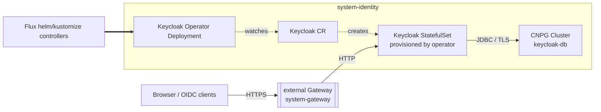

Identity gives the cluster one login every consumer can share. Turn it on
once and Grafana, kubectl, and future add-ons authenticate against the same
issuer instead of each carrying its own password.

## Turn it on

```yaml
identity:
  enabled: true
```

This hosts Keycloak in-cluster — the operator, a `Keycloak` server, and its
own Postgres database, reachable at `keycloak.${external_domain}` through
the shared gateway. A consumer with SSO support turns it on with its own
switch and never has to name Keycloak directly:

```yaml
observability:
  enabled: true
  grafana:
    sso: true   # or omit: SSO is inferred once identity is enabled
```

In `dev` mode this needs no further setup. The platform realm seeds two
users so you can see the role mapping work immediately: `dev-admin` /
`admin-password` (admin everywhere) and `dev-viewer` / `viewer-password`
(read-only). Neither exists outside dev.

## Hosted Keycloak or an external issuer

`identity.driver: keycloak` (the default) hosts Keycloak in the cluster.
`identity.driver: oidc` hosts nothing and points every consumer at an
issuer you already run:

```yaml
identity:
  enabled: true
  driver: oidc
  display_name: Acme SSO
  oidc:
    issuer: https://sso.corp/realms/platform
observability:
  grafana:
    client_secret: ${secret("MyVault", "grafana-oidc", "clientSecret")}
```

With an external issuer, Windsor deploys nothing into `system-identity` —
consumers read the issuer and bring their own client credentials, since the
external provider owns them. Either driver, consumers see the same
effective issuer and realm; nothing downstream cares which one is behind it.

## Let apps use it

A consumer opts in with its own flag rather than a global registry. Grafana
is the one shipped today:

```yaml
identity:
  enabled: true
observability:
  enabled: true
  grafana:
    sso: true
```

With the hosted driver, Core registers a `grafana` OIDC client in the
platform realm and pins its secret via
`identity.keycloak.grafana_client_secret` (a dev default applies in dev;
required otherwise). The client carries a mapper that puts the
`platform-admins` group into the token, which Grafana maps to the Admin
role — override with `grafana.role_attribute_path`, or set `grafana.sso:
false` to opt back out.

## kubectl over SSO

`cluster.oidc.enabled: true` turns on OIDC login for the Kubernetes API
server — **on Talos-driven platforms only** (Metal, Hetzner, Hyper-V,
vSphere). It works by patching Talos's own machine config with
`--oidc-*` flags on the apiserver, so it needs Windsor to control the
control plane directly:

```yaml
identity:
  enabled: true
cluster:
  oidc:
    enabled: true
```

With the hosted driver, the issuer and a public PKCE client are inferred
from the platform realm, so no `issuer_url` or `client_id` is needed — pair
this with a `kubectl` OIDC plugin such as `kubelogin`. OIDC only
authenticates; it grants no RBAC by itself. Outside dev, bind
`platform-admins` (or another realm claim) to a `ClusterRoleBinding`
yourself — in `dev`, that binding is seeded to `cluster-admin` so the
seeded `dev-admin` user can do something after logging in.

**On AWS (EKS) and Azure (AKS), this flag does nothing.** Those are managed
control planes — Windsor has no way to inject apiserver flags into them,
and neither platform facet reads `cluster.oidc` at all, so setting it is a
silent no-op rather than an error. Hosted Keycloak and Grafana SSO above
still work fully on EKS/AKS; only kube-apiserver-level `kubectl` login is
Talos-only today. Reaching the same outcome on EKS or AKS means using each
cloud's own native mechanism (EKS access entries / IAM, Azure AD/Entra
integration) instead — Windsor doesn't wire either of those up yet.

## Under the hood

Keycloak has no first-party Helm chart, so its operator is vendored
verbatim and its CRDs come in through the `crds:` layer, both from the same
upstream release and kept in lockstep.



TLS terminates at the gateway; Keycloak serves plain HTTP internally and
trusts the proxy's forwarded headers for the external scheme and host.

Enabling Keycloak also imports a `platform` realm — apps never live in
`master`. The import is one-shot: the operator applies it once, so later
changes happen in-console (or by recreating the `Keycloak` resource), not
by continuous reconciliation. The realm ships a security baseline (TLS
required, brute-force detection, a 12-character password policy, short
token and session lifetimes) and a `platform-admins` group as the one
place to grant realm administration.

`topology: ha` scales the stack: Keycloak runs 2 replicas with clustering
wired between them, on a 3-instance Postgres cluster with automatic
failover. `single-node` and `multi-node` keep both at 1.

Database traffic is `sslmode=verify-full` against Postgres's own generated
CA, ingress is HTTPS-only at the gateway, and every image in
`system-identity` is digest-pinned under policy. Client secrets never land
in git — `${secret(...)}` references resolve them at apply time, and
consumer pods wait rather than start misconfigured.

## Reference

- [Identity add-on reference](https://www.windsorcli.dev/reference/blueprints/core/kustomize/identity) — every component, dependency, and config field
- [Facets](../blueprints/facets.md), [Kustomize](../blueprints/kustomize.md) — how add-ons like this compose into a blueprint
- [Securing secrets](securing-secrets.md) — how `${secret(...)}` resolves
