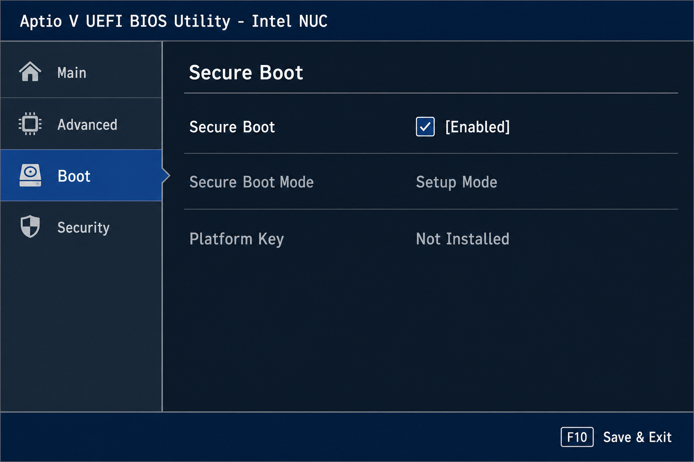
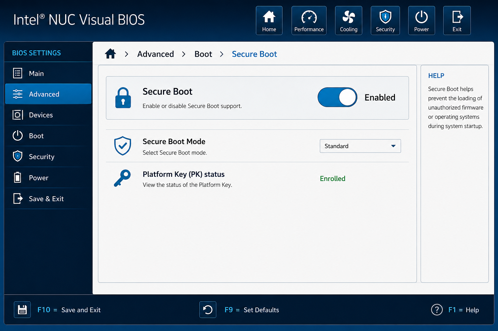

This page covers preparing a Talos **metal-amd64** image on USB and booting an Intel NUC until Talos runs in **maintenance mode** from that stick. You need a workstation (macOS or Linux), a USB drive of at least 8 GB, and the NUC on Ethernet. The walkthrough ends before machine configuration, etcd bootstrap, or kubeconfig.

```bash
curl -fL -o metal-amd64.raw.xz \
  "https://factory.talos.dev/image/<schematic-id>/<version>/metal-amd64.raw.xz"
```

## Prerequisites

- Intel NUC (x86_64) on **UEFI** (Secure Boot requires UEFI; Legacy/CSM boot is not supported for Talos Secure Boot)
- USB drive, 8 GB or larger
- Workstation with `curl`, `xz`, and `sudo`
- Ethernet on the NUC (recommended)
- Wired USB keyboard for firmware setup (Bluetooth keyboards often miss the F2 prompt)
- [`talosctl`](https://www.talos.dev/latest/introduction/installation/) on the workstation if you want to verify the node after boot

## Anatomy

| Piece | Role |
|-------|------|
| [Talos Image Factory](https://factory.talos.dev) | Builds a **schematic** (extensions, drivers) and emits a versioned **metal-amd64** raw image |
| USB stick | Holds the image; Talos boots from it in maintenance mode |
| Maintenance mode | Talos runs from RAM; nothing is installed to internal disks until you apply machine config later |
| Secure Boot | UEFI verifies boot images against enrolled keys; wrong setting blocks unsigned USB media |
| Node IP | Shown on the console or in your router DHCP client list; used with `talosctl` |

## Walkthrough

### Build the image at the factory

Open [Talos Image Factory](https://factory.talos.dev), choose extensions for your NUC, and note the **schematic ID**, Talos **version** (for example `v1.11.6`), and profile **metal-amd64**.

Export the values you will use on the workstation:

```bash
export SCHEMATIC="<schematic-id>"
export VERSION="<version>"
export ARCH="metal-amd64"
```

### Download and decompress

Download the compressed raw image from Image Factory, then decompress it. You should end with `metal-amd64.raw` in the current directory.

```bash
curl -fL -o "${ARCH}.raw.xz" \
  "https://factory.talos.dev/image/${SCHEMATIC}/${VERSION}/${ARCH}.raw.xz"
xz -d "${ARCH}.raw.xz"
```

### Identify the USB disk

On **macOS**, list disks and pick the whole-disk device (for example `/dev/disk4`, not `disk4s1`). Use the matching **raw** device for `dd` (for example `/dev/rdisk4`).

```bash
diskutil list
```

On **Linux**, list block devices and pick the removable whole disk (for example `/dev/sdb`), not a partition.

```bash
lsblk
```

Confirm the device name twice before writing. The next step erases that disk.

### Write the image

Unmount volumes on the target disk, write the raw image, then eject or sync.

On **macOS** (replace `4` with your disk number):

```bash
diskutil unmountDisk /dev/disk4
sudo dd if="${ARCH}.raw" of=/dev/rdisk4 bs=4m conv=sync
diskutil eject /dev/disk4
```

On **Linux** (replace `sdX` with your device):

```bash
sudo umount /dev/sdX* 2>/dev/null || true
sudo dd if="${ARCH}.raw" of=/dev/sdX bs=4M conv=fsync status=progress
sync
```

The `of=` argument must be the USB disk, not your system drive.

### Configure UEFI and Secure Boot

The **metal-amd64** raw image from Image Factory is not a Talos Secure Boot image. For this walkthrough, set **Secure Boot to Disabled** before booting the USB stick. If you plan to use [Talos Secure Boot](https://www.talos.dev/latest/talos-guides/install/bare-metal-platforms/secureboot/) instead, skip to [Enable Secure Boot for Talos](#enable-secure-boot-for-talos) and use the Secure Boot ISO or `installer-secureboot` image — not the standard raw image above.

| Boot media | Secure Boot setting | Notes |
|------------|--------------------|-------|
| Standard **metal-amd64** `.raw` (this page) | **Disabled** | Unsigned USB media is rejected when Secure Boot is on |
| Talos **Secure Boot ISO** or `installer-secureboot` | **Enabled** in **Setup Mode** | Talos enrolls keys on first boot; see Talos docs |

#### Enter BIOS setup

Power off the NUC. Connect a **wired** keyboard and monitor (HDMI or DisplayPort; USB-only monitors may not show the F2 prompt).

1. Press the power button.
2. Tap **F2** repeatedly as soon as the NUC logo appears until the firmware setup screen opens.
3. If F2 does not work, disable [Fast Boot](https://www.asus.com/support/FAQ/1052726/) from the power-button menu (hold power ~3 seconds, release, press **F3**), then retry F2. See [Can't access BIOS with F2](https://www.asus.com/support/FAQ/1052511/) for other causes.

Firmware hotkeys on most Intel NUC models:

| Key | Action |
|-----|--------|
| **F2** | Enter BIOS / UEFI setup |
| **F10** | One-time boot menu (pick USB) |
| **F7** | Boot menu on some ASUS NUC models (BIOS update USB) |
| **F10** (in setup) | Save changes and exit |
| **F9** (in setup) | Load optimized defaults |

Official references: [Intel NUC BIOS glossary (PDF)](https://www.intel.com/content/dam/support/us/en/documents/mini-pcs/BIOSGlossary_NUC.pdf), [Intel Express BIOS update instructions (PDF)](https://www.intel.com/content/dam/support/us/en/documents/mini-pcs/AptioV-BIOS-Update-NUC.pdf).

#### Disable Secure Boot (standard metal-amd64 USB)

Use this path for the raw image written earlier in this guide.

Menu names differ by firmware generation. Open the **Secure Boot** page and clear the **Secure Boot** checkbox.

**Aptio V BIOS** (common on ASUS NUC8 and later):

1. **Boot** → **Secure Boot** → **Secure Boot**
2. Set **Secure Boot** to **Disabled**
3. Confirm **UEFI Boot** is enabled (Secure Boot off still requires UEFI for Talos)
4. **Boot** → **Boot Configuration** or **Boot Priority** — ensure USB boot is allowed
5. Press **F10**, confirm **Yes** to save and exit



**Visual BIOS** (older Intel-branded NUC):

1. **Advanced** → **Boot** → **Secure Boot**
2. Set **Secure Boot** to **Disabled**
3. **Advanced** → **Boot** → **Boot Configuration** — enable USB in boot devices
4. Press **F10** to save and exit



ASUS publishes step-by-step guides with firmware screenshots: [Disable Secure Boot on NUCs](https://www.asus.com/us/support/faq/1052728/).

#### Enable Secure Boot for Talos

Use this path only when booting a [Talos Secure Boot ISO](https://www.talos.dev/latest/talos-guides/install/bare-metal-platforms/secureboot/) or installing with an `installer-secureboot` image from Image Factory. Do **not** enable Secure Boot for the unsigned **metal-amd64** raw image from the earlier steps.

Talos requires UEFI Secure Boot **enabled** and the firmware in **Setup Mode** on the first boot so Talos can enroll the [Sidero Labs signing key](https://factory.talos.dev/secureboot/signing-cert.pem).

1. Enter BIOS setup with **F2**.
2. Open the Secure Boot page (paths above: **Boot → Secure Boot** on Aptio V, or **Advanced → Boot → Secure Boot** on Visual BIOS).
3. Set **Secure Boot** to **Enabled**.
4. Check **Secure Boot Mode** on screen:
   - **Setup Mode** (or **Platform Key: Not Installed**) — ready for Talos key enrollment on first boot
   - **Standard Mode** with keys already installed — clear platform keys with **Clear Secure Boot Data** on the Secure Boot page before enrolling Talos keys
5. Press **F10** to save and exit.
6. Boot the Talos Secure Boot ISO from the one-time boot menu (**F10**).
7. If automatic enrollment does not start, press **Esc** at the boot menu and choose **Enroll Secure Boot keys: auto** (wording varies by firmware).

To put Aptio V / Visual BIOS back into Setup Mode when keys are already installed, on the Secure Boot page enable **Clear Secure Boot Data** (clears PK/KEK/db/dbx and enters Custom/Setup mode on next boot), save with **F10**, reboot into setup once, then disable **Clear Secure Boot Data** and leave **Secure Boot** enabled. Exact option names are in the [Intel NUC BIOS glossary — Secure Boot section (PDF)](https://www.intel.com/content/dam/support/us/en/documents/mini-pcs/BIOSGlossary_NUC.pdf).

After Talos reaches maintenance mode, confirm Secure Boot is active:

```bash
talosctl -n <node-ip> get securitystate --insecure
```

Expect `SECUREBOOT` to read `true`. Full install and upgrade steps are in the [Talos Secure Boot guide](https://www.talos.dev/latest/talos-guides/install/bare-metal-platforms/secureboot/).

#### Set USB as the boot device

After Secure Boot is configured for your path:

1. Re-enter setup with **F2** if needed.
2. On Aptio V: **Boot** → **Boot Priority** or **Boot Configuration** — move **USB** above internal NVMe/SSD, or use the one-time boot menu.
3. On Visual BIOS: **Advanced** → **Boot** → **Boot Configuration** — enable the USB device.
4. Save with **F10**.

You can also skip permanent boot-order changes: power on, press **F10** (or **F7** on some models), and select the USB entry labeled **UEFI: &lt;your USB brand&gt;**.

### Boot the NUC

Insert the USB stick, connect Ethernet, and power on. If you followed [Disable Secure Boot](#disable-secure-boot-standard-metal-amd64-usb), the standard raw image should load Talos into maintenance mode.

When Talos starts, note the node IP from the console or your router DHCP list.

### Verify with talosctl

From the workstation, confirm Talos responds on the node IP:

```bash
talosctl version --nodes <node-ip>
```

## Troubleshooting

### NUC does not boot from USB

**Symptom:** Firmware skips USB or returns to the previous boot device.

**Cause:** USB boot disabled, wrong boot order, or Secure Boot rejecting the stick.

**Fix:** Enable USB boot and set boot order as in [Set USB as the boot device](#set-usb-as-the-boot-device). For the standard **metal-amd64** raw image, [disable Secure Boot](#disable-secure-boot-standard-metal-amd64-usb). Re-flash the stick if the image write did not complete.

### Secure Boot blocks the USB stick

**Symptom:** Boot halts with a security violation, "Unauthorized" message, or immediate return to firmware.

**Cause:** Secure Boot is **Enabled** while booting the unsigned standard **metal-amd64** raw image.

**Fix:** Enter setup with **F2**, [disable Secure Boot](#disable-secure-boot-standard-metal-amd64-usb), save with **F10**, and boot again. Alternatively, switch to the [Talos Secure Boot ISO path](#enable-secure-boot-for-talos) and keep Secure Boot enabled.

### Cannot enter BIOS with F2

**Symptom:** The NUC boots straight to an OS or blank screen; F2 has no effect.

**Cause:** Fast Boot, wireless keyboard, or USB monitor without early POST output.

**Fix:** [Disable Fast Boot](https://www.asus.com/support/FAQ/1052726/), use a wired keyboard on a rear USB port, and connect HDMI or DisplayPort. See [ASUS: Can't access BIOS with F2](https://www.asus.com/support/FAQ/1052511/).

### Wrong disk selected for `dd`

**Symptom:** Workstation OS fails to boot or data is missing after the write step.

**Cause:** `of=` pointed at an internal disk instead of the USB device.

**Fix:** Re-image the affected disk from backup if you have one. On the next attempt, run `diskutil list` or `lsblk` again and verify the disk size matches the USB drive before running `dd`.

### `talosctl` cannot reach the node

**Symptom:** `talosctl version` times out or reports connection errors.

**Cause:** Wrong IP, no route to the NUC, or Talos still booting.

**Fix:** Confirm the IP on the NUC console or DHCP list. Ping the address from the workstation. Wait for boot to finish and retry.

## Where to next

- [Talos Linux documentation](https://www.talos.dev/latest/) — configuration, upgrades, and operations
- [Talos Secure Boot guide](https://www.talos.dev/latest/talos-guides/install/bare-metal-platforms/secureboot/) — enable Secure Boot, enroll keys, and install with `installer-secureboot`
- [Talos Image Factory](https://factory.talos.dev) — change schematic, version, or extensions
- [Bare-metal install guide](https://www.talos.dev/latest/talos-guides/install/bare-metal/) — install Talos to disk and form a cluster after maintenance mode
- [ASUS: Disable Secure Boot on NUCs](https://www.asus.com/us/support/faq/1052728/) — manufacturer steps with firmware screenshots
- [Intel NUC BIOS glossary (PDF)](https://www.intel.com/content/dam/support/us/en/documents/mini-pcs/BIOSGlossary_NUC.pdf) — Secure Boot option reference
