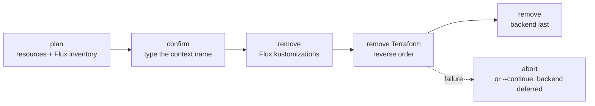

[`windsor destroy`](https://www.windsorcli.dev/reference/cli/commands/destroy) removes a context's live infrastructure. It begins by tearing down Flux kustomizations first, followed by every Terraform component in reverse-dependency order. It will display a plan before asking you for confirmation.



## Tear down

On a local workstation, [`windsor down`](https://www.windsorcli.dev/reference/cli/commands/down) is usually all you need. It removes the local environment directly: the containers, volumes, and network on Docker, or the whole VM and its data. That skips the slower, orderly Kubernetes teardown that `destroy` performs. Run `destroy` first, then `down`, when you want that orderly teardown, as you would on a production cluster.

A cloud or metal context has no local environment, so `destroy` is sufficient.

```bash
windsor down                          # local workstation: fast
windsor destroy --confirm=staging     # cloud or metal: slow but orderly
```

## Safety and concurrency

`destroy` has two safety behaviors:

- If a Terraform resource carries `lifecycle { prevent_destroy = true }`, `destroy` warns the run may halt partway through. It does not override the protection; remove the lifecycle block in HCL to actually destroy.
- By default `destroy` aborts on the first component failure. `--continue` keeps going, collects failures, and prints a one-line summary. It is layer-wide only; Windsor refuses it when given a component argument. When a non-tier component stays un-destroyed or a Flux kustomization fails to delete, `destroy` defers the backend tier so it doesn't remove the [state store](state-backend.md) out from under components that still depend on it. Rerun to converge.

To read more about safety from concurrent runs, see [Locking](overview.md#locking).

## See also

- [Overview](overview.md): where `destroy` fits among the other commands
- [State backend](state-backend.md): how the backend is created and why destroy removes it last
- [Upgrade](upgrade.md): moving a context forward instead of tearing it down
