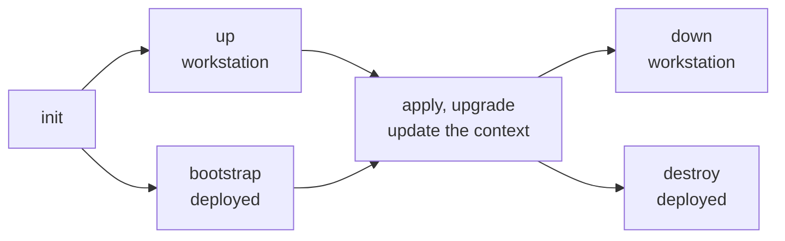

[First project](../getting-started/first-project.md) ran `init`, `up`, `destroy`, and `down` against a local workstation. Every context follows the same lifecycle: scaffold it, provision it, change it, and tear it down. The first-run and teardown commands differ by context type. A local workstation has a runtime to start and remove, and a deployed context has a state backend to create.



## A workstation context

A workstation context (typically `local`, or any name starting with `local-`) runs a Kubernetes cluster on your machine. Its lifecycle is `up` and `down`, with `apply` for changes in between. On Docker Desktop or Docker, the flow looks like this:

```bash
windsor init local
windsor up --wait               # start the runtime, run Terraform, install the blueprint
windsor configure network       # first run only: prompts for sudo
# ... work ...
windsor down                    # remove the local environment
```

`up` starts the configured runtime, runs Terraform for the workstation infrastructure, and installs the blueprint via Flux.

Once the workstation is up, [`windsor apply`](https://www.windsorcli.dev/reference/cli/commands/apply) applies a change to your blueprint or values without touching the runtime. It runs the same Terraform and Flux steps as `up`, so it suits quick iteration. It does not start the runtime or print the network follow-up.

Enabling host DNS requires elevation. When `windsor up` finishes, it requests a [`windsor configure network`](https://www.windsorcli.dev/reference/cli/commands/configure-network) as a follow-up so `*.<domain>` resolves from your browser. Running this command asks for sudo on macOS and Linux, and should be run as an Administrator in PowerShell on Windows.

`down` removes the local environment: the containers, volumes, and network on Docker, or the VM and its data on Colima. It also clears local caches and stale cluster credentials. It skips the orderly teardown that [`destroy`](destroy.md) performs, as the VM itself is destroyed, bringing any state with it.

### Colima

Colima also needs a host route to reach the cluster, and `up` cannot create the route without elevation. The first `up` provisions what it can, then stops and prints `Run 'windsor configure network' (sudo), then re-run 'windsor up'.` Run the command, then run `up` again to install the blueprint:

```bash
windsor init local --vm-driver colima
windsor up                      # stops after provisioning, asks for network setup
windsor configure network       # host route and DNS: prompts for sudo
windsor up                      # installs the blueprint via Flux
```

The same flow applies to Colima + Incus. Once the route is in place, later `up` runs skip it. See [Colima + Docker](../workstation/colima-docker.md) and [Colima + Incus](../workstation/colima-incus.md).

## A cloud or metal context

Deployment contexts that target real platforms follow a slightly different flow. The first run uses `bootstrap`; later reconciles use `apply`:

```bash
windsor init staging
windsor set context staging
windsor bootstrap               # first run: handles backend, migrates state, waits for kustomizations
# ... later reconciles ...
windsor apply --wait
# ... and tear down ...
windsor destroy --confirm=staging
```

`apply` runs the Terraform components and installs the Flux blueprint. It supports targeted runs:

```bash
windsor apply terraform cluster        # one terraform component
windsor apply kustomize observability  # one Flux kustomization
```

Use `bootstrap` on the first run. It handles the case where Terraform must create its own state backend. See [State backend](state-backend.md#bootstrap).

## Inspect before you apply

[`windsor plan`](https://www.windsorcli.dev/reference/cli/commands/plan) previews pending changes to Terraform components and Flux kustomizations without applying them:

```bash
windsor plan                    # summary of every component
windsor plan terraform cluster  # full plan for one Terraform component
```

A component that has never been applied shows as `(new)`. Add `--json` for CI or `--no-color` to turn off color.

To inspect the composed blueprint, use `windsor show` or `windsor explain`. See [Inspecting](../blueprints/inspecting.md).

## Move to a newer version

[`windsor upgrade`](https://www.windsorcli.dev/reference/cli/commands/upgrade) moves a running context to the latest stable version of each blueprint source, then reconciles it. It shows what will change and asks before it proceeds. Pass `--yes` to skip the prompt. See [Upgrade](upgrade.md) for source pinning, downgrades, and Talos nodes.

## Locking

Commands that depend on a context's state take a lock on it; `up`, `apply`, `bootstrap`, `upgrade`, `destroy`, and `plan` take out a lock. A second `windsor` command on the same context fails with an error explaining that the state is locked. Pass [`--lock-timeout`](https://www.windsorcli.dev/reference/cli/global-flags) to wait instead. The lock is local to your checkout. It keeps two `windsor` commands on one machine from colliding. It does not coordinate separate machines or CI jobs remotely.

The lock releases when the command exits. A hung command may leave an orphaned lock. [`windsor unlock`](https://www.windsorcli.dev/reference/cli/commands/unlock) removes the lock files, and `--force` skips that prompt. Use it only when no other `windsor` process is using the context.

Terraform's own state lock is separate. See [State locks](state-backend.md#state-locks).

## Reference

| Group       | Command                                                                                              | What it does                                                                                         |
| ----------- | ---------------------------------------------------------------------------------------------------- | ---------------------------------------------------------------------------------------------------- |
| Scaffold    | [`init`](https://www.windsorcli.dev/reference/cli/commands/init)                                     | Creates the context and its `values.yaml`, adds a `windsor.yaml` version stamp if the project has none, marks the directory trusted. |
| Workstation | [`up`](https://www.windsorcli.dev/reference/cli/commands/up) / [`down`](https://www.windsorcli.dev/reference/cli/commands/down) | Starts/stops the local VM and container runtime. Workstation contexts only.                          |
| First-run   | [`bootstrap`](https://www.windsorcli.dev/reference/cli/commands/bootstrap)                           | End-to-end install for deployed contexts. Two-phase apply when a `backend` component is in play.     |
| Install     | [`apply`](https://www.windsorcli.dev/reference/cli/commands/apply)                                   | Runs Terraform components, then installs the Flux blueprint.                                         |
| Inspect     | [`plan`](https://www.windsorcli.dev/reference/cli/commands/plan) / [`show`](https://www.windsorcli.dev/reference/cli/commands/show) / [`explain`](https://www.windsorcli.dev/reference/cli/commands/explain) | Previews changes, prints rendered resources, traces values.                                          |
| Upgrade     | [`upgrade`](https://www.windsorcli.dev/reference/cli/commands/upgrade) / [`upgrade cluster`](https://www.windsorcli.dev/reference/cli/commands/upgrade-cluster) / [`upgrade node`](https://www.windsorcli.dev/reference/cli/commands/upgrade-node) | Moves sources to a new version and reconciles; upgrades Talos nodes.                                 |
| Recovery    | [`unlock`](https://www.windsorcli.dev/reference/cli/commands/unlock)                                 | Force-releases a stuck stack lock.                                                                   |
| Tear down   | [`destroy`](https://www.windsorcli.dev/reference/cli/commands/destroy)                               | Destroys live infrastructure (Terraform + Flux).                                                     |

## See also

- [First project](../getting-started/first-project.md): the hands-on walkthrough this page generalizes
- [Contexts](../contexts/overview.md): workstation and deployed contexts, switching contexts
- [Workstation overview](../workstation/overview.md): the runtimes and what gets built
- [State backend](state-backend.md): where state lives and how bootstrap creates it
- [Destroy](destroy.md): safety behaviors on teardown
- [Upgrade](upgrade.md): moving a context to a newer blueprint version
