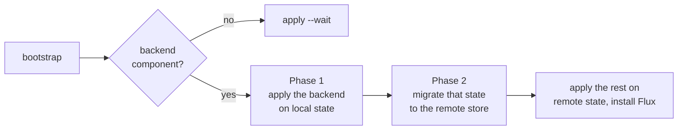

Every context keeps its Terraform state in a backend. Windsor picks a default for the platform, writes the backend settings for each component, and, on a first run, creates the remote store through a two-phase Terraform bootstrap.

## Choose a backend

When you do not set a backend, `--platform` picks a default:

| Platform                                                   | Default backend                                                            |
| ---------------------------------------------------------- | -------------------------------------------------------------------------- |
| `aws`                                                      | `s3`                                                                       |
| `azure`                                                    | `azurerm`                                                                  |
| `gcp`                                                      | `gcs`                                                                      |
| `metal`, `docker`, `incus`, `hetzner`, `hyperv`, `vsphere` | `kubernetes` (each component's state is stored as a Secret in the cluster) |
| `none`, unset                                              | not defaulted (effectively `local`)                                        |

To change it, set `terraform.backend.type` in `values.yaml` to `local`, `s3`, `azurerm`, `gcs`, or `kubernetes`. You can also pass `--backend` to `init` or `--set terraform.backend.type=...` to `bootstrap`.

Windsor will create a backend if one isn't specified, or you can configure one you've already created. To use a store that already exists, see [Use an existing backend](#use-an-existing-backend).

State is keyed per component and isolated within a context. Windsor writes the backend settings into a generated `backend_override.tf` next to each module, so a module never needs a hard-coded `backend` block. The [Terraform page](../components/terraform.md#folder-layout) has more information.

## Use an existing backend

Describe the store in `values.yaml`, under `terraform.backend`:

```yaml
# contexts/staging/values.yaml
terraform:
  backend:
    type: s3
    s3:
      bucket: my-existing-state
      region: us-east-2
      dynamodb_table: my-locks
```

Windsor passes these settings to `terraform init` as `-backend-config` arguments:

| Type         | Set under `terraform.backend.<type>`                                     | Windsor sets    |
| ------------ | ------------------------------------------------------------------------ | --------------- |
| `s3`         | `bucket`, `region`, and `dynamodb_table` or `use_lockfile` for locking   | `key`           |
| `azurerm`    | `resource_group_name`, `storage_account_name`, `container_name`          | `key`           |
| `gcs`        | `bucket`                                                                 | `prefix`        |
| `kubernetes` | `namespace`, and `config_path` or `config_context` to choose the cluster | `secret_suffix` |

For Azure, Google Cloud, and Kubernetes, you define similar blocks:

```yaml
terraform:
  backend:
    type: azurerm
    azurerm:
      resource_group_name: tfstate-rg
      storage_account_name: mytfstate
      container_name: tfstate
```

```yaml
terraform:
  backend:
    type: gcs
    gcs:
      bucket: my-existing-state
```

```yaml
terraform:
  backend:
    type: kubernetes
    kubernetes:
      namespace: tfstate
```

The full argument lists are in Terraform's documentation: [s3](https://developer.hashicorp.com/terraform/language/backend/s3), [azurerm](https://developer.hashicorp.com/terraform/language/backend/azurerm), [gcs](https://developer.hashicorp.com/terraform/language/backend/gcs), and [Kubernetes](https://developer.hashicorp.com/terraform/language/backend/kubernetes).

## Bootstrap

Windsor's bootstrapping flow handles the chicken-or-egg problem with terraform state backends. It handles this in two phases, first creating the backend resources in terraform before pivoting to use this backend throughout the stack.

1. Phase 1 sets `terraform.backend.type` to `local` in memory and applies the backend component and any component declared before it. This creates the remote state store, usually an object store.
2. Phase 2 restores the configured backend type and runs `terraform init -migrate-state -force-copy` for those components. This moves their state to the remote store.

The remaining components then initialize directly against the remote backend.

If you allow the default backend to be created, it will generate `contexts/<name>/backend.tfvars`. This file holds the store's connection settings, such as the bucket and region on AWS. Windsor passes the file to `terraform init` for every other component. This file should be checked in to source control.



The following are typical bootstrap commands using various parameters:

```bash
windsor bootstrap                    # current context
windsor bootstrap staging            # switch context, then bootstrap
windsor bootstrap --platform aws --blueprint ghcr.io/org/blueprint:v1.2.0
```

## State locks

Windsor passes `-lock-timeout` to `init` and to every Terraform command that changes state. `terraform.lock.timeout` can be set to change how long to wait for a locked state. It defaults to `5m`:

```yaml
terraform:
  lock:
    timeout: 10m
```

Windsor also takes its own lock for each context, preventing two `windsor` commands on the same machine from running at the same time. That lock is separate and engages before Terraform's. See [Locking](overview.md#locking).

## See also

- [Overview](overview.md): the commands that read and write this state
- [Terraform](../components/terraform.md): declaring the components that use the backend
- [Destroy](destroy.md): how teardown treats the backend
