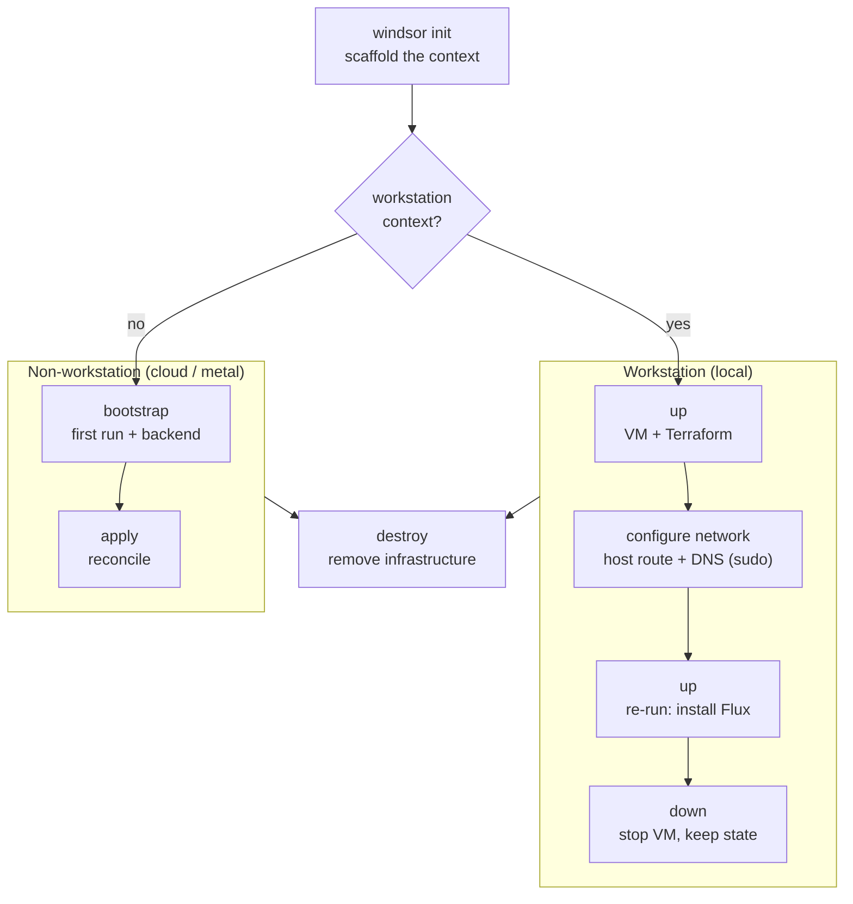

[First project](../getting-started/first-project.md) ran `init`, `up`, and `destroy` against a local workstation. Every context follows the same short lifecycle: scaffold it, provision its infrastructure and install the blueprint, then tear it down. Which commands do that work depends on whether the context runs a local workstation VM or targets cloud infrastructure. The path splits right after `windsor init`:



## A workstation context

A workstation context (typically `local`, or any name starting with `local-`) runs a VM-backed Kubernetes cluster on your machine. Its lifecycle is `up` and `down`:

```bash
windsor init local
windsor up                      # start VM + Terraform; halts if network setup is needed
windsor configure network       # first run only: prompts for sudo
windsor up                      # re-run to install the blueprint via Flux
# ... work ...
windsor down                    # stop VM, clean up local artifacts
```

`up` starts the configured VM driver, runs Terraform for the workstation infrastructure, and installs the blueprint via Flux. Pass `--wait` to block until every kustomization reports ready.

Host networking and DNS need elevation, which `up` does not request on its own. It hands that to [`configure network`](https://www.windsorcli.dev/reference/cli/commands/configure-network) instead: sudo on macOS/Linux, an Administrator PowerShell on Windows. What you do next depends on the runtime:

- **Colima** needs a host route to reach the cluster. `up` provisions what it can, then halts and prints `Run 'windsor configure network' (sudo), then re-run 'windsor up'.` Run it and re-run `up` to finish the install.
- **Docker Desktop** only needs DNS. `up` completes, then prints `configure network` as a follow-up so `*.<domain>` resolves from your browser. Run it once; there's no re-run.

Writing the DNS resolver entry needs elevation either way, so that step applies to every local runtime. Once it's configured, later `up` runs skip it. Use `--dry-run` to preview and `--revert` to remove what it installed.

`down` stops the VM and clears local artifacts. It does not touch live cloud resources; run `destroy` first for that.

## A cloud or metal context

Staging, production, and any other deployment context has no VM. The first run uses `bootstrap`; later reconciles use `apply`:

```bash
windsor init staging
windsor set context staging
windsor bootstrap               # first run: handles backend, migrates state, waits for kustomizations
# ... later reconciles ...
windsor apply --wait
# ... and tear down ...
windsor destroy --confirm=staging
```

`apply` runs the Terraform components and installs the Flux blueprint, the same work `up` does for a workstation but without managing a VM. It supports targeted runs:

```bash
windsor apply terraform cluster        # one terraform component
windsor apply kustomize observability  # one Flux kustomization
```

Use `bootstrap` on the first run. It handles a chicken-and-egg case with the Terraform backend, described in [Under the hood](#under-the-hood).

## Inspect before you apply

`windsor plan` previews changes without applying them. With no argument it prints a summary across all components; with a name it streams the full plan for that component:

```bash
windsor plan                    # summary across all components
windsor plan terraform cluster  # full plan for one component
```

To inspect the composition itself, render it with `windsor show` or trace a value with `windsor explain`. See [Inspecting](../blueprints/inspecting.md).

## Under the hood

`bootstrap` handles the case where the remote Terraform backend, an S3 bucket or DynamoDB table, is itself created by Terraform. It applies the `backend` component against local state, migrates state to the configured backend, then runs the rest of `apply`. With no `backend` component declared, `bootstrap` is the same as `apply`.

`plan` sorts its output destructive-first. The summary renders per-component rows with affected resources indented underneath, and a single replace shows as `±1` rather than `+1 -1`. Add `--summary` for the compact table, `--json` for machine-readable output in CI, or `--no-color` to disable color.

## Reference

| Group | Command | What it does |
|---|---|---|
| Scaffold | [`init`](https://www.windsorcli.dev/reference/cli/commands/init) | Creates the context, writes `windsor.yaml`, marks the directory trusted. |
| Workstation | [`up`](https://www.windsorcli.dev/reference/cli/commands/up) / [`down`](https://www.windsorcli.dev/reference/cli/commands/down) | Starts/stops the local VM and container runtime. Workstation contexts only. |
| First-run | [`bootstrap`](https://www.windsorcli.dev/reference/cli/commands/bootstrap) | End-to-end install for non-workstation contexts. Two-phase apply when a `backend` component is in play. |
| Install | [`apply`](https://www.windsorcli.dev/reference/cli/commands/apply) | Runs Terraform components, then installs the Flux blueprint. |
| Inspect | [`plan`](https://www.windsorcli.dev/reference/cli/commands/plan) / [`show`](https://www.windsorcli.dev/reference/cli/commands/show) / [`explain`](https://www.windsorcli.dev/reference/cli/commands/explain) | Previews changes, prints rendered resources, traces values. |
| Upgrade | [`upgrade`](https://www.windsorcli.dev/reference/cli/commands/upgrade) / [`upgrade cluster`](https://www.windsorcli.dev/reference/cli/commands/upgrade-cluster) / [`upgrade node`](https://www.windsorcli.dev/reference/cli/commands/upgrade-node) | Moves sources to a new version and reconciles; upgrades Talos nodes. |
| Recovery | [`unlock`](https://www.windsorcli.dev/reference/cli/commands/unlock) | Force-releases a stuck stack lock. |
| Tear down | [`destroy`](https://www.windsorcli.dev/reference/cli/commands/destroy) | Destroys live infrastructure (Terraform + Flux). |

- [First project](../getting-started/first-project.md) — the hands-on walkthrough this page generalizes
- [Contexts](../contexts/overview.md) — workstation vs non-workstation, switching contexts
- [Workstation overview](../workstation/overview.md) — VM driver options and topology
- [Upgrade](../maintenance/upgrade.md) — moving a context to a newer blueprint version
- [Destroy](../maintenance/destroy.md) — safety behaviors and locking on teardown
