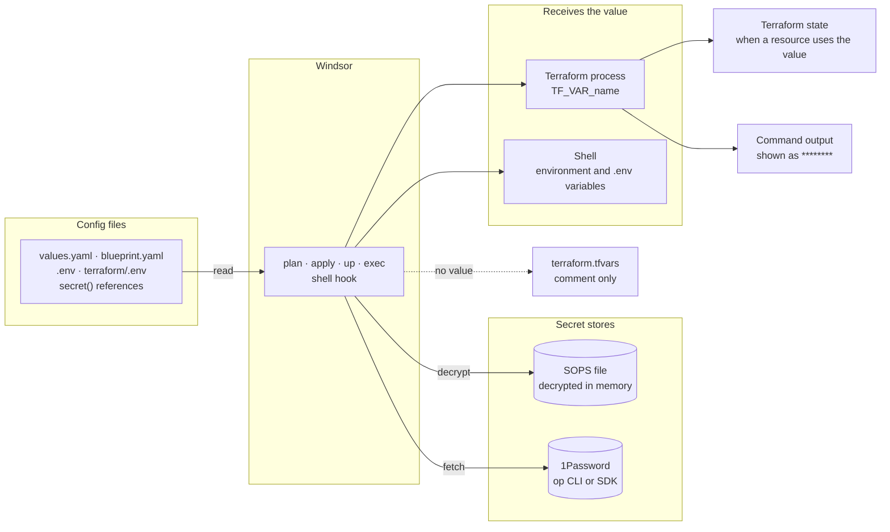

Windsor reads secrets from [SOPS](sops.md) encrypted files and from [1Password](1password.md) vaults.

## Write a reference

A reference calls `secret()` with a vault, an item, and, for 1Password, a field:

```text
${secret("<vault>", "<item>", "<field>")}
```

The arguments have different meanings for each provider:

| Argument  | 1Password                                | SOPS                                          |
| --------- | ---------------------------------------- | --------------------------------------------- |
| `<vault>` | A key under `secrets.onepassword.vaults` | The word `sops`                               |
| `<item>`  | The item name                            | The dot-path of the key in the decrypted file |
| `<field>` | The field to read in the item            | Leave empty                                   |

Here is one reference for each provider:

```yaml
inputs:
  stripe_key: ${secret("development", "stripe", "api_key")}
  db_password: ${secret("sops", "database.password")}
```

## Where to use a secret

You can reference secrets in these places:

- Terraform input values in your `blueprint.yaml`
- Any sensitive values in `values.yaml` (API keys, _etc._)
- Provider credentials in `contexts/<name>/terraform/.env`
- A context's environment variable configuration — either in `values.yaml` or `.env` files

### Terraform inputs

Add the reference to a component's `inputs:` in `blueprint.yaml`:

```yaml
terraform:
- path: example/my-app
  inputs:
    api_token: ${secret("development", "stripe", "api_key")}
```

[`windsor plan`](https://www.windsorcli.dev/reference/cli/commands/plan) and `windsor apply` fetch the value and pass it to Terraform as `TF_VAR_api_token`. If you run `terraform` yourself instead, the [shell hook](../contexts/environment-injection.md#set-up-the-shell-hook) supplies the variable. When you `cd terraform/example/my-app`, the hook sets `TF_VAR_api_token` in your shell, and it removes the variable when you leave that directory.

### Values in values.yaml

A blueprint property that holds a credential takes a reference as its value. For example, set the Hetzner API token in the context's `values.yaml`:

```yaml
# contexts/staging/values.yaml
hetzner:
  token: ${secret("MyVault", "hetzner", "token")}
```

The blueprint passes the value to the component that needs it. The command `windsor show values` hides any property that the blueprint marks as sensitive.

### Provider credentials in terraform/.env

Many Terraform providers read their credentials from environment variables, for example `HCLOUD_TOKEN` or `VSPHERE_PASSWORD`. Put these variables in `contexts/<name>/terraform/.env`. Windsor adds `.env` to `contexts/<name>/.gitignore` to keep your `.env` files out of source control. To commit the `.env` file, add `!.env` to the end of that file. The file holds only references, so a team can share it, and each person's own 1Password session or SOPS key supplies the values.

```text
VSPHERE_PASSWORD=${secret("MyVault", "vsphere", "password")}
```

Windsor loads the file and injects its values when performing Terraform operations, or when your working directory is underneath a module in the `terraform/` directory. On macOS and Linux, Windsor warns when the group or other users can read this file or `contexts/<name>/.env`. Run `chmod 600` on the file to clear the warning. Windsor does not check permissions on Windows.

### Shell environment

The `environment:` key in `values.yaml`, and the file `contexts/<name>/.env`, export variables into every shell in the context:

```yaml
# contexts/staging/values.yaml
environment:
  DB_PASSWORD: ${secret("sops", "database.password")}
```

Use this method last. The [shell hook](../contexts/environment-injection.md#set-up-the-shell-hook) fetches each reference at the first prompt of every new shell. Each 1Password reference is a separate call to the `op` CLI or to the 1Password SDK, so many references make the first prompt slow. Also, every process that you start from the shell can read the decrypted value. Use these variables only for tools outside Terraform. Give Terraform its secrets through inputs.

### Kustomize substitutions

Do not put a secret in a Kustomize `substitutions:` entry. Windsor writes substitutions to a ConfigMap, and a ConfigMap is plain text. Windsor rejects a substitution that points directly at a `sensitive` property. It does not check a `secret()` call, so that call is accepted.

## Under the hood

Windsor resolves a reference only when a command needs the value. It does not write the resolved value into your config files, the composed blueprint, or the generated `terraform.tfvars`.



The generated `terraform.tfvars` holds a comment such as `# api_token = "(sensitive)"` in place of the value, and `windsor show blueprint` prints the reference, not the value. The Terraform process receives the value as `TF_VAR_<name>` for the length of the run. Your shell receives a value only for `environment` and `.env` references, and for a component's `TF_VAR_` variables while you are in its module folder.

Windsor decrypts a SOPS file in memory. The `op` CLI or the 1Password SDK decrypts a 1Password value and returns it to Windsor.

### When Windsor decrypts

Composition leaves each `secret()` call as written. Windsor resolves the call later, when a command asks it to decrypt. These commands decrypt:

- Commands that run Terraform or apply the blueprint, such as [`windsor plan`](https://www.windsorcli.dev/reference/cli/commands/plan), `apply`, and `up`. They only fetch secrets referenced by each terraform input
- [`windsor exec`](https://www.windsorcli.dev/reference/cli/commands/exec) decrypts secrets referenced as environment variables
- The [shell hook](../contexts/environment-injection.md#set-up-the-shell-hook). At each prompt it runs `windsor env --decrypt --hook`. This fetches `environment` and `.env`. In a module folder, it also fetches that component's inputs and `terraform/.env`.

The command `windsor env` without flags shows `********` for each secret. The command `windsor env --decrypt` prints the plain text.

### Caching

After a variable resolves, the shell holds its value persistently as long as that shell lives. On later prompts, the hook reuses that value and does not call the secret store again. This applies to `environment`, `.env`, `terraform/.env`, and the `TF_VAR_` variables of a component. A new shell fetches everything again. You can also set `NO_CACHE=1` to force a new fetch, which is how an open shell picks up a secret that you changed. If a variable fails to resolve, Windsor tries again. In some cases this can cause a delay in your prompt loading between commands.

### Masking

Windsor masks secrets in printed output. It replaces an exact match with `********`. This includes Terraform plans, applies, and error messages. A tool can change a value, for example by base64 encoding it, and the changed value no longer matches. Do not rely on masking alone.

When a resource uses an input, Terraform saves the value in its state. Keep state in an encrypted backend.

## Troubleshooting

If a secret fails to resolve, the variable holds an error marker instead of a value. To find the markers:

- Bash: `env | grep '<ERROR'`. An example result is `MY_SECRET=<ERROR: secret not found: database.password>`.
- PowerShell: `Get-ChildItem Env: | Where-Object { $_.Value -like '*<ERROR*' }`

To see the full error, run `windsor env --decrypt --verbose`. Without `--verbose`, `windsor env` prints nothing when it fails.

## Choosing a provider

SOPS keeps the secrets in your repository in encrypted files. They are versioned and reviewed like any other file in your repository, and Windsor needs no external secrets provider. 1Password keeps the secrets in a vault that your team already manages. To rotate a value, edit the item. A context can use both providers.

- [SOPS](sops.md): encrypted `secrets.yaml` files in the context
- [1Password](1password.md): vault items through the `op` CLI or a service account
