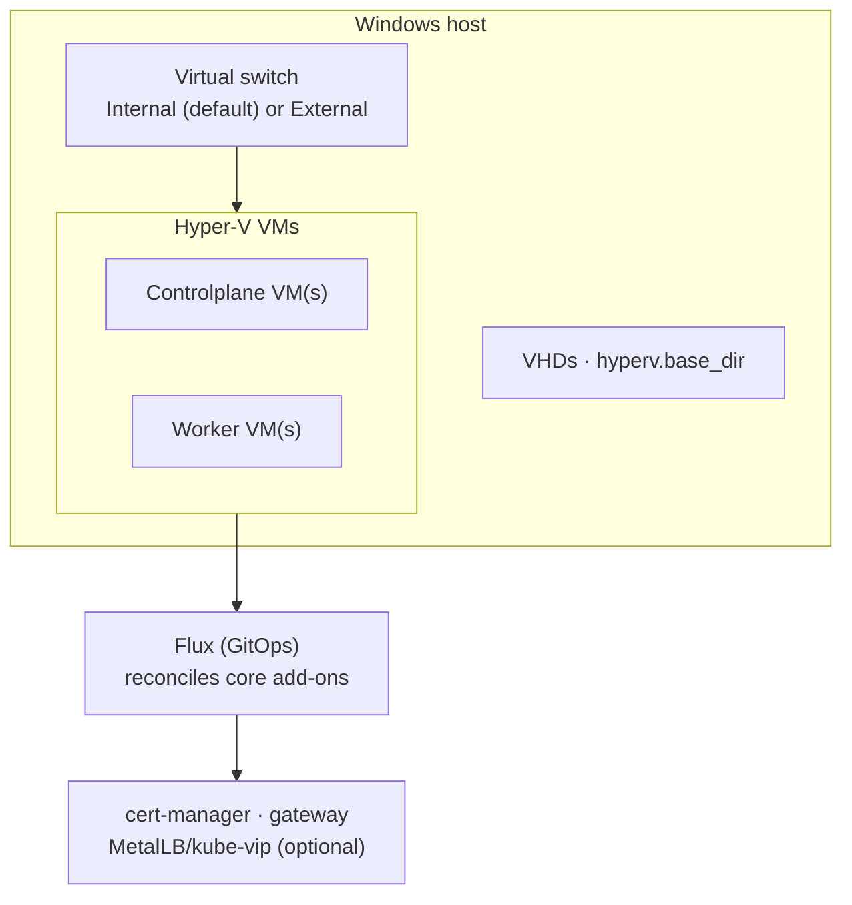

This guide stands up a Windsor stack on [Hyper-V](https://learn.microsoft.com/en-us/virtualization/hyper-v-on-windows/), the hypervisor built into Windows Pro, Enterprise, and Server: Talos Linux VMs, full-VM isolation rather than containers, and the `core` blueprint's services reconciled by Flux. It targets a **non-workstation context**. Hyper-V has no `windsor up`/`down` overlay, so the lifecycle is `init` → `bootstrap` → `apply` → `destroy`, the same as a cloud platform. For the concepts behind those verbs, see [Command model](../provisioning/workflow.md).

Hyper-V only runs on a Windows host. `cluster.driver` is always `talos`: Hyper-V has no managed Kubernetes offering to target instead.

## Prerequisites

- A Windows host with Hyper-V enabled, and this project running there (Hyper-V administration is local to the host running the VMs).
- Terraform (or OpenTofu) and `kubectl` on your `PATH`. Run `windsor check` to validate the toolchain.
- A git repository for the project (`windsor init` refuses to scaffold outside one).

## What gets created

Setting `platform: hyperv` selects the Hyper-V path in the `core` blueprint:



There's no Talos image prebuilt for Hyper-V in the Image Factory. Windsor downloads the generic `metal-amd64.iso` instead, and pairs it with a generated CIDATA seed ISO carrying each VM's machine config. This is the same mechanism cloud-init uses, adapted for Talos. VMs boot from HDD first, fall through to the Talos ISO on a fresh disk, install, and reboot from disk from then on.

## 1. Create the context

```bash
windsor init hyperv-prod --platform hyperv
windsor set context hyperv-prod
```

## 2. Configure values

Edit `contexts/hyperv-prod/values.yaml`. A minimal cluster, host-only networking:

```yaml
platform: hyperv
network:
  cidr_block: 10.5.0.0/16
cluster:
  controlplanes:
    count: 1
  workers:
    count: 2
```

As on Hetzner, there's no `cluster.pools`. `cluster.controlplanes.count` and `cluster.workers.count` set node counts directly, sized by `cluster.{controlplanes,workers}.cpu`/`memory`. `topology` is inferred from those counts rather than something you set.

### Reaching the cluster from your network

`hyperv.net_adapter` picks which of the two networking modes you get:

- **Unset (default): an Internal switch.** VMs are reachable from the host only. Simplest to set up; use this when you're driving `kubectl` from the same Windows machine.
- **Set to a host NIC name:** an External switch, bridged onto that NIC. VMs get real addresses on your LAN, reachable from any machine on the network. This is closer to how AWS, Azure, GCP, or Hetzner behave.

```yaml
hyperv:
  net_adapter: ["Ethernet"]   # bridge onto this host NIC instead of host-only
```

A third mode exists for a specific case: the host itself is reachable, but you don't want to bridge a NIC. Setting `gateway.service_type: NodePort` switches automatically to a NAT-backed switch. It publishes the cluster's ports (Kubernetes API, Talos API per node, and any gateway NodePorts) onto the host's own LAN address via port forwarding. This mode adds real complexity: per-node port assignments and a fixed `cluster.endpoint` requirement. Reach for External bridging first unless you specifically need NodePort's port-forwarding model.

Other common knobs:

| Key | Effect |
|-----|--------|
| `hyperv.base_dir` | Host directory for VHDs and downloaded images. Default `C:/hyperv`. |
| `cluster.cni.driver: cilium` | Replace the default flannel CNI with Cilium. Hyper-V defaults to flannel, unlike the cloud platforms. |
| `observability.enabled: true` | Grafana, Prometheus, and the logging stack. |

## 3. Bootstrap

```bash
windsor bootstrap hyperv-prod
```

`bootstrap` generates cluster identity and per-node machine config first (so the CIDATA seed is ready before a VM boots), creates the virtual switch and VMs, then installs the Flux blueprint and waits for every kustomization to report ready.

## 4. Verify

```bash
kubectl get nodes                       # VMs Ready
kubectl get kustomizations -A           # Flux reconciling
windsor show blueprint                  # the fully composed blueprint
```

`kubectl` uses the context's `KUBECONFIG`; prefix with `windsor exec --` or install the [shell hook](../contexts/environment-injection.md) so it's exported automatically.

## 5. Day-two changes

```bash
windsor plan                            # summary across all components
windsor apply --wait
```

Raising `cluster.workers.count` adds VMs on the next `apply`. There's no autoscaling group: each VM is a fixed Terraform resource.

## 6. Tear down

```bash
windsor destroy --confirm=hyperv-prod
```

`destroy` removes the Flux kustomizations, then the VMs and virtual switch in reverse order. It cleans up VHDs and downloaded images under `hyperv.base_dir` along with their owning VM. The exception is a switch you didn't let Windsor create (`create_network: false` against an existing switch): Windsor leaves that one alone.

## Troubleshooting

- **VMs never get an IP in `windsor show`.** Hyper-V reports guest IPs through integration services, which need the guest agent running. This can lag a boot or two after install. Give it a minute and re-check. A VM stuck longer usually means the CIDATA seed didn't attach. Check the `cluster-config` Terraform component's output for `boot_from_dvd` conflicts or a missing ISO.
- **`kubectl`/Talos API times out from another machine.** The default Internal switch is host-only by design. Either run commands from the Hyper-V host itself, or switch to an External switch with `hyperv.net_adapter` set. See [Reaching the cluster from your network](#reaching-the-cluster-from-your-network).
- **NodePort mode: forwards don't reach a specific node.** Each Talos API forward targets one node's NAT-internal IP; a `windsor apply` after changing node counts recomputes the whole forward map, so a partial re-apply can leave stale rules. Re-run `windsor apply --wait` to converge.
- **Nested virtualization: reboot never confirms.** `upgrade node`'s default `kexec` reboot doesn't always register as an offline transition inside nested virtualization. Pass `--reboot-mode=powercycle`. See [Talos nodes](../maintenance/upgrade.md#talos-nodes).

## Where to next

- [Command model](../provisioning/workflow.md) — the full command model
- [Destroy](../maintenance/destroy.md) — safety behaviors and locking on teardown
- [Terraform](../components/terraform.md) — state backends and cross-component outputs
- [vSphere](vsphere.md) — the other on-premises VM platform
- [AWS](../cloud/aws.md), [Azure](../cloud/azure.md), [GCP](../cloud/gcp.md), and [Hetzner](../cloud/hetzner.md) — the other deployment targets
