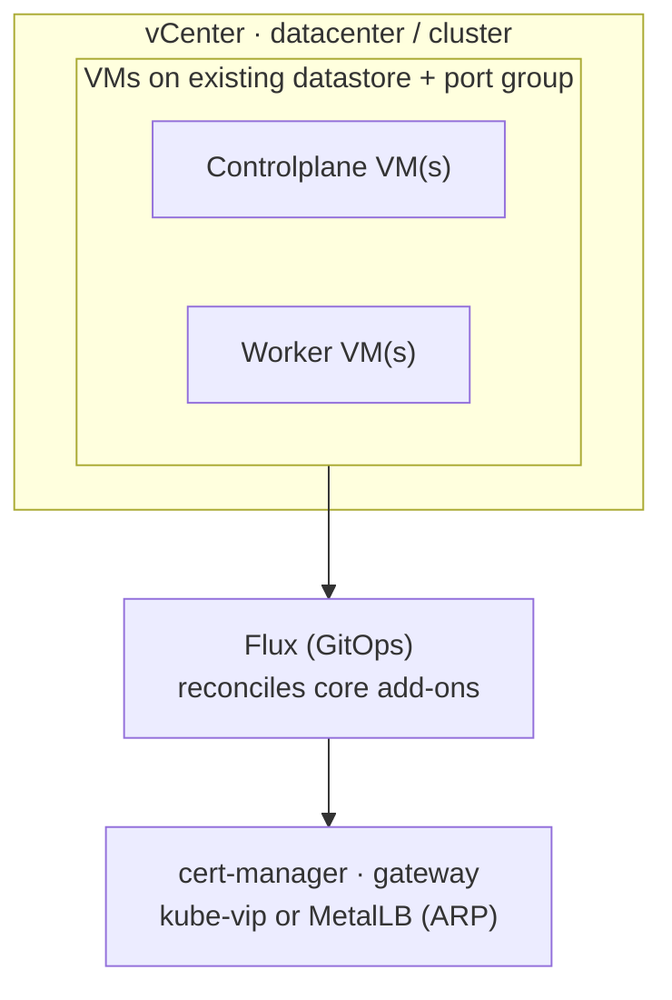

This guide stands up a Windsor stack on [VMware vSphere](https://www.vmware.com/products/cloud-infrastructure/vsphere): Talos Linux VMs on infrastructure you already run, and the `core` blueprint's services reconciled by Flux. It targets a **non-workstation context**. The lifecycle is `init` → `bootstrap` → `apply` → `destroy`, the same as a cloud platform. For the concepts behind those verbs, see [Command model](../provisioning/workflow.md).

vSphere is common for industrial and on-premises deployments with no public cloud reachable: plant networks, air-gapped-adjacent sites, and existing VMware estates. `cluster.driver` is always `talos`. vSphere has no managed Kubernetes offering to target instead.

## Prerequisites

vSphere is the one platform where Windsor reads existing inventory rather than creating it. Before you run anything, vCenter needs:

- A **datacenter**.
- A **compute cluster** (a `ClusterComputeResource`) with at least one ESXi host joined to it. A host added directly to the datacenter, not inside a cluster, doesn't satisfy this. Put it in a cluster even if that cluster has just the one host.
- A **datastore** and a **port group** reachable from that host.
- The ESXi host needs outbound access to `factory.talos.dev` to pull the Talos OVA on first apply.

Beyond the inventory:

- vCenter credentials with permission to deploy and manage VMs.
- Terraform (or OpenTofu) and `kubectl` on your `PATH`. Run `windsor check` to validate the toolchain.
- A git repository for the project (`windsor init` refuses to scaffold outside one).

To inspect or prepare inventory out of band, [`govc`](https://github.com/vmware/govmomi/tree/main/govc) reads the same credentials via `GOVC_URL`/`GOVC_USERNAME`/`GOVC_PASSWORD`/`GOVC_INSECURE`. Mirror your `vsphere.*` values into those.

## What gets created

Setting `platform: vsphere` selects the vSphere path in the `core` blueprint. Nothing here provisions inventory. It deploys VMs onto what you already have:



VMs deploy from the Talos OVA using vSphere's guestinfo mechanism, the vSphere equivalent of cloud-init on AWS or Azure. The deploy generates machine secrets and machine config inline, so there's no separate config-generation step like Hyper-V needs.

## 1. Create the context

```bash
windsor init vsphere-prod --platform vsphere
windsor set context vsphere-prod
```

## 2. Configure values

Set vCenter credentials as environment variables. Windsor exports `VSPHERE_SERVER`/`VSPHERE_USER`/`VSPHERE_ALLOW_UNVERIFIED_SSL` from the `vsphere.*` block below, and the password from a `${secret(...)}` reference. Neither ever lands in `values.yaml` in plaintext:

```yaml
platform: vsphere
vsphere:
  server: vcenter.plant.local
  user: administrator@vsphere.local
  password: ${secret("MyVault", "vsphere", "password")}
  datacenter: dc-prod
  cluster: cluster-01
  datastore: datastore-01
  network: "VM Network"
network:
  cidr_block: 10.5.0.0/16
cluster:
  controlplanes:
    count: 1
  workers:
    count: 2
```

`datacenter`, `cluster`, `datastore`, and `network` are all required. Windsor refuses to compose the blueprint without them: there's no sensible default for infrastructure it doesn't own. Names must match vCenter's inventory exactly.

As on Hetzner and Hyper-V, there's no `cluster.pools`. `cluster.controlplanes.count` and `cluster.workers.count` set node counts directly, sized by `cluster.{controlplanes,workers}.cpu`/`memory`. `topology` is inferred from those counts.

Other common knobs:

| Key | Effect |
|-----|--------|
| `vsphere.folder` | VM folder path, relative to the datacenter root. Unset places VMs at the datacenter root. |
| `vsphere.resource_pool` | Resource pool path, relative to the compute cluster. Unset uses the cluster's root pool. |
| `vsphere.host_system` | Specific ESXi host to place VMs on. Required only when the datacenter has more than one host; a single-host datacenter auto-selects it. |
| `observability.enabled: true` | Grafana, Prometheus, and the logging stack. |

### Load balancing

vSphere VMs get real routed IPs on your network, so an in-cluster load balancer works the way it would on bare metal. `kube-vip` in ARP mode is the usual choice for a plant network. It needs no switch configuration, just a reserved IP range on the same subnet as the nodes:

```yaml
network:
  loadbalancer_driver: kube-vip
  loadbalancer_ips:
    start: 10.5.0.100
    end: 10.5.0.120
```

MetalLB (also ARP mode) is supported as an alternative.

## 3. Bootstrap

```bash
windsor bootstrap vsphere-prod
```

`bootstrap` deploys the VMs from the OVA, waits for vCenter Tools to report each guest's IP, then installs the Flux blueprint and waits for every kustomization to report ready.

## 4. Verify

```bash
kubectl get nodes                       # VMs Ready
kubectl get kustomizations -A           # Flux reconciling
windsor show blueprint                  # the fully composed blueprint
```

`kubectl` uses the context's `KUBECONFIG`; prefix with `windsor exec --` or install the [shell hook](../contexts/environment-injection.md) so it's exported automatically.

## 5. Day-two changes

```bash
windsor plan                            # summary across all components
windsor apply --wait
```

Raising `cluster.workers.count` adds VMs on the next `apply`. There's no autoscaling group: each VM is a fixed Terraform resource sized by `cluster.workers.cpu`/`memory`.

## 6. Tear down

```bash
windsor destroy --confirm=vsphere-prod
```

`destroy` removes the Flux kustomizations, then the VMs, in reverse order. Windsor never touches vCenter's own inventory (the datacenter, cluster, datastore, port group). It only ever reads it.

## Troubleshooting

- **`vsphere_compute_cluster` lookup fails.** The named cluster has to be an actual `ClusterComputeResource` in vCenter. A bare host added straight to the datacenter, outside any cluster, doesn't satisfy this. Wrap it in a cluster, even a single-host one.
- **VMs never get an IP in `windsor show`.** IPs come from `vmtoolsd` (VMware Tools) reporting back to vCenter. This needs the Talos OVA's bundled guest agent running, which can lag a boot or two. If it never resolves, confirm the ESXi host reached `factory.talos.dev` to pull the OVA in the first place.
- **OVF deploy fails outbound.** The ESXi host itself needs the network path to `factory.talos.dev`, not the machine running `windsor`. This is a common gap in segmented plant networks.
- **Composition fails demanding `vsphere.host_system`.** Set when the datacenter has more than one ESXi host; Windsor can't guess which one you mean.

## Where to next

- [Command model](../provisioning/workflow.md) — the full command model
- [Destroy](../maintenance/destroy.md) — safety behaviors and locking on teardown
- [Terraform](../blueprints/terraform.md) — state backends and cross-component outputs
- [Hyper-V](hyperv.md) — the other on-premises VM platform
- [AWS](../cloud/aws.md), [Azure](../cloud/azure.md), and [Hetzner](../cloud/hetzner.md) — the other deployment targets
