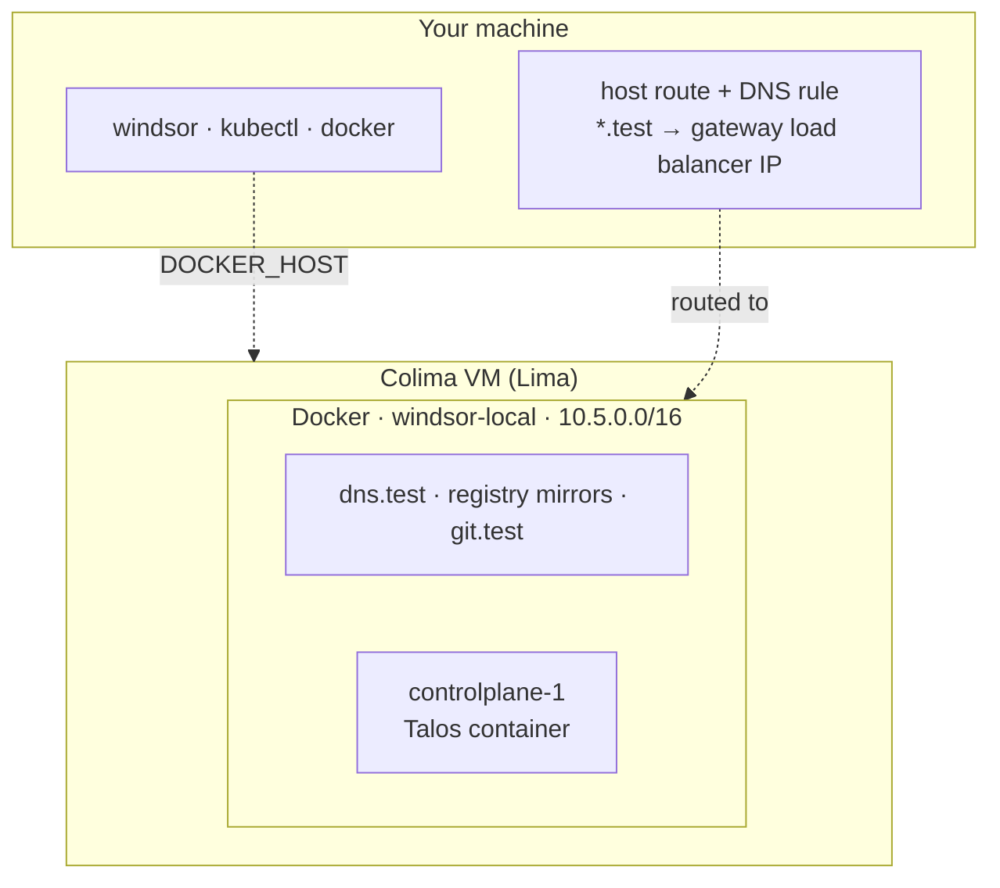

[Colima](https://colima.run/docs/) runs container runtimes on macOS and Linux inside a Linux VM that [Lima](https://lima-vm.io/) manages. This page uses Docker as that runtime. Windsor builds the cluster in the VM and adds a host route, so your machine reaches the cluster network directly. Of the runtimes with container nodes, this is the one that gives you routable load balancer IPs and a layer 2 load balancer.

## Supported systems

macOS on Apple silicon, and Linux.

## Install

Install Colima by following its [installation instructions](https://github.com/abiosoft/colima#installation). Windsor writes a Colima profile for each context, named `windsor-<context>`, and starts and stops the VM. On Apple silicon the VM uses Apple's virtualization framework; elsewhere it uses QEMU.

## Resources

Windsor sizes the VM from the cluster:

```text
cpu    = (controlplanes × controlplane cpu) + (workers × worker cpu) + 1
memory = (controlplanes × controlplane memory) + (workers × worker memory) + 3 GB
```

The extra 1 CPU and 3 GB cover the VM and the support containers. The VM never gets less than 2 CPUs and 4 GB, and it has 100 GB of disk.

The default node has 4 CPUs and 12 GB, so the default VM gets 5 CPUs and 15 GB. [`windsor up`](https://www.windsorcli.dev/reference/cli/commands/up) warns when the VM has more CPUs than the host, or more memory than the host's total minus a 4 GB reserve.

To change the size, set the node sizes in `contexts/local/values.yaml` and let the formula follow, or set the VM directly at `init`:

```bash
windsor init local --vm-driver colima --vm-cpu 6 --vm-memory 10 --vm-disk 80
```

## Start it

```bash
windsor init local --vm-driver colima
windsor up                       # halts: the host needs a route to the cluster
windsor configure network        # host route and DNS; prompts for sudo
windsor up --wait
```

The route and the DNS rule need elevation, which `up` does not request, so the first `up` stops and prints the command to run. Later runs skip it.

## What gets built



The Docker daemon lives in the VM, and `DOCKER_HOST` gets configured to use Colima's docker socket. The nodes and support containers join the `windsor-local` bridge, as described in the [overview](overview.md#what-gets-built).

The host route makes `10.5.0.0/16` reachable from your machine. Cilium hands out load balancer addresses from a pool on that network, `10.5.1.10` to `10.5.1.100` by default, and announces them with layer 2 ARP. The gateway takes the first address in the pool, and `*.test` names resolve to it. You reach services through that load balancer IP from your machine.

Nodes are containers, so storage is filesystem-only. For block devices, use [Colima + Incus](colima-incus.md).

## Explore

Run these after `up` finishes. With the [shell hook](../contexts/environment-injection.md), `docker`, `kubectl`, and `talosctl` target this environment. Without it, prefix each command with [`windsor exec --`](https://www.windsorcli.dev/reference/cli/commands/exec).

Start with the VM:

```bash
colima list                            # profile windsor-local: 5 CPUs, 15 GiB, 100 GiB disk, docker runtime
colima ssh -p windsor-local            # a shell in the VM; try `free -h` and `docker ps`
```

Then look at what Docker created inside it:

```bash
docker ps                              # controlplane-1, six registry mirrors, git.test, dns.test
docker network inspect windsor-local   # 10.5.0.0/16; every container has a fixed address
docker stats --no-stream               # the node, right after up: about 5.5 GiB of its 12 GiB limit
```

The node publishes only `6443` and `50000`, because your machine reaches the cluster network through the host route and needs no other ports. On macOS, you can see the route and the DNS rule:

```bash
netstat -rn -f inet | grep 10.5        # 10.5/16 via the VM's address
dscacheutil -q host -a name grafana.test   # the gateway load balancer IP, 10.5.1.10 by default
dig +short @10.5.0.2 grafana.test      # ask dns.test directly
curl -k https://grafana.test/login     # 200, on the default HTTPS port
```

Look at the cluster inside the node:

```bash
kubectl get nodes -o wide              # one Talos node, Ready
kubectl get kustomizations -A          # everything Flux installed
kubectl get gateway,httproutes -A      # the gateway and the routes it serves
talosctl -n 10.5.0.10 services         # Talos's own services
```

`windsor down` takes about 25 seconds and deletes the Colima VM with everything in it. The host route goes with the VM, and `down` prints `windsor configure network --revert` for the DNS rule.
