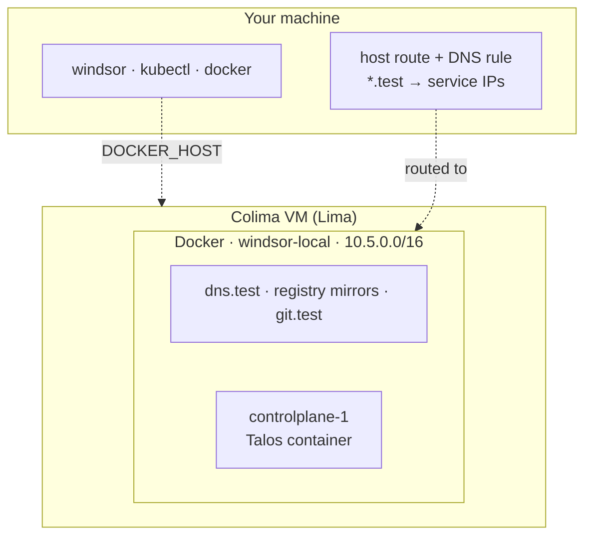

Colima runs the cluster inside its own Linux VM, and Windsor adds a route so your machine can reach the cluster network directly. It's the closest workstation setup to production that still uses containers for nodes.

## Supported systems

macOS on Apple silicon, and Linux.

## Install

[Colima](https://github.com/abiosoft/colima#installation) wraps [Lima](https://lima-vm.io/) to start a Linux VM and run a container runtime inside it. Install it with its own instructions. Windsor writes a Colima profile for each context (`windsor-<context>`) and starts and stops the VM for you. On Apple silicon the VM uses Apple's virtualization framework, and elsewhere it uses QEMU.

## Resources

Windsor sizes the VM from the cluster you ask for:

```text
cpu    = (controlplanes × controlplane cpu) + (workers × worker cpu) + 1
memory = (controlplanes × controlplane memory) + (workers × worker memory) + 3 GB
```

The extra 1 CPU and 3 GB cover the VM itself and the support containers. Windsor never goes below 2 CPUs and 4 GB, and gives the VM 100 GB of disk.

The default node has 4 CPUs and 12 GB, so the default VM gets 5 CPUs and 15 GB. If that's more than the host can spare, [`windsor up`](https://www.windsorcli.dev/reference/cli/commands/up) warns. A VM larger than your CPU count, or memory beyond your total minus a 4 GB reserve, is what triggers it.

To change the size, either set the node sizes in `contexts/local/values.yaml` and let the formula follow, or set the VM directly when you initialize:

```bash
windsor init local --vm-driver colima --vm-cpu 6 --vm-memory 10 --vm-disk 80
```

## Start it

```bash
windsor init local --vm-driver colima
windsor up                       # halts: the host needs a route to the cluster
windsor configure network        # host route and DNS; prompts for sudo
windsor up --wait
```

Both the route and the DNS rule need elevation, and `up` doesn't ask for it, so the first `up` stops and prints the command to run. Later runs don't repeat it.

## What gets built



- **The Docker daemon lives in the VM.** `DOCKER_HOST` points your `docker` commands at it. The nodes and support containers join the `windsor-local` bridge, as described in the [overview](overview.md#what-gets-built).
- **Real service IPs.** The host route makes `10.5.0.0/16` reachable from your machine, and `*.test` names resolve to addresses on it. You can open a service by its cluster IP, and a layer 2 load balancer works.
- **A git server you can clone from.** `git.test` serves your project, so another folder can clone it: `git clone http://local@git.test/git/<project>`.
- **No block devices.** Nodes are containers, so storage is filesystem-only. [Colima + Incus](colima-incus.md) gives you block devices.

## Explore

Run these after `up` finishes. With the [shell hook](../contexts/environment-injection.md), `docker`, `kubectl`, and `talosctl` target this environment. Without it, prefix each command with [`windsor exec --`](https://www.windsorcli.dev/reference/cli/commands/exec).

Start with the VM:

```bash
colima list                            # profile windsor-local: 5 CPUs, 15 GiB, 100 GiB disk, docker runtime
colima ssh -p windsor-local            # a shell in the VM; try `free -h` and `docker ps`
```

Then look at what Docker created inside it:

```bash
docker ps                              # controlplane-1, six registry mirrors, git.test, dns.test
docker network inspect windsor-local   # 10.5.0.0/16; every container has a fixed address
docker stats --no-stream               # the node, right after up: about 5.5 GiB of its 12 GiB limit
```

The node publishes only `6443` and `50000`, because your machine reaches the cluster network through the host route and needs no other ports. On macOS, you can see the route and the DNS rule:

```bash
netstat -rn -f inet | grep 10.5        # 10.5/16 via the VM's address
dscacheutil -q host -a name grafana.test   # a service IP on 10.5.1.x
dig +short @10.5.0.2 grafana.test      # ask dns.test directly
curl -k https://grafana.test/login     # 200, on the default HTTPS port
```

Look at the cluster inside the node:

```bash
kubectl get nodes -o wide              # one Talos node, Ready
kubectl get kustomizations -A          # everything Flux installed
kubectl get gateway,httproutes -A      # the gateway and the routes it serves
talosctl -n 10.5.0.10 services         # Talos's own services
```

When you're done, `windsor down` takes about 25 seconds. It deletes the Colima VM and everything in it. The host route goes with the VM. `down` prints `windsor configure network --revert`, which removes the DNS rule.
