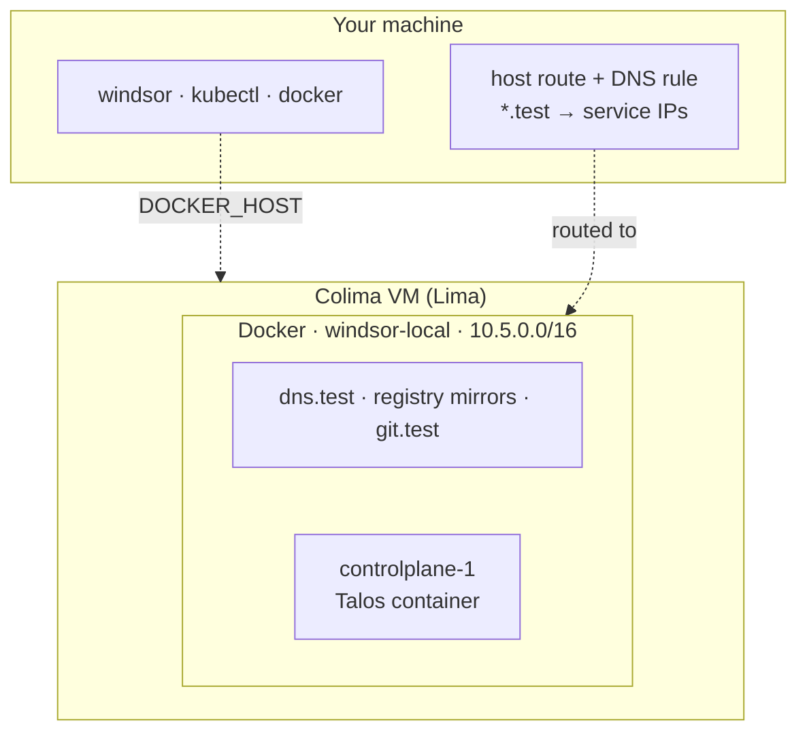

Colima runs the cluster inside its own Linux VM, and Windsor adds a route so your machine can reach the cluster network directly. It's the closest workstation setup to production that still uses containers for nodes.

## Supported systems

macOS on Apple silicon, and Linux.

## Install

[Colima](https://github.com/abiosoft/colima#installation) wraps [Lima](https://lima-vm.io/) to start a Linux VM and run a container runtime inside it. Install it with its own instructions. Windsor writes a Colima profile for each context (`windsor-<context>`) and starts and stops the VM for you. On Apple silicon the VM uses Apple's virtualization framework, and elsewhere it uses QEMU.

## Resources

Windsor sizes the VM from the cluster you ask for:

```text
cpu    = (controlplanes × controlplane cpu) + (workers × worker cpu) + 1
memory = (controlplanes × controlplane memory) + (workers × worker memory) + 3 GB
```

The extra 1 CPU and 3 GB cover the VM itself and the support containers. Windsor never goes below 2 CPUs and 4 GB, and gives the VM 100 GB of disk.

For a single control plane that runs workloads, Windsor assumes 8 CPUs and 12 GB, so the default VM gets 9 CPUs and 15 GB. If that's more than the host can spare, `windsor up` warns. A VM larger than your CPU count, or memory beyond your total minus a 4 GB reserve, is what triggers it.

To change the size, either set the node sizes in `contexts/local/values.yaml` and let the formula follow, or set the VM directly when you initialize:

```bash
windsor init local --vm-driver colima --vm-cpu 6 --vm-memory 10 --vm-disk 80
```

## Start it

```bash
windsor init local --vm-driver colima
windsor up                       # halts: the host needs a route to the cluster
windsor configure network        # host route and DNS; prompts for sudo
windsor up --wait
```

Both the route and the DNS rule need elevation, and `up` doesn't ask for it, so the first `up` stops and prints the command to run. Later runs don't repeat it.

## What gets built



- **The Docker daemon lives in the VM.** `DOCKER_HOST` points your `docker` commands at it. The nodes and support containers join the `windsor-local` bridge, as described in the [overview](overview.md#what-every-workstation-builds).
- **Real service IPs.** The host route makes `10.5.0.0/16` reachable from your machine, and `*.test` names resolve to addresses on it. You can open a service by its cluster IP, and a layer 2 load balancer works.
- **A git server you can clone from.** `git.test` serves your project, so another folder can clone it: `git clone http://local@git.test/git/<project>`.
- **No block devices.** Nodes are containers, so storage is filesystem-only. [Colima + Incus](colima-incus.md) gives you block devices.
