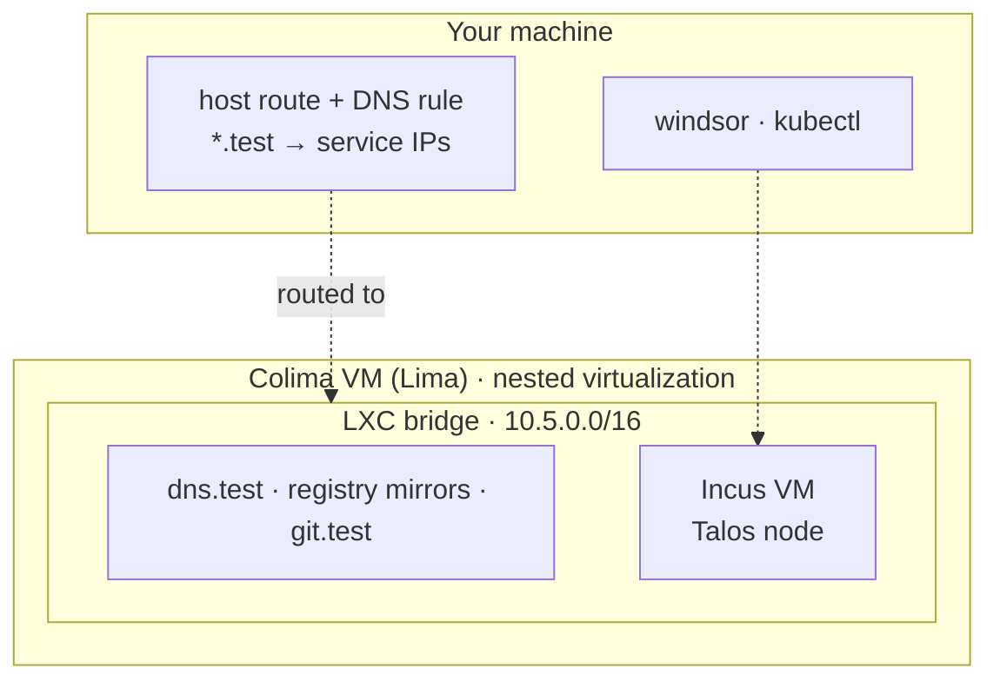

Colima + Incus swaps the container nodes for virtual machines, which behave more like real servers than containers do. It's also the slowest of the three, because the nodes are VMs running inside the Colima VM.

## Supported systems

macOS on Apple silicon with nested virtualization, and Linux. You need `limactl` 2.0.3 or newer. Older versions can hang at "Terminal is not available".

## Install

[Colima](https://github.com/abiosoft/colima#installation) wraps [Lima](https://lima-vm.io/) to start a Linux VM. With this driver Windsor configures that VM to run [Incus](https://linuxcontainers.org/incus/), the LXC and VM manager, instead of Docker, and turns on nested virtualization so Incus can start VMs inside it. Install Colima and Incus with their own instructions. Windsor writes the Colima profile (`windsor-<context>`) and starts and stops the VM.

## Resources

The VM is sized the same way as [Colima + Docker](colima-docker.md#resources): the node resources plus 1 CPU and 3 GB, with a floor of 2 CPUs and 4 GB and 100 GB of disk. The default one-node cluster gets a 9 CPU, 15 GB VM.

To change it, set `--vm-cpu`, `--vm-memory`, or `--vm-disk` when you initialize, or set the node sizes in `contexts/local/values.yaml`.

## Start it

```bash
windsor init local --vm-driver colima-incus
windsor up                       # halts: the host needs a route to the cluster
windsor configure network        # host route and DNS; prompts for sudo
windsor up --wait
```

The first `up` stops because the route and DNS rule need elevation. Run `configure network`, then `up` again to finish.

## What gets built



- **Nodes are VMs.** Each Kubernetes node is an Incus VM instance running Talos, not a container. DNS, the registry mirrors, and the git mirror run alongside it, as described in the [overview](overview.md#what-every-workstation-builds).
- **An LXC bridge.** The private network is an Incus bridge instead of a Docker one. The host route and DNS rule work the same as with Colima + Docker, so `*.test` resolves to service IPs and a layer 2 load balancer works.
- **Block devices.** Because the nodes are VMs, they can attach block devices, which storage drivers and CSIs need.

Docker image semantics differ here. The registry mirrors still work, but for the most common local workflow (Docker images, a local registry, Kubernetes), [Colima + Docker](colima-docker.md) is the better-supported path.
