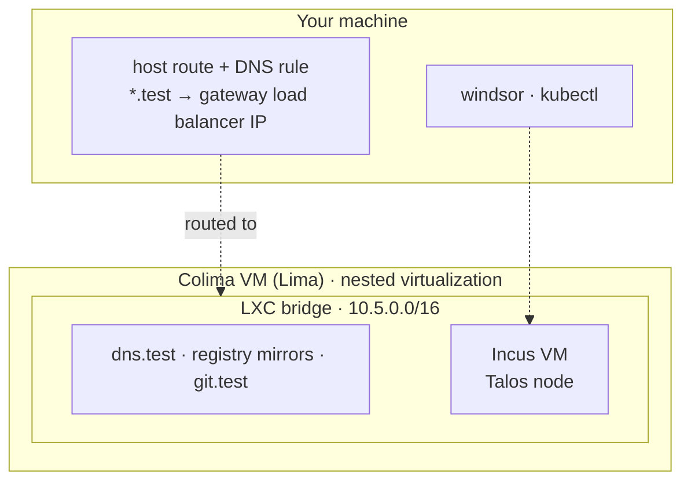

[Colima](https://colima.run/docs/) runs container runtimes on macOS and Linux inside a Linux VM that [Lima](https://lima-vm.io/) manages. [Incus](https://linuxcontainers.org/incus/docs/main/) is a system container and virtual machine manager. With this driver, Colima run Incus in the VM instead of Docker, and Incus runs each Kubernetes node as a virtual machine. VMs behave more like real servers than containers do. They also make this the slowest of the three runtimes, because the nodes are nested VMs running inside the Colima VM.

## Supported systems

macOS on Apple silicon with nested virtualization, and Linux. You need `limactl` 2.0.3 or newer. Older versions can hang at "Terminal is not available".

## Install

Windsor configures the Colima VM to run Incus instead of Docker, and turns on nested virtualization so Incus can start VMs inside it. Install Colima and Incus by following their instructions: [Colima](https://github.com/abiosoft/colima#installation) and [Incus](https://linuxcontainers.org/incus/docs/main/installing/). Windsor writes the Colima profile `windsor-<context>` and starts and stops the VM.

## Resources

The VM is sized the same way as [Colima + Docker](colima-docker.md#resources): the node resources plus 1 CPU and 3 GB, with a floor of 2 CPUs and 4 GB and 100 GB of disk. The default one-node cluster gets a 5 CPU, 15 GB VM.

To change it, set `--vm-cpu`, `--vm-memory`, or `--vm-disk` when you initialize, or set the node sizes in `contexts/local/values.yaml`.

This is the heaviest runtime. The node is a full VM inside the Colima VM, so the 15 GB VM is nearly full once the cluster is up. Use a machine with 32 GB of memory or more. On an M3 Max with 64 GB, `up` took about ten minutes.

## Start it

```bash
windsor init local --vm-driver colima-incus
windsor up                       # halts: the host needs a route to the cluster
windsor configure network        # host route and DNS; prompts for sudo
windsor up --wait
```

The first `up` stops because the route and DNS rule need elevation. Run `windsor configure network`, then `up` again to finish.

With the current `core`, `init` fails for this driver until `contexts/local/values.yaml` declares a control plane node ([windsorcli/core#3053](https://github.com/windsorcli/core/issues/3053)):

```yaml
cluster:
  controlplanes:
    nodes:
      controlplane-1:
        hostname: controlplane-1
```

## What gets built



- **Nodes are VMs.** Each Kubernetes node is an Incus VM instance running Talos, not a container. DNS, the registry mirrors, and the git mirror run alongside it, as described in the [overview](overview.md#what-gets-built).
- **An LXC bridge.** The private network is an Incus bridge instead of a Docker one. The host route and DNS rule work the same as with Colima + Docker, so `*.test` resolves to the gateway load balancer IP and layer 2 load balancing works.
- **Block devices.** Because the nodes are VMs, they can attach block devices, which storage drivers and CSIs need.

Docker image semantics differ here. The registry mirrors still work, but for the most common local workflow (Docker images, a local registry, Kubernetes), [Colima + Docker](colima-docker.md) is the better-supported path.

## Block devices

Declare disks for a node in `contexts/local/values.yaml`. Use `cluster.workers.disks` for workers:

```yaml
cluster:
  controlplanes:
    disks:
      - name: data
        size: 10           # GB
```

Each disk takes a `name` and a `size` in GB. An optional `type` names the Incus storage pool, which is `default` unless you set it. By default, nodes have no extra disks.

For each disk, Windsor creates a block volume in the pool, named `<node>-<disk>`, such as `controlplane-data`. It then attaches the volume to the node VM as a disk device. Talos sees an extra raw disk next to the 30 GB system disk. In the example, `sda` is the system disk and `sdb` is the new 10 GB disk, with no filesystem on it. Storage drivers that need raw block devices use these disks. The default OpenEBS driver uses local paths and ignores them.

The pools live inside the Colima VM, so the disks count against its 100 GiB of disk.

## Explore

Run these after `up` finishes. With the [shell hook](../contexts/environment-injection.md), `kubectl` and `talosctl` target this environment. Without it, prefix each command with [`windsor exec --`](https://www.windsorcli.dev/reference/cli/commands/exec). Windsor adds a Colima remote to Incus, so `incus` talks to the VM.

Start with the VM and the instances Incus created:

```bash
colima list                            # profile windsor-local: 5 CPUs, 15 GiB, incus runtime
incus remote list                      # colima-windsor-local (current), plus docker and ghcr
incus list                             # controlplane (VIRTUAL-MACHINE) and the support services (CONTAINER (APP))
incus network show incusbr0            # the bridge: 10.5.0.1/16 with NAT
incus storage list                     # default (zfs) and local (dir)
incus storage volume list default      # custom volumes, such as controlplane-data (content type block)
```

Then look at the node VM:

```bash
incus config show controlplane         # the Talos image and TALOSSKU=4CPU-12288RAM
incus config device show controlplane  # a 30GB root disk and a NIC
incus info controlplane                # status and memory use
colima ssh -p windsor-local -- free -h # the node takes most of the Colima VM's memory
```

Right after `up`, the node VM uses about 11 GiB, and `free -h` shows 12 of 14 GiB in use in the Colima VM. This is the cost of VMs inside a VM, and why this runtime is the slowest.

Look at the cluster and reach it through the host route. These commands are for macOS:

```bash
kubectl get nodes -o wide              # one Talos node, Ready
kubectl get kustomizations -A          # everything Flux installed
talosctl -n 10.5.0.10 services         # Talos's own services
talosctl -n 10.5.0.10 get disks        # sda is the system disk; sdb is an extra disk, if you declared one
dscacheutil -q host -a name grafana.test   # the gateway load balancer IP, 10.5.1.10 by default
curl -k https://grafana.test/login     # 200, on the default HTTPS port
```

When you're done, `windsor down` takes about 40 seconds. It deletes the Colima VM, the Incus VM, and the containers inside it. The host route goes with the VM, and `down` prints `windsor configure network --revert` to remove the DNS rule.
