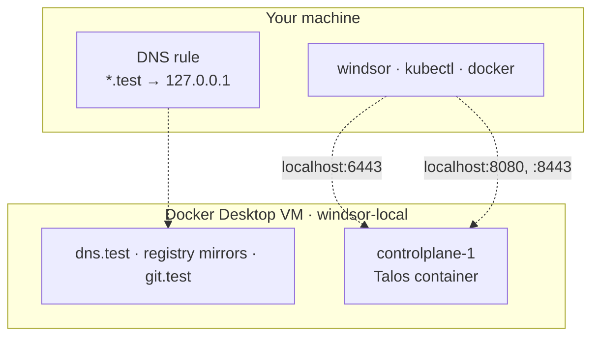

Docker Desktop is the quickest way to get a workstation context running, and the default on macOS and Windows. The cluster nodes run as containers inside Docker Desktop's VM, and your machine reaches them through ports published on localhost.

## Supported systems

macOS, Windows, and Linux. On Linux with Docker Engine instead of Docker Desktop, use `--vm-driver docker`.

## Install

Install [Docker Desktop](https://docs.docker.com/desktop/) and start it before you run [`windsor up`](https://www.windsorcli.dev/reference/cli/commands/up). Docker Desktop provides the Docker daemon used by Windsor.

## Resources

Docker Desktop's VM limits are set in Docker Desktop, not in Windsor. Open **Settings → Resources** and set them there. See [Docker's settings reference](https://docs.docker.com/desktop/settings-and-maintenance/settings/).

The default cluster is one node, limited to 4 CPUs and 12 GB of memory. That node runs the workloads as well as the control plane, which is why it gets the larger memory figure. Give it at least:

- **CPUs:** 6
- **Memory:** 14 GB
- **Disk:** about 60 GB free, for images and the registry cache

Each worker you add brings its own limit of 4 CPUs and 8 GB, so raise these to match. A dedicated control plane, with workers to carry the workloads, needs 8 GB of memory instead of 12. To change a node's limits, set `cluster.controlplanes.cpu` and `cluster.controlplanes.memory` in `contexts/local/values.yaml`.

## Start it

```bash
windsor init local --vm-driver docker-desktop
windsor up --wait
windsor configure network        # once; prompts for sudo (Administrator PowerShell on Windows)
```

`up` finishes without halting. `configure network` only writes the DNS rule, and it needs elevation.

## What gets built



- **Nodes are containers.** `controlplane-1` runs Talos as a privileged container on the `windsor-local` bridge, next to the support containers described in the [overview](overview.md#what-gets-built).
- **Localhost access.** The container publishes the Kubernetes API on `6443`, the Talos API on `50000`, and the gateway's NodePorts on `8080`, `8081`, `8443`, and `8444`. That's why Grafana is at `https://grafana.test:8443`.
- **DNS answers `127.0.0.1`.** Every `*.test` name resolves to localhost, and the published ports do the routing. There's no route to the cluster network, so the host can't reach load balancer IPs.
- **Flannel, not Cilium.** Cilium has no working transport over Docker Desktop's loopback, so Windsor sets the CNI to Flannel for this runtime.

Filesystem volumes work as usual: `${project_root}/.volumes` is bind-mounted into the node so persistent volumes show up as folders in your project. Block devices aren't available. For them, use [Colima + Incus](colima-incus.md).

## Explore

Run these after `up` finishes. With the [shell hook](../contexts/environment-injection.md), `docker`, `kubectl`, and `talosctl` target this environment. Without it, prefix each command with [`windsor exec --`](https://www.windsorcli.dev/reference/cli/commands/exec).

Start with what Docker created:

```bash
docker ps                              # controlplane-1, six registry mirrors, git.test, dns.test
docker network inspect windsor-local   # 10.5.0.0/16; every container has a fixed address
docker port controlplane-1             # 6443, 50000, and the NodePorts on 8080, 8081, 8443, 8444
docker stats --no-stream               # the node, right after up: about 7 GiB of its 12 GiB limit
```

Then look at the cluster inside the node:

```bash
kubectl get nodes -o wide              # one Talos node, Ready
kubectl get kustomizations -A          # everything Flux installed
kubectl get pods -A                    # all Running
kubectl get gateway,httproutes -A      # the Envoy gateway and the routes it serves
kubectl get storageclass               # local and single (default), both OpenEBS
talosctl -n 10.5.0.10 services         # Talos's own services: apid, etcd, kubelet, and more
```

You can reach services before you run `windsor configure network`. The DNS container answers on localhost, and the gateway's HTTPS port is published:

```bash
dig +short @127.0.0.1 grafana.test     # 127.0.0.1
curl -k --resolve grafana.test:8443:127.0.0.1 https://grafana.test:8443/login   # 200
```

When you're done, `windsor down` takes about ten seconds. It removes the containers, the `windsor-local` network, and the node's volumes.
