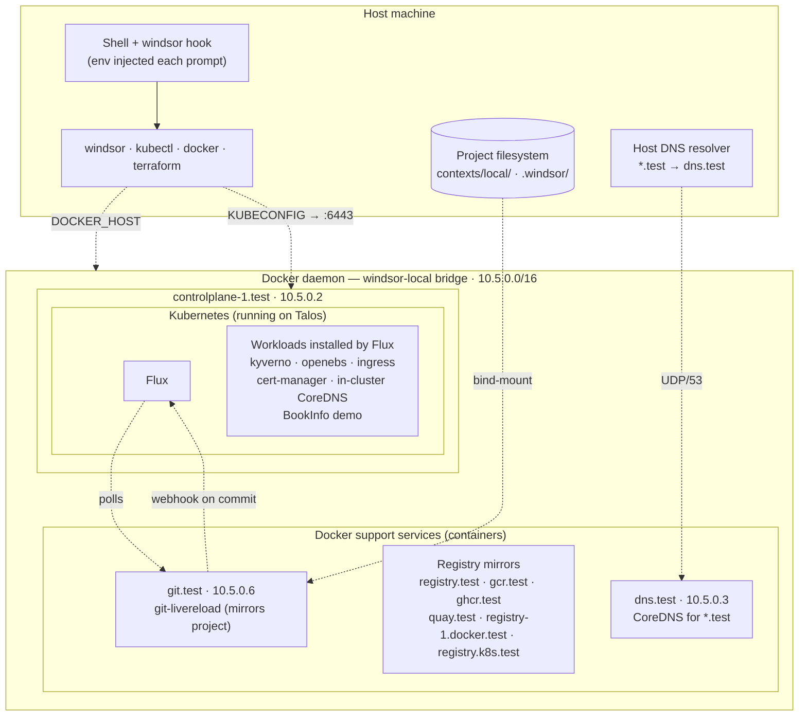

A workstation context runs a VM-backed Kubernetes cluster on your machine, with DNS, container registries, and a local git mirror configured to mimic production. Workstation contexts are the only place [`windsor up`](https://www.windsorcli.dev/reference/cli/commands/up) and [`windsor down`](https://www.windsorcli.dev/reference/cli/commands/down) apply — every other context (`staging`, `prod`, etc.) uses [`apply`](https://www.windsorcli.dev/reference/cli/commands/apply) and [`destroy`](https://www.windsorcli.dev/reference/cli/commands/destroy) directly.

```bash
git init
windsor init local
windsor up --wait
```

## Anatomy



The Docker daemon is on the host with `docker-desktop` / `docker`, and inside the Lima VM with `colima` / `colima-incus`. Either way, every container — support services and Talos alike — joins the `windsor-local` bridge, so they address each other on `10.5.0.x`.

Key flows:

- The shell hook re-evaluates `windsor env` each prompt, exporting `KUBECONFIG`, `DOCKER_HOST`, `TALOSCONFIG`, `REGISTRY_URL`, etc., so plain `kubectl` and `docker` commands target the workstation.
- `dns.test` (CoreDNS, on the docker network) resolves `*.test` names. The host resolver is pointed at it by `windsor configure network`. Pods inside Kubernetes have a separate cluster-scoped CoreDNS for service DNS.
- `git-livereload` runs as a docker container, not in the cluster. It mirrors your working tree onto an HTTP git server at `git.test` and pings the Flux webhook on each change. Flux reconciles from `git.test`.
- `${project_root}/.volumes` bind-mounts onto the Talos container, so PVCs surface as host directories under your project.

## Workstation configuration

After `init`, two files describe the context:

```yaml
# contexts/local/values.yaml — user-authored
dev: true
dns:
  domain: test
id: w2g5rk7d
```

```yaml
# .windsor/contexts/local/workstation.yaml — system-managed, ephemeral
platform: docker
workstation:
  arch: arm64
  dns:
    address: 127.0.0.1
  runtime: docker-desktop
```

`workstation.yaml` is system-managed — Windsor writes it during `init` / `up` based on `--vm-driver`, `--platform`, and the host architecture. Treat it as ephemeral; do not check it in.

Keys inside `workstation.yaml`:

| Key | Meaning |
|-----|---------|
| `platform` | Workstation platform: `docker`, `metal`, `incus`, `aws`, `azure`, `gcp`, `none`. Drives backend defaults and which terraform components are picked. |
| `workstation.runtime` | VM/container runtime: `docker-desktop`, `colima`, `docker` (host docker). |
| `workstation.arch` | VM architecture (`arm64` or `amd64`); inferred from host `GOARCH` when unset. |
| `workstation.address` | VM IP, set by Windsor after VM boot. |
| `workstation.dns.address` | DNS service IP that the host resolver should be pointed at. |

## Choose a driver

| Feature | [Docker Desktop](docker-desktop.md) | [Colima + Docker](colima-docker.md) | [Colima + Incus](colima-incus.md) |
|---------|---------------------------------------------------|---------------------------------------------------|--------------------------------------------------|
| Prod parity | ★ | ★★ | ★★★ |
| Platform | macOS, Linux, Windows | macOS, Linux | macOS, Linux |
| DNS | Routes to localhost | Routes to service IPs | Routes to service IPs |
| Docker registries | Full support (local: registry.test:5002) | Full support | Full support (LXC/Incus image semantics) |
| Local Git | Full support | Full support | Full support |
| Kubernetes node type | Container nodes | Container nodes | VM nodes |
| Device emulation | Filesystem only | Filesystem only | Block devices |
| Host→cluster access | Port mapping to localhost; NodePort | VM network; cluster CIDR reachable from host | Same as Colima + Docker; LXC bridge inside VM |
| In-cluster network | Bridge inside Docker VM; no L2 from host | Cluster CIDR; DNS → service IPs; L2 LB | Cluster CIDR; DNS → service IPs; L2 LB; LXC bridge |

When to pick what:

- **Docker Desktop** — application development, quick iteration, basic cluster access. Lowest setup cost.
- **Colima + Docker** — networking work, production-like DNS/load balancing, CNIs. Free open-source alternative to Docker Desktop.
- **Colima + Incus** — storage and CSIs, realistic networking constraints. Closest to a real datacenter; nested virt is slower.

`--vm-driver` writes `workstation.runtime` (with `colima-incus` aliased to `colima` plus `platform: incus`). When `--platform` isn't provided, Windsor infers it from the driver: `colima` and `docker-desktop` → `docker`; `colima-incus` → `incus`.

`colima-incus` requires `limactl` ≥ 2.0.3 (older lima can hang at "Terminal is not available").

## Cluster topology

Windsor runs Kubernetes via [Talos](https://github.com/siderolabs/talos). Configure the cluster in `contexts/<name>/values.yaml`:

```yaml
cluster:
  driver: talos
  controlplanes:
    count: 1
    cpu: 4
    memory: 4
  workers:
    count: 1
    cpu: 4
    memory: 8
    hostports:
    - 80:30080/tcp
    - 443:30443/tcp
    volumes:
    - ${project_root}/.volumes:/var/mnt/local
```

When fields are unset, Windsor derives sensible defaults. The default topology is **single-node**: one schedulable controlplane and zero workers, where the controlplane runs both control-plane and workload pods.

| Topology | Default `cpu` | Default `memory` (GB) |
|----------|---------------|------------------------|
| Single schedulable controlplane (workers count 0) | 8 | 12 |
| Dedicated controlplane (workers count > 0) | 4 | 4 |
| Worker | 4 | 8 |

`controlplanes.schedulable` is automatically `true` when `workers.count == 0` and `controlplanes.count == 1`.

`hostports` are container-to-host port mappings (only applied for `docker-desktop` and `docker`). `volumes` are bind-mounts on the worker filesystem — typically used to expose `${project_root}/.volumes/` to the cluster as PVC storage.

### VM rightsizing (Colima)

For Colima, the VM size is derived from cluster topology rather than fixed:

```text
cpu    = (controlplanes.count × controlplanes.cpu) + (workers.count × workers.cpu) + 1
memory = (controlplanes.count × controlplanes.memory) + (workers.count × workers.memory) + 3 GB
```

The `+1 / +3` overhead covers the Ubuntu base and Docker services running inside the VM. Floors of 2 vCPU and 4 GB always apply. If the calculated size exceeds the host's physical resources minus a 4 GB reserve, Windsor warns; tune individual node values in `values.yaml` or pass `--vm-cpu` / `--vm-memory` to `init`.

When `cluster.driver` is unset, Windsor falls back to half of the host's CPU and memory.

## DNS

The local DNS resolver routes the configured domain (default: `test`) to a CoreDNS instance. Services like `http://aws.test`, `http://git.test`, `http://registry.test`, and any in-cluster service DNS resolve through it.

```yaml
# contexts/local/values.yaml
dns:
  domain: test       # IANA-reserved for testing
```

`.test` is reserved by IANA for testing and is the recommended choice. Override `dns.domain` if you must.

`windsor configure network` wires the host's resolver and routes for the active workstation. It runs automatically after the workstation Terraform component applies during `up`, but you can re-run it manually if DNS or routing drifts:

```bash
windsor configure network --dns-address=10.5.0.10
```

`--dns-address` is the DNS service IP — typically taken from the workstation Terraform component's outputs.

## Local git mirror

When `dev: true`, Windsor runs [git-livereload](https://github.com/windsorcli/git-livereload) as a docker container. Saves to your local files surface as commits to `http://git.test/git/<project>`, which is what Flux subscribes to in the local context — so pushing to a remote isn't required for the local GitOps loop.

A Flux webhook is also wired up so changes reconcile faster than the configured interval. git-livereload triggers it automatically after each filesystem change.

## Build IDs

Windsor maintains a build identifier for tagging artifacts during local development. Stored in `.windsor/.build-id`, exposed as `BUILD_ID` and as a Flux substitution variable.

```bash
windsor build-id            # current
windsor build-id --new      # rotate
```

Format: `YYMMDD.RANDOM.#` — date, random suffix for collision avoidance, and a same-day sequence counter. See the [build-id reference](build-id.md).

## Verifying

```bash
kubectl get nodes               # nodes Ready
kubectl get kustomizations -A   # all Ready, no Pending
windsor explain workstation.address    # VM address
windsor show values             # effective context values
```

The default blueprint installs Istio's [BookInfo](https://istio.io/latest/docs/examples/bookinfo/) demo. Visit `http://bookinfo.test:8080` (or `:80` if hostports are mapped to the standard web ports).

## See also

- [Lifecycle](../contexts/lifecycle.md) — `up` / `down` phase boundaries
- [Environment injection](../contexts/environment-injection.md) — `DOCKER_HOST`, `KUBECONFIG`, `TALOSCONFIG`, `REGISTRY_URL`
- [`up`](https://www.windsorcli.dev/reference/cli/commands/up), [`down`](https://www.windsorcli.dev/reference/cli/commands/down), [`configure`](https://www.windsorcli.dev/reference/cli/commands/configure), [`init`](https://www.windsorcli.dev/reference/cli/commands/init)
- [Configuration reference](https://www.windsorcli.dev/reference/cli/configuration) — full schema for `workstation`, `cluster`, `dns`, `docker`
