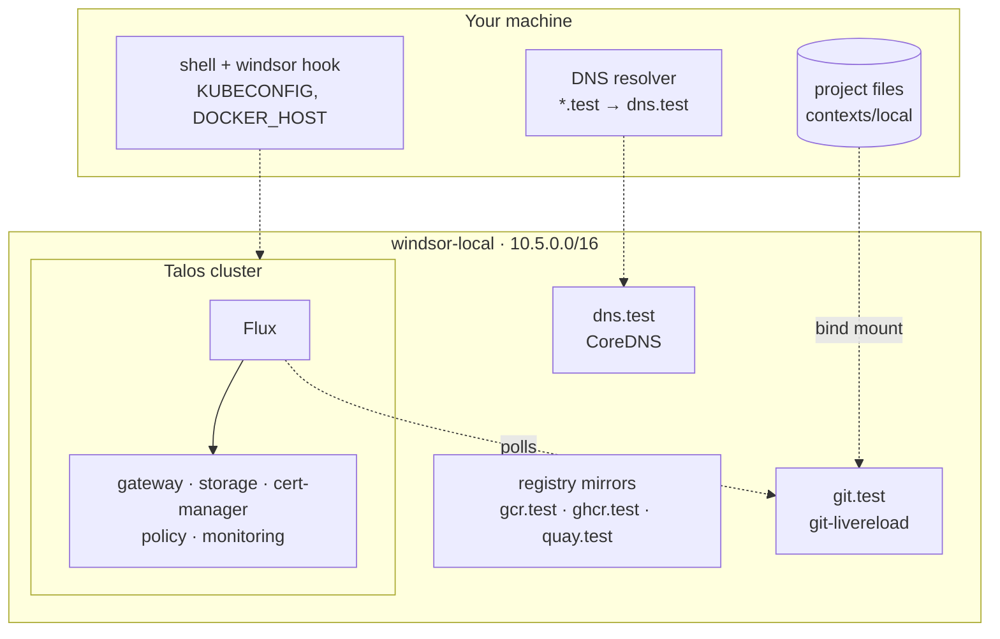

A workstation context runs a Kubernetes cluster on your own machine, with DNS, image registries, and a git mirror set up so it behaves like a small production environment. You start it with [`windsor up`](https://www.windsorcli.dev/reference/cli/commands/up) and stop it with [`windsor down`](https://www.windsorcli.dev/reference/cli/commands/down). If you have not done so, try running through [First project](../getting-started/first-project.md). This tutorial will run you through a workstation built on docker-desktop.

## Choose a runtime

The cluster can be hosted three ways. They differ in what the cluster nodes are and how your machine reaches them.

|                       | [Docker Desktop](docker-desktop.md) | [Colima + Docker](colima-docker.md) | [Colima + Incus](colima-incus.md)   |
| --------------------- | ----------------------------------- | ----------------------------------- | ----------------------------------- |
| Runs on               | macOS, Linux, Windows               | macOS, Linux                        | macOS, Linux                        |
| Cluster nodes         | Containers                          | Containers                          | VMs                                 |
| Reaching the cluster  | Ports published on localhost        | A host route to the cluster network | A host route to the cluster network |
| `*.test` resolves to  | `127.0.0.1`                         | The gateway load balancer IP        | The gateway load balancer IP        |
| Load balancer         | NodePort only                       | Layer 2                             | Layer 2                             |
| Block devices         | Filesystem only                     | Filesystem only                     | Yes                                 |
| Closest to production | Least                               | Middle                              | Most                                |
| Performance           | ★★★                                 | ★★★                                 | ★☆☆                                 |

[`windsor init local`](https://www.windsorcli.dev/reference/cli/commands/init) picks Docker Desktop on macOS and Windows, and Docker on Linux. Docker Desktop is the quickest to set up and suits application work. Choose Colima + Docker when you're working on networking, DNS, load balancing, or a CNI. Choose Colima + Incus for storage and CSI work, or when you want nodes that are VMs instead of containers. Nested virtualization makes it the slowest of the three.

On Linux with Docker Engine on the host, use `--vm-driver docker`. It uses the host's Docker Engine directly, with no VM in between.

## What gets built

`windsor up` creates a private Docker network, `windsor-local` (`10.5.0.0/16`). It runs a Talos Kubernetes cluster and three support services on that network. The layout is the same on all three runtimes.


```mermaid
flowchart TB
  subgraph Host["Your machine"]
    Shell["shell + windsor hook<br/>KUBECONFIG, DOCKER_HOST"]
    Resolver["DNS resolver<br/>*.test → dns.test"]
    Files[("project files<br/>contexts/local")]
  end
  subgraph Net["windsor-local · 10.5.0.0/16"]
    DNS["dns.test<br/>CoreDNS"]
    Reg["registry mirrors<br/>gcr.test · ghcr.test · quay.test"]
    Git["git.test<br/>git-livereload"]
    subgraph Cluster["Talos cluster"]
      Flux["Flux"] --> Apps["gateway · storage · cert-manager<br/>policy · monitoring"]
    end
  end
  Shell -.-> Cluster
  Resolver -.-> DNS
  Files -.->|bind mount| Git
  Flux -.->|polls| Git
```

### Your machine

The shell hook exports `KUBECONFIG` and `DOCKER_HOST` on every prompt, so plain `kubectl` and `docker` commands point to the local workstation. Without the hook, run commands through [`windsor exec --`](https://www.windsorcli.dev/reference/cli/commands/exec). See [Environment injection](../contexts/environment-injection.md).

[`windsor configure network`](https://www.windsorcli.dev/reference/cli/commands/configure-network) adds a DNS resolver entry that sends the `test` domain to `dns.test`.

When you save project files locally, they mirror through the local `git.test` livereload service as a git endpoint. Your local cluster actively resolves this code, providing a responsive environment for developing against gitops based setups.

### The cluster

The local cluster runs Kubernetes using [Talos](https://github.com/siderolabs/talos). By default it is a single node that is both control plane and worker. Node count and size are set in `contexts/local/values.yaml`.

Flux installs the default blueprint's workloads:

- **Gateway and DNS:** Envoy for ingress, and CoreDNS inside the cluster.
- **Storage:** OpenEBS, for local persistent volumes.
- **Certificates:** cert-manager and a private certificate authority.
- **Policy:** Kyverno.
- **Monitoring:** Prometheus, Grafana, and Fluent Bit and Fluentd for logs.
- **Databases:** the CloudNativePG operator, with no databases created.

The sample apps in `core`, such as BookInfo, are off by default. [First project](../getting-started/first-project.md) shows how to turn on a demo to see live web endpoints in action. To see what Flux is operating, run `kubectl get kustomizations -A`.

### Support services

Three containers run beside the cluster. `docker ps` lists them.

| Service          | Address                                          | What it does                                                                                         |
| ---------------- | ------------------------------------------------ | ---------------------------------------------------------------------------------------------------- |
| DNS              | `dns.test`                                       | A CoreDNS server for the `test` domain, which is how `git.test` and `grafana.test` resolve in a browser. Set `dns.domain` in `values.yaml` to use a different domain. |
| Registry mirrors | `gcr.test`, `ghcr.test`, `quay.test`, and others | Stand in for `gcr.io`, `ghcr.io`, `quay.io`, `reg.kyverno.io`, Docker Hub, and `registry.k8s.io`. Images pull through them and cache locally in `.windsor/.docker-cache`. |
| Git mirror       | `git.test`                                       | Runs [git-livereload](https://github.com/windsorcli/git-livereload), which serves your working tree as a git repository at `http://git.test/git/<project>`. Flux pulls from it and gets a webhook on every change, so saving a file reaches the cluster without a push. |

For the modules behind all of this, see the `core` blueprint's [workstation](https://github.com/windsorcli/core/tree/main/terraform/workstation) and [dns](https://github.com/windsorcli/core/tree/main/kustomize/dns) READMEs.

## Build and push your own images

The workstation also provides a local registry for your images. Windsor exports its address as `REGISTRY_URL`, and it exports a **build ID** as `BUILD_ID`. A build ID has the format `YYMMDD.RANDOM.#`: the date, a random three-digit number, and a counter that increases for each ID generated on the same day. Windsor stores it in `.windsor/.build-id`, and it substitutes the current ID into Flux kustomizations as `${BUILD_ID}`.

```bash
windsor build-id                    # print the current build ID
windsor build-id --new              # generate a new one
```

To build and deploy an image, generate a new ID, tag the image with it, and push it to the local registry:

```bash
BUILD_ID=$(windsor build-id --new)
docker build -t ${REGISTRY_URL}/myapp:$BUILD_ID .
docker push ${REGISTRY_URL}/myapp:$BUILD_ID
```

Reference `${BUILD_ID}` in your manifests or Kustomize files instead of a fixed tag. Each new ID gives the image a unique tag, which keeps iterations traceable and avoids overwriting a shared `:latest`. See [Kustomize](../components/kustomize.md) for the other substitutions that Flux provides.

## See also

- [Lifecycle](../provisioning/overview.md): `up` and `down`, and how a deployed context differs
- [Contexts](../contexts/overview.md): switching between a workstation and other contexts
