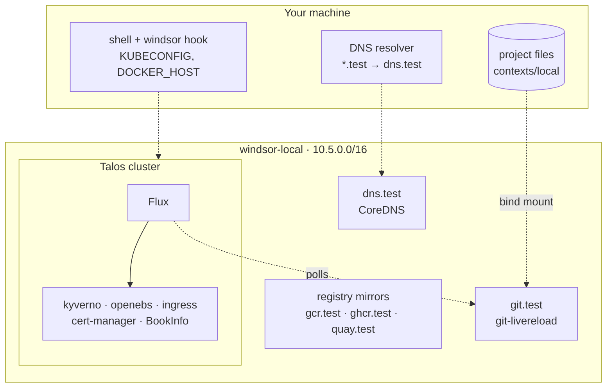

A workstation context runs a Kubernetes cluster on your own machine, with DNS, image registries, and a git mirror set up so it behaves like a small production environment. You start it with [`windsor up`](https://www.windsorcli.dev/reference/cli/commands/up) and stop it with [`windsor down`](https://www.windsorcli.dev/reference/cli/commands/down). If you have not done so, try running through [First project](../getting-started/first-project.md). This tutorial will run you through a workstation built on docker-desktop.

## Choose a runtime

The cluster can be hosted three ways. They differ in what the cluster nodes are and how your machine reaches them.

| | [Docker Desktop](docker-desktop.md) | [Colima + Docker](colima-docker.md) | [Colima + Incus](colima-incus.md) |
|---|---|---|---|
| Runs on | macOS, Linux, Windows | macOS, Linux | macOS, Linux |
| Cluster nodes | Containers | Containers | VMs |
| Reaching the cluster | Ports published on localhost | A host route to the cluster network | A host route to the cluster network |
| `*.test` resolves to | `127.0.0.1` | The service IPs | The service IPs |
| Load balancer | NodePort only | Layer 2 | Layer 2 |
| Block devices | Filesystem only | Filesystem only | Yes |
| Closest to production | Least | Middle | Most |

[`windsor init local`](https://www.windsorcli.dev/reference/cli/commands/init) picks Docker Desktop on macOS and Windows, and Docker on Linux. Docker Desktop is the quickest to set up and suits application work. Choose Colima + Docker when you're working on networking, DNS, load balancing, or a CNI. Choose Colima + Incus for storage and CSI work, or when you want nodes that are VMs instead of containers. Nested virtualization makes it the slowest of the three.

On Linux with Docker Engine on the host, use `--vm-driver docker`. It uses the host's Docker Engine directly, with no VM in between.

## What gets built

On any of the three runtimes, `windsor up` ends up with the same layout: a private Docker network, `windsor-local` (`10.5.0.0/16`), holding a Kubernetes cluster and a few support services.

```mermaid
flowchart TB
  subgraph Host["Your machine"]
    Shell["shell + windsor hook<br/>KUBECONFIG, DOCKER_HOST"]
    Resolver["DNS resolver<br/>*.test → dns.test"]
    Files[("project files<br/>contexts/local")]
  end
  subgraph Net["windsor-local · 10.5.0.0/16"]
    DNS["dns.test<br/>CoreDNS"]
    Reg["registry mirrors<br/>gcr.test · ghcr.test · quay.test"]
    Git["git.test<br/>git-livereload"]
    subgraph Cluster["Talos cluster"]
      Flux["Flux"] --> Apps["kyverno · openebs · ingress<br/>cert-manager · BookInfo"]
    end
  end
  Shell -.-> Cluster
  Resolver -.-> DNS
  Files -.->|bind mount| Git
  Flux -.->|polls| Git
```

Your shell hook exports `KUBECONFIG` and `DOCKER_HOST` on every prompt, so plain `kubectl` and `docker` commands reach this environment. Without the hook, prefix them with [`windsor exec --`](https://www.windsorcli.dev/reference/cli/commands/exec). See [Environment injection](../contexts/environment-injection.md).

The cluster is [Talos](https://github.com/siderolabs/talos) running Kubernetes. By default it's a single node that is both control plane and worker. Node count and size are set in `contexts/local/values.yaml`.

Three kinds of container run beside it. `dns.test` is a CoreDNS server, and [`windsor configure network`](https://www.windsorcli.dev/reference/cli/commands/configure-network) points your resolver's `test` domain at it, which is why `git.test` and `bookinfo.test` open in a browser. Set `dns.domain` in `values.yaml` to use a different domain. The registry mirrors stand in for `gcr.io`, `ghcr.io`, `quay.io`, Docker Hub, and `registry.k8s.io`, and image pulls go through them. Their cache lives in `.windsor/.docker-cache`, and `REGISTRY_URL` points at the local registry for images you build (see [Build ID](build-id.md)). `git.test` runs [git-livereload](https://github.com/windsorcli/git-livereload), which serves your working tree as a git repository at `http://git.test/git/<project>`. Flux pulls from it and gets a webhook on every change, so saving a file reaches the cluster without a push.

Flux then installs the default blueprint's workloads: Kyverno, OpenEBS, ingress, cert-manager, and the BookInfo demo, which you can open at `http://bookinfo.test:8080/productpage`. `docker ps` lists the containers and `kubectl get kustomizations -A` shows what Flux installed. For the modules behind all of this, see the `core` blueprint's [workstation](https://github.com/windsorcli/core/tree/main/terraform/workstation), [dns](https://github.com/windsorcli/core/tree/main/kustomize/dns), and [demo](https://github.com/windsorcli/core/tree/main/kustomize/demo) READMEs.

## See also

- [Lifecycle](../provisioning/workflow.md): `up` and `down`, and how a deployed context differs
- [Contexts](../contexts/overview.md): switching between a workstation and other contexts
