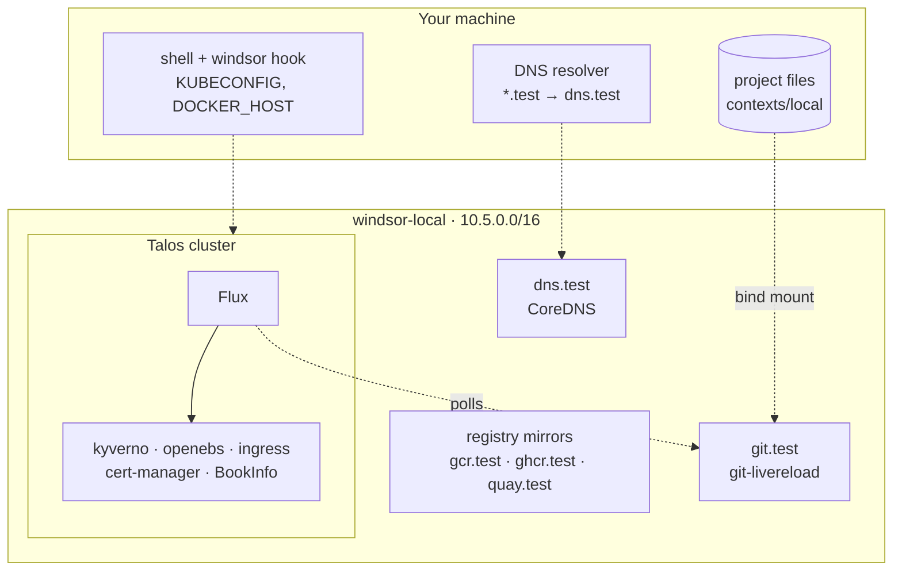

A workstation context runs a Kubernetes cluster on your own machine, with DNS, image registries, and a git mirror set up so it behaves like a small production environment. You start it with `windsor up` and stop it with `windsor down`. If you have not done so, try running through [First project](../getting-started/first-project.md). This tutorial will run you through a workstation built on docker-desktop.

## Choose a runtime

The cluster can be hosted three ways. They differ in what the cluster nodes are and how your machine reaches them.

| | [Docker Desktop](docker-desktop.md) | [Colima + Docker](colima-docker.md) | [Colima + Incus](colima-incus.md) |
|---|---|---|---|
| Runs on | macOS, Linux, Windows | macOS, Linux | macOS, Linux |
| Cluster nodes | Containers | Containers | VMs |
| Reaching the cluster | Ports published on localhost | A host route to the cluster network | A host route to the cluster network |
| `*.test` resolves to | `127.0.0.1` | The service IPs | The service IPs |
| Load balancer | NodePort only | Layer 2 | Layer 2 |
| Block devices | Filesystem only | Filesystem only | Yes |
| Closest to production | Least | Middle | Most |

`windsor init local` picks Docker Desktop on macOS and Windows, and Docker on Linux. Docker Desktop is the quickest to set up and suits application work. Choose Colima + Docker when you're working on networking, DNS, load balancing, or a CNI. Choose Colima + Incus for storage and CSI work, or when you want realistic hosts. Nested virtualization makes it the slowest of the three.

On Linux with Docker Engine on the host, use `--vm-driver docker`. It uses the host's Docker Engine directly, with no VM in between.

## What every workstation builds

Whichever runtime you pick, `windsor up` builds the same set of pieces on one private network, `windsor-local`, which uses `10.5.0.0/16`.

```mermaid
flowchart TB
  subgraph Host["Your machine"]
    Shell["shell + windsor hook<br/>KUBECONFIG, DOCKER_HOST"]
    Resolver["DNS resolver<br/>*.test → dns.test"]
    Files[("project files<br/>contexts/local")]
  end
  subgraph Net["windsor-local · 10.5.0.0/16"]
    DNS["dns.test<br/>CoreDNS"]
    Reg["registry mirrors<br/>gcr.test · ghcr.test · quay.test"]
    Git["git.test<br/>git-livereload"]
    subgraph Cluster["Talos cluster"]
      Flux["Flux"] --> Apps["kyverno · openebs · ingress<br/>cert-manager · BookInfo"]
    end
  end
  Shell -.-> Cluster
  Resolver -.-> DNS
  Files -.->|bind mount| Git
  Flux -.->|polls| Git
```

Your shell hook exports `KUBECONFIG`, `DOCKER_HOST`, and the rest on each prompt, so plain `kubectl` and `docker` commands reach this environment. Without the hook, prefix them with `windsor exec --`. See [Environment injection](../contexts/environment-injection.md).

- **A Talos cluster.** [Talos](https://github.com/siderolabs/talos) runs Kubernetes. The default is one node, a schedulable control plane with no workers. Change the node count and size in `contexts/local/values.yaml`.
- **DNS for `*.test`.** `dns.test` is a CoreDNS container. `windsor configure network` points your resolver's `test` domain at it, so `git.test` and `bookinfo.test` resolve from your browser and shell. Set `dns.domain` in `values.yaml` to use another domain.
- **Registry mirrors.** The other `*.test` containers mirror `gcr.io`, `ghcr.io`, `quay.io`, Docker Hub, and `registry.k8s.io`, and image pulls go through them. The cache lives in `.windsor/.docker-cache`, and `REGISTRY_URL` points at the local registry for your own images. See [Build ID](build-id.md) for tagging them.
- **A git mirror.** `git.test` runs [git-livereload](https://github.com/windsorcli/git-livereload), which serves your working tree at `http://git.test/git/<project>`. Flux reconciles from it, and a webhook fires on each change, so saving a file reaches the cluster without a push.
- **The default blueprint's workloads.** Flux installs Kyverno, OpenEBS, ingress, cert-manager, and the BookInfo demo. Open `http://bookinfo.test:8080/productpage` to see it running.

To look at any of this, `docker ps` lists the containers and `kubectl get kustomizations -A` shows what Flux installed. The `core` blueprint's [workstation](https://github.com/windsorcli/core/tree/main/terraform/workstation), [dns](https://github.com/windsorcli/core/tree/main/kustomize/dns), and [demo](https://github.com/windsorcli/core/tree/main/kustomize/demo) READMEs cover the modules behind these pieces.

## See also

- [Lifecycle](../provisioning/workflow.md): `up` and `down`, and how a deployed context differs
- [Contexts](../contexts/overview.md): switching between a workstation and other contexts
